.. _menu_Cost:

사업비/계약관리
###############

사업비계획관리
**************

사업비편성
==========

.. note::
  - 해당 사업의 사업비분류체계(PBCOA) 별 월간 사업비 편성을 등록 관리합니다.

1. 리스트영역은 등록된 사업비분류체계 리스트를 트리 형태로 보여 줍니다.
2. 검색기능을 통해 조회조건에 따라 PBCOA 항목을 검색 할 수 있습니다 .
3. 월간예산 영역에서는 선택된 항목의 상세 월간예산 편성정보를 보여 줍니다.
   월별 당기계획과 누계계획의 금액 및 비율(%)을 조회 할 수 있습니다.
4. ‘엑셀올리기’ 버튼을 클릭하여 엑셀로 작업된 월간예산 편성내역을 등록 할 수 있습니다.
5. ‘엑셀 내려받기’ 버튼을 클릭하여 코드별 또는 월별 합계내역을 엑셀로 다운받을 수 있습니다.

.. note::
  - 엑셀을 통해 월간예산 등록 시 동일한 PBCOA 항목의 기존 월간예산 정보가 존재 할 경우 기존 데이터는 삭제되므로 주의 하십시오. 
  - 월간예산 편성 시 PBCOA의 최하위 항목에만 편성 가능하며 부모 항목에 예산 편성 시 시스템에 반영되지 않습니다. 

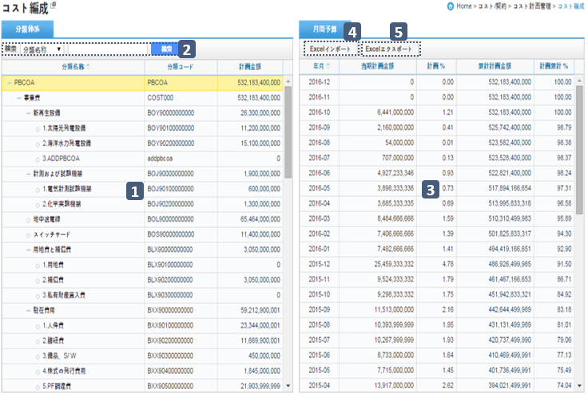

.. image:: ../_images/B_0002.png

검색기능
--------

.. image:: ../_images/B_0003.png

1.검색기능을 이용하여 원하는 항목을 쉽게 찾아볼 수 있습니다.
2.검색조건 선택 후 검색어 입력란에 검색어를  입력하신 후 ‘검색’버튼을 클릭 합니다.

엑셀 올리기
-----------

 
1.‘샘플파일다운로드’ 버튼을 클릭하여 엑셀 양식 파일을 다운로드 합니다.
2.지정된 엑셀 양식에 맞춰 사업비 월간예산을 작성 합니다.
3.작성된 엑셀파일을 ‘파일추가’ 기능을 통해 시스템에 업로드 합니다.
4.우측의 리스트에서 업로드된 엑셀파일의 내용을 확인한 후 이상 없을 시 하단의 ‘저장’ 버튼을 누르면 시스템에 저장 됩니다.

사업비계획
==========

.. note::
  - 사업비분류체계(PBCOA)별 월간, 연간예산 지출계획을 조회합니다.

1. 리스트 영역은 등록된 사업비분류체계를 트리 형태로 보여주며 각 항목별 예산현황을 월간/연간 별로 보여 줍니다.
2. 검색기능을 통해 조회조건에 따라 PBCOA 항목을 검색 할 수 있습니다 .
3. 조회조건 선택으로 ① 리스트 영역의 예산현황을 연도별, 월별 로 조회 할 수 있습니다.

.. note::
  - 조회되는 기간은 예산편성 및 실적 금액이 입력된 최초일 부터 마지막 일까지 기간이 자동 설정 됩니다.

.. image:: ../_images/B_0006.png

검색기능
--------

1.검색 기능을 이용하여 예산명칭/예산코드 별로 조회 할 수 있습니다.
2.검색조건 선택 후 검색어 입력란에 검색어를  입력하신 후 ‘검색’버튼을 클릭 합니다

조회조건
--------

.. image:: ../_images/B_0008.png

1.조회조건을 월별로 선택 시 연도를 선택할 수 있는 콤보박스가 나타나며 클릭한 연도의 12개월 정보의 예산내역을 확인 할 수 있습니다.

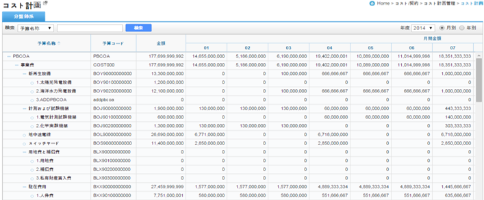

사업비집행관리
**************

집행실적등록
=============

.. note::
  - 해당 사업의 사업비분류체계(PBCOA) 별 집행실적을 관리 합니다.

1. 리스트영역은 등록된 사업비분류체계 항목을 집행금액정보와 함께 트리 형태로 보여 줍니다. 
2. 검색기능을 통해 조회조건에 따라 PBCOA 항목을 검색 할 수 있습니다.
3. 집행내역 리스트에서는 해당 사업비분류체계의 집행금액과 일자정보, 사용내역, 마감일자 정보를 집행일자 기준으로 정렬하여 보여 줍니다.
4. 검색기능을 통해 조회조건에 따라 집행내역을 검색 할 수 있습니다.
5. ③ 집행내역 리스트에서 선택한 집행내역 항목의 상세정보를 보여 줍니다.
   버튼 기능을 통해 집행내역을 등록 하거나 수정, 삭제 할 수 있습니다.
  
  .. note::  
      - 마감 혹은 승인된 집행실적은 ③ 리스트의 마감일자 항목에 마감일자가 표시되며, 수정, 삭제 할 수 없습니다.
  
6. ⑤ 상단의 ‘엑셀올리기’ 기능을 이용하여 집행내역을 엑셀로 정리하여 한번에 등록 할 수 있습니다. 샘플양식을 다운로드 받은 후 양식에 맞추어 집행실적 내용을 작성하여 등록 하십시오 .
7. ‘첨부파일’ 버튼을 누르면 해당 집행내역에 관련자료를 첨부할 수 있습니다.
8. ‘관련계약’ 항목의 돋보기 아이콘을 클릭하면 집행내역의 관련계약정보를 지정 할 수 있습니다.
9. ➇ 에서 관련계약을 지정하면 하단의 ‘계약업체’ 항목에 해당 계약의 업체 정보가 표시되며 업체 선택 후 저장 합니다.

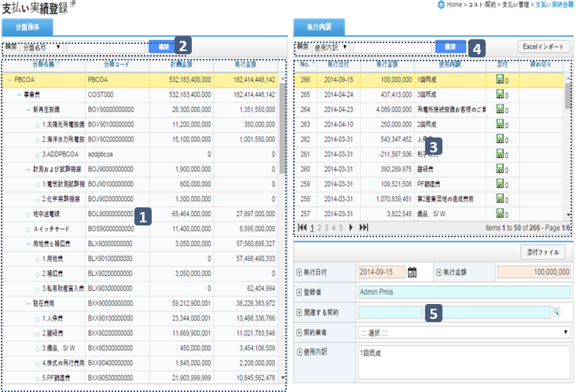

.. image:: ../_images/B_0011.png

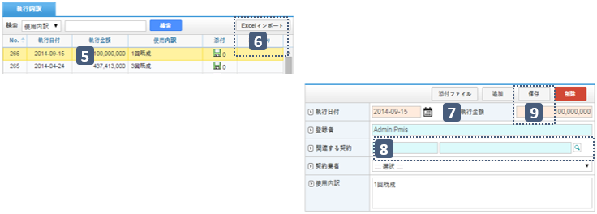

엑셀올리기
----------

1. ‘샘플파일다운로드’ 버튼을 클릭하여 엑셀 양식 파일을 다운로드 합니다.
2. 지정된 엑셀 양식에 맞춰 사업비 집행내역을 작성 합니다.
3. 작성된 엑셀파일을 ‘파일추가’ 기능을 통해 시스템에 업로드 합니다.
4. 우측의 리스트에서 업로드된 엑셀파일의 내용을 확인한 후 이상 없을 시 하단의 ‘저장’ 버튼을 누르면 시스템에 저장 됩니다.

관련계약
----------

1. ‘관련계약’ 항목 돋보기 아이콘을 클릭하면 해당 사업 계약목록이 팝업으로 나타납니다.
2. 계약을 선택하면 해당계약의 업체정보를 ‘계약업체’ 항목으로 자동으로 불러 오며 목록에서 선택 할 수 있습니다.

검색기능
--------

.. image:: ../_images/B_0012.png

1. 검색기능을 이용하여 원하는 항목을 쉽게 찾아볼 수 있습니다.
2. 검색조건 선택 후 검색어 입력란에 검색어를  입력하신 후 ‘검색’버튼을 클릭 합니다

집행내역 리스트
-----------------

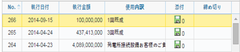

1. 집행내역 리스트에 마감 혹은 승인된 집행내역 항목은 마감일자가 표시 됩니다

상세정보 
--------------

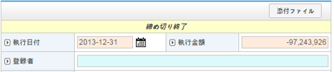

1. 상세정보에서 마감 혹은 승인된 집행내역은 상단에 ‘마감완료’ 혹은 ‘결재완료’ 메시지가 표시되며 ‘저장’, ‘삭제’ 버튼이 나타나지 않습니다.

집행실적승인
============

.. note::
  - 해당 사업의 집행실적을 마감하고 마감된 항목을 승인요청 합니다.

1. 마감일을 등록하고 마감집행실적을 등록된 마감일 기준으로 조회 합니다.
2. 선택된 마감일에 포함된 실적집행정보(집행일자, 집행금액, 계약업체, 계약명, 사용내역 등)를 리스트 형식으로 보여줍니다.
3. 검색기능을 통해 조회조건에 따라 집행내역 항목을 검색 할 수 있습니다.
4. 신규로 집행실적을 승인을 하시려면 ① 리스트 상단의 ‘마감일추가’ 버튼을 눌러 나타나는 팝업 창에 마감일자를 입력한 후 ‘저장’ 버튼을 누릅니다.
   마감일자는 이전에 등록된 마지막 마감일자 이후로 지정 할 수 있으며, 지정된 마감일자까지 등록된 집행내역이 ② 집행내역 리스트에 나타납니다.
5. ‘마감일 삭제’ 버튼을 클릭하여 선택된 집행목록의 전체 집행내역을 삭제할 수 있습니다.
6. ② 집행내역 리스트의 체크박스에 승인요청 할 집행내역을 체크 하고 ⑥의‘마감처리’ 버튼을 누르십시오. ⑥의 ‘전체마감처리’ 버튼을 누르면 해당 기간의 모든 집행내역이 마감처리 됩니다.
7. 결재’ 버튼을 누르면 마감된 집행실적의 보고서를 자동으로 생성하여 보여 줍니다.
8. 보고서는 ➇ 상단의 ‘PDF저장’ 및 ‘DOC저장’ 버튼 기능을 통해 PDF나 DOC 파일로 변환하여 저장 할 수 있습니다.
9. ‘저장’ 버튼을 누르면 보고서 결재상신 할 수 있습니다. 보고서 상신 시 결재선을 지정하는 팝업이 나타나며 결재선 지정 후 ‘확인’ 버튼을 누르면 해당 보고서가 결재 상신 됩니다.

.. note::
  -결재선 지정 및 결재처리에 대한 자세한 내용은 본 매뉴얼의 문서/자료 관리의 결재부분을 참고 하십시오.
  -결재가 진행중이거나 완료된 집행실적은 수정, 삭제 할 수 없습니다.

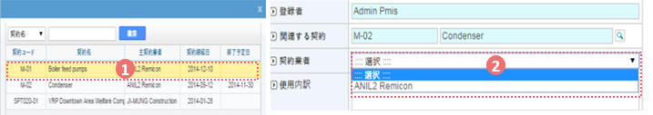

상세정보 
--------------

 
1. 검색기능을 이용하여 원하는 항목을 쉽게 찾아볼 수 있습니다.
2. 검색조건 선택 후 검색어 입력란에 검색어를  입력하신 후 ‘검색’버튼을 클릭 합니다.

마감일 추가 
--------------

1. ‘마감일 추가’ 버튼을 눌러 마감일을 지정하고 새로운 마감일을 등록합니다.

마감처리
--------------

1. ‘마감완료’ 집행일자의 집행금액을 마감하고 완료 시키는 버튼입니다.

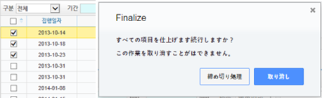

결재
--------------

1. 마감완료된 집행실적에 대해 ‘결재’ 처리 합니다.
2. 문서 결재모듈이 호출되며 마감 처리된 집행내역에 대한 보고서가 자동으로 생성됩니다.
3. 문서결재에 대한 자세한 사용법은 본 매뉴얼의 문서/자료 관리의 결재부분을 참고 하십시오

.. image:: ../_images/B_0026.png

보고서 파일 변환
------------------

1. ‘PDF저장’ 및 ‘DOC저장’ 버튼을 누르면 사업비 보고서를 PDF 파일이나 DOC 파일로 변환 저장 할 수 있습니다.
2. ‘인쇄’ 버튼을 클릭하면 해당 사업비 보고서를 프린트로 인쇄 합니다.

저장
--------------

1.‘Step추가’ 버튼을 누르면 결재란이 생성 됩니다. 결재상신자인 작성자를 제외한 문서의 결재자 수만큼 결재란을 생성 합니다.
2. 상단의 조직도에서 결재자를 마우스로 드레그하여 결재란에 가져다 놓으면 결재선이 지정 됩니다.
3. 확인’ 버튼을 누르면 결재상신 합니다

집행실적집계
============

.. note::
  - 해당 사업의 사업비집행현황을 조회 합니다.

1. 리스트에서는 사업비분류체계(PBCOA) 별 현재 시점의 계획금액, 집행금액, 집행율, 승인금액, 승인율(%)을 집계하여 보여 줍니다.
2. 검색기능을 통해 조회조건에 따라 사업비분류체계를 검색 할 수 있습니다.
3. 상세정보 영역에서는 선택된 사업비 항목의 계획대비 집행에 대한 금액 및 비율(%) 정보를 집계하여 기간 별로 보여 줍니다.
4. 조회조건을 통해 월별, 분기별, 연도별 조회가 가능합니다.
5. ‘엑셀 내려받기’ 기능을 통해 상세정보를 받아볼 수 있습니다.

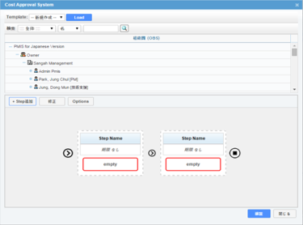

검색기능
--------------

.. image:: ../_images/B_0030.png

1.검색기능을 이용하여 원하는 항목을 쉽게 찾아볼 수 있습니다.
2.검색조건 선택 후 검색어 입력란에 검색어를  입력하신 후 ‘검색’버튼을 클릭 합니다.

조회조건
--------------

 
1. 라디오 버튼을 통해 사업비 정보를 월별, 분기별 연도별 기준으로 집계 가능합니다.

엑셀 내려받기
--------------

 
1.‘엑셀 내려받기’ 기능을 통해 선택된(월별, 분기별, 연도) 데이터를 다운 받아 볼 수 있습니다.

사업비분석관리
**************

사업비분석(월/분기/년)
======================

.. note::
  - 해당 사업의 사업비 정보를 S-Curve 차트와 리스트를 통해 조회 합니다.
  - 사업비의 계획대비 집행 금액 및 비율(%)을 월별, 분기별, 연도별로 제공 합니다.

1. 내용의 데이터를 기반으로 S-Curve 차트 형식으로 화면을 나타냅니다.
2. 검색기능을 통해 사업비분류체계(PBCOA)별 조회가 가능 합니다.
3. 상세정보 영역에서는 선택된 사업비 항목의 계획대비 집행에 대한 금액 및 비율(%) 정보를 집계하여 기간 별로 보여 줍니다.
4. 메뉴에 따라 월별, 분기별, 연도별 조회가 가능합니다.

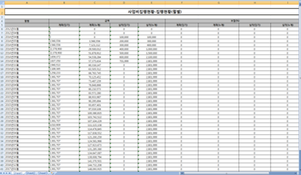

.. image:: ../_images/B_0035.png

검색기능
--------------
1. 사업비분류체계(PBCOA) 조회 기능을 통해 특정 사업비계정에 대한 분석현황 조회가 가능 합니다

조회조건
--------------

1. 메뉴에 따라 분기별, 연도별 사업비 분석현황을 조회해 볼 수 있습니다.

 
계약관리
********

일반계약(일반,설계,구매,시공 공통)
==================================

.. note::
  - 해당 주 사업에 대한 기본계약정보, 계약업체정보, 계약 이력, 기성현황 이력을 관리합니다.

1. 화면에서는 사업자의 계약현황을 리스트로 제공 합니다.
2. 검색기능을 통해 조회조건에 따라 계약현황을 검색 할 수 있습니다.
3. 계약내용에서는 ① 리스트에서 선택한 계약의 상세정보를 표시합니다. 해당계약의 변경계약이 존재할 경우 최종 변경계약 정보가 표시 됩니다.
4. 버튼 기능을 이용해 신규 계약을 등록 하거나 수정, 삭제 할 수 있습니다.
5. 신규 계약정보를 등록하려면 ③ 상단의 ‘추가’ 버튼을 클릭하여 계약정보를 작성하고 ‘저장’ 버튼을 눌러 입력된 계약정보를 저장합니다. 기존 계약정보를 수정은 내용수정 후 ‘저장’ 버튼을 눌러 수정된 내용을 저장 합니다.
6. ‘저장’ 버튼을 눌러 입력된 계약정보를 저장합니다. 기존 계약정보를 수정은 내용수정 후 ‘저장’ 버튼을 눌러 수정된 내용을 저장 합니다.
7. ‘삭제’ 버튼을 누르면 계약에 관련된 모든 정보를 삭제 합니다.
8. [계약내용], [계약업체], [계약이력], [기성현황]의 탭을 선택 하면 각 탭에 해당하는 상세 관리페이지로 이동 합니다.
9. [계약내용] 탭에서는 계약기본 정보를 보여주며 계약관련 자료를 ‘첨부파일’ 버튼을 통해 등록 할 수 있습니다.
10. [계약업체] 탭에서는 해당 계약의 계약업체 정보를 보여주며, 컨소시엄 구성 계약일 경우 업체간 분담률 및 주 계약업체 정보를 관리 합니다.
11. [계약이력] 탭에서는 해당 계약의 변경계약 이력을 보여주며, 계약일자, 계약금액, 변경사유, 변경계약관련 첨부파일 정보를 관리 합니다.
12. [기성이력] 탭에서는 해당 계약의 기성지급 이력을 보여주며, 기성산출기간, 신청일자, 전회/금회/누계 기성금 및 기성율 정보를 관리 합니다. 
    기성이력은 ‘시공관리 > 기성관리 > 기성확정’ 메뉴와 연계되어 확정 된 기성차수가 자동으로 기성이력에 등록 됩니다.

검색기능
--------------
 
 .. image:: ../_images/B_0038.png
 
 1. 계약명칭 및 계약코드로 계약 리스트를 검색할 수 있습니다.

첨부파일
--------------

 .. image:: ../_images/B_0039.png
 
 1. ‘파일추가’ 버튼을 클릭 하여  첨부파일을 등록 할 수 있습니다.
 2. 등록된 파일 선택 후 ‘다운로드’ 버튼을 클릭하면 선택한 파일을 로컬PC로 다운로드 합니다.

삭제
--------------

 .. image:: ../_images/B_0040.png
 
 1. ‘삭제’ 버튼은 계약에 관련된 모든 정보를 삭제하므로 주의를 요합니다.

계약내용
------------

 .. image:: ../_images/B_0041.png
 
 1. 기본 계약정보를 등록합니다.
 2. 계약코드, 계약명칭, 계약금액, 계약일자, 주계약업체 등을 입력하여 저장합니다.
 3. 계약업체가 존재하지 않을 경우 일반관리 > 조직관리 > 참여업체 메뉴에서 업체를 등록 후 사용합니다.

 .. image:: ../_images/B_0042.png

계약업체
------------

 .. image:: ../_images/B_0043.png
 
 1. 계약업체 정보를 등록, 관리 합니다.
 2. [계약일반] 탭에서 계약업체를 지정하면 주 계약사로 자동 등록 됩니다.
 3. ‘추가’ 버튼을 클릭하여 공동계약업체를 등록할 수 있습니다.
 4. 등록된 업체별로 분담률을 조정할 수 있습니다.

계약이력
------------

 .. image:: ../_images/B_0044.png
 
 1. 변경계약이력을 등록합니다.
 2. 최종 변경 계약금액 및 계약일자가 [계약일반]에 표시됩니다.
 3. ‘추가’ 버튼을 클릭하면 새로운 변경계약을 작성 할 수 있는 라인이 추가됩니다.
 4. ‘삭제’ 버튼을 클릭하면 선택된 변경계약 건을 삭제 할 수 있고, 최종 변경계약 건만 삭제가 가능합니다.

기성이력
------------

 .. image:: ../_images/B_0045.png
 
 1. 기성이력정보를 등록합니다.
 2. 시공관리 > 기성관리 > 기성확정 메뉴와 연계되어 확정 된 기성차수가 자동으로 기성이력에 등록 되며 ‘추가’ 버튼을 클릭하여 해당 메뉴에서 기성이력을 추가할 수도 있습니다.
 3. ‘삭제’ 버튼을 클릭하면 선택된 기성이력을 삭제 할 수 있습니다.

시공내역
========

 .. note::
  - 해당사업의 시공 내역(산출내역서) 정보를 관리 합니다.

 1. 시공내역은 시공계약의 차수 별로 관리되며 ① 영역에서 해당 시공계약을 선택합니다.
 2. 계약정보 계약차수를 선택 하면 ⑤ 리스트영역에 계약차수 별 시공내역이 나타납니다.
 3. 최초로 시공내역을 입력하거나 신규 계약차수의 내역을 등록 할 경우 ③ 영역 진행상태는 ‘작성중’ 상태로 표시되며 시공내역의 작성을 완료한 후 ③영역우측의 ‘작성완료’ 버튼을 누르면 진행상태가 ‘작성완료’로 표기 됩니다. 
 4. 작성완료 된 해당 차수의 시공내역은 검토 후 이상이 없을 시 ‘확정’ 시킵니다. 확정된 최종 차수의 시공내역은 공정관리에서 내역정보로 활용 됩니다.
 5. 리스트영역에서는 선택된 계약차수의 내역을 확인해 볼 수 있습니다.
 6. 공종선택 기능을 통해 공종별 내역을 조회하여 볼 수 있습니다.
 7. 시공내역을 최초 등록 하거나 변경차수가 추가될 경우 ③ 영역의 ‘엑셀업로드’ 기능을 이용하여 시공내역을 등록할 수 있습니다. 
    ‘엑셀올리기’ 버튼을 누르면 업로드 팝업 창이 나타나며, 팝업 창 상단에 등록된 샘플 파일을 다운받아 해당 양식에 맞추어 시공내역을 작성 한 후 팝업 창 하단의 업로드 기능을 이용하여 시스템에 등록 할 수 있습니다.
 8. ‘엑셀내려받기’ 버튼을 누르면 시공내역을 로컬PC로 다운 받을 수 있습니다.
 9. ‘상위금액집계’ 버튼을 클릭하면 등록한 시공내역을 집계하여 상위 분류항목에 보여 줍니다. 집계금액을 비교하여 작성 시 오류가 있는지 점검 할 수 있습니다.
 10. ‘확정’상태가 아닌 시공내역의 경우 ‘내역삭제’ 버튼이 표시되며, 클릭하면 시공내역 전체를 삭제 할 수 있습니다. 신규로 시공내역을 입력 하고자 할 경우 사용 하십시오.

 .. note::
  - [CBS], [총괄표], [내역분류(CBS)] 탭을 선택 하면 각 탭에 해당하는 상세 관리페이지로 이동 합니다.

 11. [CBS] 탭의 좌측영역에서는 시공내역 CBS를 Tree 형태로 보여 주며, 우측 리스트 영역에서는 선택된 CBS항목의 시공내역을 보여 줍니다.
 12. [총괄표] 탭에서는 직접공사비 항목과 산출근거 산식에 의해 도출된 간접비를 포함한 비용총괄 정보를 보여 줍니다.
 13. [내역분류(CBS)] 탭에서는 CBS 코드를 등록, 관리 합니다.

 .. image:: ../_images/B_0046.png
 
 .. image:: ../_images/B_0047.png 

계약정보
------------

 .. image:: ../_images/B_0048.png
 
 1. 시공계약 별로 시공내역을 관리 합니다.
 2. 시공내역을 계약차수 별로 검색할 수 있습니다.

진행상태
------------

 .. image:: ../_images/B_0049.png
 
 1. 시공내역을 처음 입력할 경우 진행상태가 ‘작성중’으로 표시되며,  시공내역을 작성하고 ‘작성완료’ 버튼을 누르면 진행상태가 ‘작성완료’로 변경 됩니다.
 2. 작성완료 된 시공내역은 확정 시키거나 작성완료를 취소하고 ‘작성중’ 상태로 되돌릴 수 있습니다.
 3. 진행상태가 ‘작성중’일 경우만 시공내역을 등록, 수정, 삭제 할 수 있습니다.

 .. image:: ../_images/B_0050.png
 
공종선택
------------ 
 1. 시공내역 상단의 공종선택 기능을 통해 공종 별 시공내역을 조회할 수 있습니다.

 .. image:: ../_images/B_0051.png

엑셀올리기
------------ 

1. 상단에 샘플 파일을 다운받아 해당 양식에 맞추어 시공내역을 작성 하십시오.
2. 작성된 시공내역의 엑셀 파일을 하단의 업로드 기능을 통해 시스템에 등록 할 수 있습니다.

.. image:: ../_images/B_0054.png
 
엑셀내려받기
------------ 

1. 엑셀내려받기 버튼을 누르면 시공내역을 엑셀파일로 다운 받을 수 있습니다.

 
상위금액집계
------------ 

1.‘상위금액집계’ 버튼을 누르면 등록된 시공내역의 금액을 집계하여 상위항목에 표시 합니다.

 
내역삭제
------------ 
‘내역삭제’ 버튼을 누르면 등록된 시공내역전체를 삭제 합니다.

CBS 탭
------------ 

1. [CBS] 탭의 좌측영역에서는 CBS를 Tree 형태로 보여 주며, 우측 리스트 영역에서는 선택된 CBS항목의 하위 내역 정보를 보여 줍니다.
2. 상단의 공종선택 기능을 통해 공종별 검색이 가능 합니다.

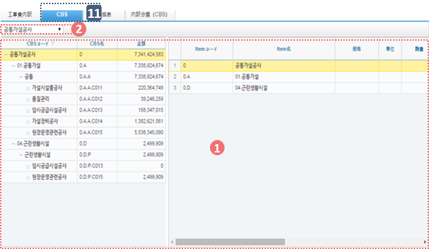

총괄표 탭
------------ 

.. image:: ../_images/B_0059.png

1. [총괄표] 탭에서는 직접공사비 항목과 산출근거 산식에 의해 도출된 간접비를 포함한 비용총괄 정보를 보여 줍니다.

내역분류(CBS)탭
--------------- 

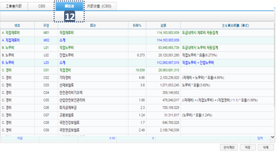

1. [내역분류(CBS)] 탭에서는 CBS의 코드를 등록, 관리 합니다.

하도급계약
==========

.. note::
  - 해당 시공계약에 대한 하도급계약 정보를 관리합니다.

1. 화면에서는 선택한 시공계약의 하도급계약 현황을 리스트로 제공 합니다.
2. 검색기능을 통해 하도급계약 현황을 검색 할 수 있습니다.
3. 계약내용에서는 ① 리스트에서 선택한 하도급계약의 상세정보를 표시합니다. 해당 하도급계약의 변경계약이 존재할 경우 최종 변경계약 정보가 표시 됩니다.
4. ‘삭제’ 버튼을 누르면 하도급계약에 관련된 모든 정보를 삭제 합니다.
5. 신규 하도급계약정보를 등록하려면 ③ 상단의 ‘추가’ 버튼을 클릭하여 계약정보를 작성하고 ‘저장’ 버튼을 눌러 입력된 계약정보를 저장합니다.
6. 기존 계약정보를 수정 하려면 내용수정 후 ‘저장’ 버튼을 눌러 수정된 내용을 저장 합니다

.. note::
  - [계약내용], [계약목록], [기성현황], [인력현황]의 탭을 선택 하면 각 탭에 해당하는 상세 관리페이지로 이동 합니다.

7. [계약내용] 탭에서는 계약기본 정보를 보여주며 계약관련 자료를 ‘첨부파일’ 버튼을 통해 등록 할 수 있습니다.
8. [계약목록] 탭에서는 해당 계약의 변경계약 이력을 보여주며, 계약일자, 계약금액, 변경사유, 변경계약관련 첨부파일 정보를 관리 합니다.
9. [기성현황] 탭에서는 해당 계약의 기성지급 이력을 보여주며, 기성산출기간, 신청일자, 전회/금회/누계 기성금 및 기성율 정보를 관리 합니다. 
10. [인력현황]탭에서는 하도급 계약의 인력현황 정보를 관리 합니다.

계약정보선택
---------------

.. image:: ../_images/B_0063.png

1. 계약정보가 표시되고, 다수의 계약일 경우 선택할 수 있습니다.

검색기능
---------------

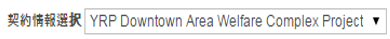

1. 계약명칭 및 계약코드로 계약 리스트를 검색할 수 있습니다.

 
삭제
-----------

1. ‘삭제’ 버튼은 계약에 관련된 모든 정보를 삭제하므로 주의를 요합니다.

 
계약내용
-----------

1. 하도급 기본 계약정보를 등록합니다.
2. 계약명칭, 계약구분, 하도급계약금액, 하도급계약일자, 하도급계약업체 등을 입력하여 저장합니다.
   하도급계약업체가 존재하지 않을 경우 ‘일반관리 > 조직관리 > 참여업체’ 메뉴에서 업체를 등록 후 사용합니다

계약목록
-----------

1. 변경 하도급 계약정보를 등록합니다.
2. ‘추가’ 버튼을 클릭한 후 신규 변경계약현황을 입력하고 ‘저장’버튼을 클릭하여 입력된 정보를 저장합니다.
3. 최근 변경계약정보가 [계약일반]에 반영됩니다.

기성현황
-----------

1. 기성이력 정보를 등록합니다.
2.‘추가’ 버튼을 클릭한 후 차수명, 지급일, 지급금액을 입력하고 ‘저장’ 버튼을 클릭하여 입력된 정보를 저장합니다.

인력현황
-----------

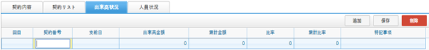

1. 하도급 인력현황 정보를 등록합니다.
2.‘추가’ 버튼을 클릭한 후 인력정보를 입력하고 ‘저장’ 버튼을 클릭하여 입력된 정보를 저장합니다.
3.‘엑셀양식 내려받기’ 버튼을 클릭하면 엑셀파일로 인력정보를 일괄등록 할 수 있는 템플릿 파일이 다운로드 됩니다.
4. 입력 후 ‘엑셀Upload’ 버튼으로 일괄 등록 처리가 가능합니다.

계약자료
========

.. note::
  - 해당 사업의 계약자료 산출물을 등록, 관리 합니다.
  - 계약자료에 등록된 자료는 조직(업체)별로 등록, 관리 되며, 제출/승인 받아야 할 자료의 경우 관련 조직에 Transmittal을 통해 제출 혹은 승인 받을 수 있습니다.
    자료는 분류체계에 따라 등록 가능하며 자료의 Revision 관리 및 조회/다운로드 이력관리가 가능 합니다.

1. 문서구분[FBS]에서는 자료분류체계를 Tree 형식으로 보여주며 상단의 검색기능을 통해 해당 분류로 바로 이동 할 수 있습니다.
   문서구분의 분류목록은 FBS 수정을 통해 사용자가 정의 할 수 있습니다.
2. 자료목록에서는 ①에서 선택한 분류체계 및 하위 분류체계에 등록된 모든 자료의 목록이 보여집니다.
   자료목록에서 등록된 자료를 더블클릭 하면 해당자료의 상세정보 페이지로 이동합니다. 상세정보 페이지의 자세한 내용은②을 참고 하십시오
3. 검색기능을 통해 조직구분, 결재상태, 조회기간, 작성자, 문서번호, 명칭 등 다양한 검색 조건으로 원하는 문서를 찾아 볼 수 있습니다.
4. 버튼 기능을 통해 등록된 자료의 조회 및 수정, 신규 자료 등록, 등록된 자료의 삭제가 가능하며, 선택한 자료의 분류체계 이동, Transmittal  발송, 자료의 일괄등록 및 다운로드가 가능 합니다.
5. ‘일괄등록’ 버튼 클릭 시 자료를 일괄 등록 할 수 있는 팝업 창이 나타나며 지정된 Excel 양식 및 압축첨부파일(.zip)을 통해 자료를 일괄등록 시킬 수 있습니다.
6. To Transmittal 기능을 통해 선택한 자료를 타 조직(업체)에게 송부하거나 검토/승인을 요청 할 수 있습니다.
   자료목록에서 자료선택 후 ‘To Transmittal’ 버튼을 클릭하면 Transmittal 작성화면으로 바로 이동하므로 메뉴이동 없이 편하게 Transmittal을 보낼 수 있습니다.
7. Auto Transmittal 기능을 이용하면 선택 자료를 이전에 보낸 Transmittal과 동일한 설정으로 다시 보낼 수 있습니다.
8. 내려받기 기능을 통해 선택 자료의 다수의 첨부 파일을 압축하여 .zip 파일로 한번에 다운로드 받을 수 있습니다.
9. 자료의 신규등록 및 수정, 조회 시 상세정보 페이지로 전환되며 상세정보 페이지는 ‘상세내용’, ‘Revision’, ‘Event Log’의 탭 기능으로 구성되어 있습니다.
 
  | ‘상세내용’ 탭에서는 목록에서 선택한 자료의 세부내용 조회, 수정 및 신규개정 이 가능 합니다.
  | ‘Revision’  탭에서는 해당 자료의 Revision 이력 및 상세정보를 확인할 수 있습니다.
  | ‘Event Log’ 탭에서는 해당 자료의 열람기록과 다운로드 기록을 확인 할 수 있습니다.

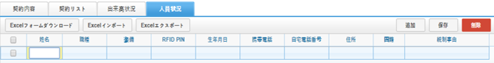

자료목록
-----------

 .. image:: ../_images/B_0072.png
 
 1. 자료목록에서는 등록된 자료의 등록번호, 명칭, Revision번호, Version, 분야,등록자 등의 정보가 표시되며, 동일한 등록번호에 대해 최종 Revision 자료만 목록에 표시 됩니다.
 2. ‘이력보기’를 체크하면 문서의 이전 Revision도 목록에 나타납니다.
 3. ‘Show Review Info’ 체크 시 문서의 Transmittal을 통한 검토결과 및 검토정보를 추가로 조회할 수 있습니다.
 4. 등록된 자료에 첨부파일이 있을 경우     아이콘이 표시되며,  해당 자료를 Transmittal을 통해 제출 혹은 승인요청 할 경우     아이콘이 표시됩니다. Transmittal을 통한 검토 및 승인이 진행중인 자료는      아이콘이 표시되며 검토 및 승인이 완료 되기 전까지 자료를 수정하거나 Revision 시킬 수 없습니다. 
    등록된 자료를 더블클릭 하면 해당자료의 상세정보 페이지로 이동합니다. 

검색기능
-----------

 .. image:: ../_images/B_0073.png
 
 1. 검색기능을 이용하여 등록된 문서를 조회 할 수 있습니다.
    검색조건 입력 후 ‘검색’버튼을 클릭 하면 해당 조건에 맞는 문서 목록이 조회 됩니다.
 2. ‘이력보기’를 체크하면 문서의 이전 Revision도 목록에 나타납니다.
 3. ‘Show Review Info’ 체크 시 문서의 Transmittal을 통한 검토결과 및   검토정보를 추가로 조회할 수 있습니다.
 4. 순서를 선택하면 자료목록이 선택한 컬럼으로 정렬되어 표시됩니다.

버튼기능
-----------

 .. image:: ../_images/B_0074.png
 
 1. ‘상세정보’ 버튼을 클릭하면 선택한 자료의 상세정보 페이지로 이동 합니다.
 2. 등록된 자료를 선택하고 ‘분류이동’ 버튼을 클릭하면 선택한 자료를 다른 자료분류로 이동 시킬 수 있습니다.
 3. ‘등록’ 버튼을 클릭하면 새로운 자료를 등록 할 수 있는 상세정보 페이지로 이동합니다.
 4. ‘일괄등록’ 버튼을 클릭하면 자료를 일괄 등록 할 수 있는 팝업 창이 나타나며 지정된 Excel 양식 및 압축첨부파일(.zip)을 통해 자료를 일괄등록 시킬 수 있습니다.
 5. ‘삭제’ 버튼을 클릭하면 등록된 자료를 삭제 할 수 있습니다.
 6. 자료를 선택하고 ‘To Transmittal’ 혹은 ‘Auto Transmittal’ 버튼을 클릭하면 선택 자료를 Transmittal 할 수 있으며, ‘내려받기’ 버튼을 누르면 등록된 파일을 다운로드 합니다.

일괄등록
-----------

 .. image:: ../_images/B_0075.png
 
 .. image:: ../_images/B_0076.png
 
 .. image:: ../_images/B_0077.png
 
 1. ‘엑셀양식 내려받기’ 버튼을 눌러 일괄등록 폼 양식을 내려 받은 후 양식 샘플을 참고하여 자료정보 및 파일 정보를 작성합니다.엑셀 파일과 함께 등록될 첨부파일을 압축하여 준비 합니다.
 2. 작성된 Excel 파일 및 압축첨부파일(.zip)을 선택하면 하단의 파일목록에 선택한 파일이 표시 되고 ‘임시저장’ 버튼을 클릭하면 파일을 서버에 업로드 합니다.파일 업로드가 끝나면 자료목록이 나타나며 확인 후 이상 없을 시 상단의 ’저장’ 버튼을 클릭하면 자료로 등록 됩니다.
 3. 저장 하지 않은 자료는 자료로 등록되지 않으며 창이 닫치면 삭제 됩니다.

To Transmittal
-----------------

 .. image:: ../_images/B_0078.png
 
 1. 자료목록에서 자료선택 후 ‘To Transmittal’ 버튼을 클릭하면 Transmittal 작성화면으로 이동 합니다.
 2. 선택한 자료는 Transmittal의 전송 자료로 자동 입력되어 보여지며, Transmittal 정보 입력 후 발송 합니다. 
 3. Transmittal 작성에 대한 상세내용은 본 매뉴얼 10.2.2 문서송부전 항목을 참고 하십시오.Transmittal을 통해 발송된 자료는 문서목록에 아이콘이 나타납니다.

Auto Transmittal
---------------------

 .. image:: ../_images/B_0079.png
 
 1. 이전 Revision의 자료가 이미 Transmittal을 통해 보내졌을 경우 신규 Revision된 자료는 이전 Transmittal 설정을 동일하게 사용할 수 있습니다. Auto Transmittal이 가능한 자료는 목록에        아이콘이 나타납니다.
 2. 자료 선택 후 ‘Auto Transmittal 버튼을 클릭하면 이전 Transmittal 이력이 나타나며 선택한 Transmittal과 동일한 설정으로 신규 Revision된 자료를 다시 보냅니다.
 3. Auto Transmittal 기능을 통해 자료의 검토/승인 과정 중 동일하게 발생하는 Transmittal 작성 작업을 줄일 수 있습니다. 

내려받기
--------------

 1. 자료목록에서 다운받기를 원하는 항목을 선택한 후 ‘내려받기’ 버튼을 클릭하면 해당 자료의 첨부 파일을 압축하여 .zip 파일로 다운로드 받을 수 있습니다.
 2. 다수의 자료를 다운받아야 할 경우 내려받기 기능 통해 상세정보 페이지를 거치지 않고 간편하게 첨부파일을 다운 받을 수 있습니다.

상세정보
--------------

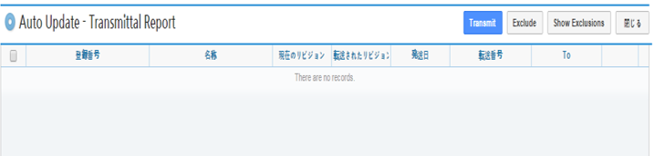
 
1. 상세정보 수정 후 ‘저장’ 버튼을 누르면 Revision 및 Version 변경 없이 수정된 내용으로 저장 됩니다. Revision을 새로 설정하거나 첨부파일을 교체 하였다면 일반저장이 불가능하며  ‘신규개정’ 버튼을 클릭하여 변경된 내용으로 신규 Revision을 생성 해야 합니다. Revision을 변경하지 않고 ‘신규개정’ 버튼을 클릭 할 경우 Revision은 변화가 없고 Version만 올라가게 됩니다. ‘닫기’ 버튼 클릭 시 자료목록 페이지로 돌아 갑니다.
2. 정보 영역에서는 등록번호(문서/도면 번호), 명칭, Revision 정보, 문서구분, 상태, 분야, 비문등급(보안등급)등 자료의 속성 정보를 관리 합니다.
3. 첨부파일 영역으로 해당 자료의 실 데이터인 파일을 등록 관리 합니다.첨부파일 변경 시 기존 첨부파일 폼에는 등록 할 수 없으며 반드시 ‘대체할 파일’ 버튼을 클릭하면 나타나는 새로운 첨부파일 등록 폼에 등록 해야 합니다.첨부파일이 변경되면 신규개정으로 저장 해야 하며, 일반 저장은 할 수 없습니다.
4. Transmittal 정보영역으로 Transmittal을 발송한 자료일 경우에만 정보가 나타납니다.
   해당 자료의 검토/승인 결과 및 Transmittal 정보가 표시 됩니다. 

  .. image:: ../_images/B_0081.png

5. 해당 자료의 Revision 이력 목록이 나타나며, Revision, Version, 명칭 등록자, 등록일자 정보가 표시 됩니다.
6. 선택한 Revision의 상세정보를 보여주며, 해당 Revision의 파일을 다운로드 받을 수 있습니다.

  .. image:: ../_images/B_0082.png

7. 해당 자료의 등록, 수정, Revision 이력 및 조회기록, 파일 다운로드 기록 등 자료에 관련된 모든 이벤트 Log를 발생 시간 순으로 보여 줍니다.
