.. _menu_Engineering:

설계관리
########

설계공정관리
**************

설계공정분석
============

.. note::
  - 프로젝트의 종합 설계공정현황을 보여 줍니다.

1. ECOA별 가중치, 계획, 실적, 대비율을 집계하여 보여 줍니다.
2. ① 에서 선택한 ECOA의 하위 항목 설계공정현황을 그래프로 표시하여 보여 줍니다.
3. ① 에서 선택한 ECOA에 속한 모든 항목 정보를 보여 줍니다.
4. 조회된 목록은 상태에 따라 전체, 정상, 주의, 지연 별로 조회가 가능 합니다.
5. 선택한 ECOA에 대한 분석 정보를 그래프로 보여 줍니다.

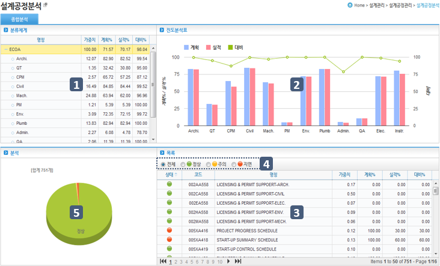

.. image:: ../_images/E_0002.png

분석정보
---------------

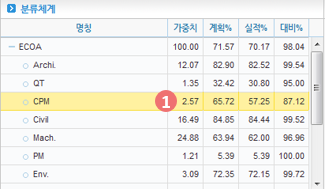

1. ② ,③ ,④  영역의 데이터는 선택한 ECOA 기준으로 나타나게 됩니다. 

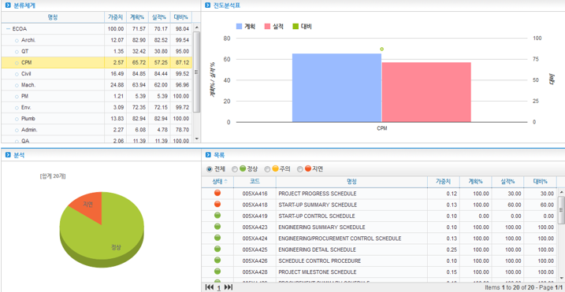

설계 S-Curve
============

.. note::
 - 설계공정현황을 S-Curve 형태로 분석합니다.

1. ‘돋보기’ 버튼을 클릭하여 EDS 목록 팝업을 호출합니다. EDS Code/Name으로 개별 EDS분석 데이터를 조회 할 수 있습니다.
2.  EDS 계획 및 실적 분석 데이터를 조회 조건에 따라 월별,분기별,연별로 제공 합니다.
3.  ① 과 ② 에서 선택한 EDS 및 기간 조회 조건에 따른 데이터를 그래프로 표시합니다.
4. ‘엑셀 내려받기’ 버튼을 이용하여 화면에 출력된 내용을 엑셀로 내려 받을 수 있습니다.

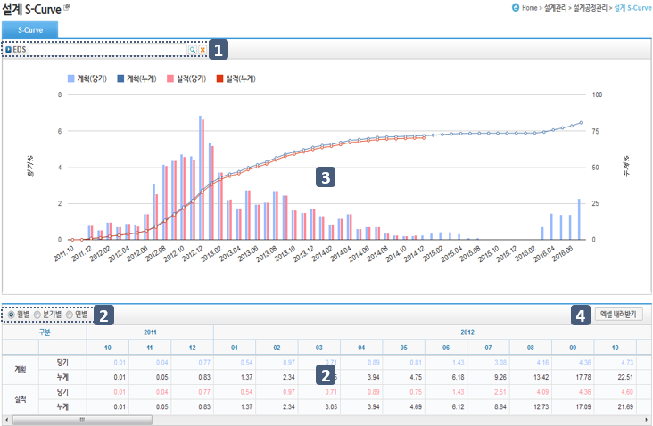

.. image:: ../_images/E_0006.png

EDS 목록 팝업
--------------

 .. image:: ../_images/E_0007.png
 
 1. EDS 목록 팝업에서 Code/Name으로 조회 할 수 있습니다.

데이터 조회 
--------------
 

 
1. 월,분기,연별로 데이터를 조회 할 수 있습니다.

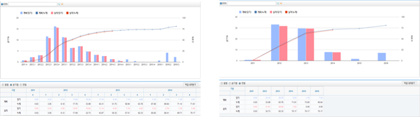

설계 Bar-Chart
==============

.. note::
  - ECOA, EDS 진도율을 Bar Chart 형태로 분석하여 보여 줍니다.

1. 해당 공사의 ECOA 정보를 트리 형태로 제공 합니다.
2. ① 에서 선택된 ECOA 항목이 ②영역에 Bar Chart 형태로 나타납니다. 
   Bar Chart 영역 상단 캘린더를 마우스로 드래그하여 기간을 확대, 축소 하여 볼 수 있습니다.
3. ①  ECOA 트리 영역과 ② Bar Chart 영역 사이를 마우스로 드래그 하여 각 영역의 너비를 조절 할 수 있습니다. 

.. note::
  - ECOA Chart 탭 
  
  .. image:: ../_images/E_0010.png

  .. image:: ../_images/E_0011.png

.. note::
  - ECOA Chart 탭
   
--------------
 
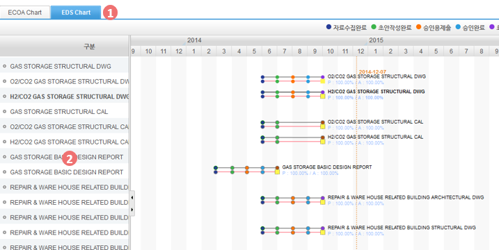
 
1. [EDS Chart] 탭 선택시  ①영역에 EDS 목록이 출력되어 나타나며 그 외 기능은 ECOA Chart의 기능과 동일 합니다.

Bar Chart 
--------------

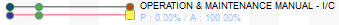
 
1. 상단Bar는 계획을 의미하고 하단 Bar는 그에 따른 실적을 나타냅니다

설계지연분석
============

.. note::
  - EDS 별 설계지연을 분석 합니다. 

1. 지연상황을 분석할 수 있는 정보를 제공하고, ② 영역에서 분야, 상태별 조회 조건을 설정할 수 있습니다.
2. 분야를 선택하여 각 분야별 지연상황을 조회할 수 있습니다.
3. ECOA Code, PBS Code 항목에서 각 항목을 팝업창을 통해 호출하여 검색 할 수 있습니다. 
4. 각 상태별 라디오버튼을 통해 지연뿐만이 아니라 정상진행중인 EDS도 조회할 수 있습니다.
5. [엑셀 내려받기] 버튼을 통해 엑셀양식으로 조회중인 데이터를 다운로드 할 수 있습니다.

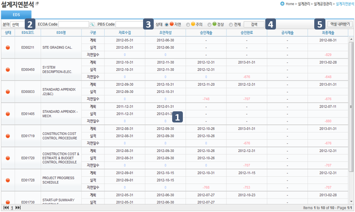

.. image:: ../_images/E_0015.png

상단바
--------------

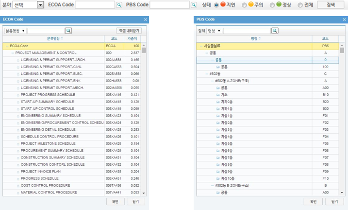

1. 분야, ECOA코드. PBS Code 지연상태별로 현황을 조회할 수 있습니다.

표준정보관리
**************

설계계정코드
============

.. note::
  - 해당 사업의 ECOA(설계계정코드) 목록을 관리 합니다.

1. 등록된 ECOA 항목을 트리 형태로 보여 줍니다.
2. 선택된 ECOA 항목의 상세내용을 관리 합니다.
3. 검색기능을 통해 분류명칭/코드로 등록된 ECOA 목록을 조회 할 수 있습니다.
4. ‘엑셀 올리기’ 기능을 통해 엑셀로 작업된 ECOA 목록을 업로드 할 수 있습니다.
5. ‘엑셀 내려받기’ 기능을 통해 ECOA 목록을 엑셀로 내려 받을 수 있습니다.
6. ECOA의 등록 방법은 ‘추가’ 버튼을 클릭하여 상세 내용을 입력하고 ‘저장’ 버튼을 클릭하면 저장 됩니다. ‘삭제’ 기능은 ① 영역에서 선택된 ECOA 항목을 삭제 합니다.
7. [EDS] 탭을 클릭하면 ① 영역에서 선택된 ECOA 항목의 EDS를 관리 합니다.

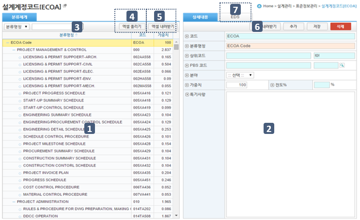

검색기능
--------------

 
1. 분야,계획일자,단계를 설정하고 해당되는 데이터를 엑셀로 내려 받을 수 있습니다.
 
.. image:: ../_images/E_0019.png

엑셀 내려받기
--------------

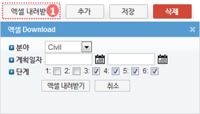
 
1. 분야,계획일자,단계를 설정하고 해당되는 데이터를 엑셀로 내려 받을 수 있습니다.

EDS 탭
--------------

 .. image:: ../_images/E_0021.png
 
 1. ‘수정’ 버튼을 클릭하면 EDS를 연결 할 수 있는 팝업 창이 열립니다. 
 2. ‘+’, ‘-’ 로 EDS 를 추가, 삭제 할 수 있고 ‘저장’ 버튼을 누르면 우측 항목을 기준으로 저장 됩니다.

설계EDS
=======

 .. note::
  - 해당 사업의 설계EDS 목록을 관리 합니다.

 1. 등록된 EDS 항목을 보여 줍니다.
 2. ① 영역에서 선택된 EDS 항목의 EDS 정보를 관리합니다.
 3. Step 정보를 관리합니다.
 4. EDS 등록 방법은 ‘추가’ 버튼을 클릭하여 상세 내용을 입력 후 시공 Activity를 연결합니다. 입력된 내용은 ‘저장’ 버튼을 클릭하여 저장하고 ‘삭제’ 버튼으로 EDS 항목을 선택하여 삭제 할 수 있습니다.
 

 .. image:: ../_images/E_0022.png

 .. image:: ../_images/E_0023.png

EDS 정보
-------------- 

 .. image:: ../_images/E_0024.png
 
 1. 시공 Activity를 연결하는 팝업 조회 화면 입니다. 연결 할 Activity를 선택하면 EDS 정보에 출력됩니다.

Step 정보
-------------- 

 .. image:: ../_images/E_0025.png
 
 1. Step Type을 선택하면 선택된 Step Type에 정의된 Step목록이 하단에 나타납니다.
 2. Step Type에 대한 정의는 ‘설계관리 > 표준정보관리 > Step 설정’ 메뉴에서 관리 합니다.

검색기능
-------------- 

 .. image:: ../_images/E_0026.png
 
 1.  분류명칭 및 코드로 설계계정코드 리스트를 검색할 수 있습니다.

Step 설정
=========

 .. note::  
  - 해당 사업의 Step Type 정보를 관리 합니다.

 1. 등록된 Step Type 목록을 보여 줍니다.
 2. ① 영역에서 선택된 Step Type 의 상세내용을 보여 줍니다.
 3. Step Type 등록 방법은 ‘추가’ 버튼을 클릭하여 Step 정보와 Step 항목을 입력하고 ‘저장’ 버튼을 클릭하면 입력된 내용이 저장합니다. ‘삭제’ 기능은 ① 영역에서 선택된 Step 항목을 삭제 합니다.
 4. 등록된 Step Type은  설계 EDS의 스텝 설정 시 사용 됩니다.

 .. note:: 
  - Step Type의 추가, 수정, 삭제 시 이미 등록된 관련 설계 데이터에 영향을 줄 수 있으므로 주의가 필요합니다.

 .. image:: ../_images/E_0027.png

 .. image:: ../_images/E_0028.png 

Step 설정
-------------- 

 .. image:: ../_images/E_0029.png 
 
 1. Step 설정 시 사용할 항목을 체크박스에 체크하고 명칭, 가중치, 공기를 입력하세요.
 2. 가중치의 합은 100%가 되어야 합니다.

설계진도관리
**************

설계진도
========

 .. note::
  - 해당 사업의 ECOA,분야,PBS별 설계 진도를 관리 합니다.

 1. 선택된 항목은 하단 ② 영역에 EDS 코드별로 조회 됩니다.
    [ECOA], [분야], [PBS] 탭 별로 조회가 가능합니다.
 2. [진도], [집계], [분석] 탭으로 구분 됩니다. 
    각 탭을 선택하여 ①영역에서 선택한 항목에 대한 정보를 각각의 방법으로 조회할 수 있습니다.

 .. image:: ../_images/E_0030.png 

 .. image:: ../_images/E_0031.png 

진도, 집계, 분석탭
-------------------  

 .. image:: ../_images/E_0032.png 
 
 1. 실적 항목을 사용자가 직접 입력합니다

 .. image:: ../_images/E_0033.png  
 
 .. image:: ../_images/E_0034.png 
 
 2. 선택한 탭에 맞는 정보를 표시합니다. 

부진만회대책
============

 .. note::
  - 해당 사업의 EDS 별 .부진만회대책을 관리 합니다.

 1. EDS 목록을 조회합니다. 
 2. 조회 조건에서는 EDS코드, 지연/전체, 분야 등을 조회 할 수 있고 결과에 따른 EDS 목록이 조회 됩니다.
 3. 우측 상단의 만회대책을 체크하면 시정조치/만회대책이 입력된 목록만 조회 합니다.
 4. 선택된 EDS 항목의 지연사유 및 만회대책을 관리 합니다.
 5. ‘엑셀 내려받기’ 버튼을 클릭하여 부진만회대책 목록을 다운로드 합니다.

 .. image:: ../_images/E_0035.png 

 .. image:: ../_images/E_0036.png 
 
엑셀 내려받기
------------------

 .. image:: ../_images/E_0037.png 

현장설계, 설계VE, 설계도면/도서 관리
************************************

현장설계, 설계VE, 설계도면/도서 관리
====================================

 .. note::
  - 현장설계관리, 설계VE관리, 설계도면/도서는 동일한 문서관리 형태를 갖습니다.
  - 설계관리문서에 등록된 자료는 조직(업체)별로 등록, 관리 되며, 제출/승인 받아야 할 자료는 관련 조직에 Transmittal을 통해 제출 혹은 승인 받을 수 있습니다.
    자료는 분류체계에 따라 등록 가능하며 자료의 Revision 관리 및 조회/다운로드 이력관리가 가능 합니다.
    
 1. 문서구분[FBS]에서는 자료분류체계를 Tree 형식으로 보여주며 상단의 검색기능을 통해 해당 분류로 바로 이동 할 수 있습니다.
    문서구분의 분류목록은 FBS 수정을 통해 사용자가 정의 할 수 있습니다.
 2. 자료목록에서는①에서 선택한 분류체계 및 하위 분류체계에 등록된 모든 자료의 목록이 보여집니다.
    자료목록에서 등록된 자료를 더블클릭 하면 해당자료의 상세정보 페이지로 이동합니다. 상세정보 페이지의 자세한 내용은②을 참고 하십시오
 3. 검색기능을 통해 조직구분, 결재상태, 조회기간, 작성자, 문서번호, 명칭 등 다양한 검색 조건으로 원하는 문서를 찾아 볼 수 있습니다.
 4. 버튼 기능을 통해 등록된 자료의 조회 및 수정, 신규 자료 등록, 등록된 자료의 삭제가 가능하며, 선택한 자료의 분류체계 이동, Transmittal  발송, 자료의 일괄등록 및 다운로드가 가능 합니다.
 5. ‘일괄등록’ 버튼 클릭 시 자료를 일괄 등록 할 수 있는 팝업 창이 나타나며 지정된 Excel 양식 및 압축첨부파일(.zip)을 통해 자료를 일괄등록 시킬 수 있습니다.
 6. To Transmittal 기능을 통해 선택한 자료를 타 조직(업체)에게 송부하거나 검토/승인을 요청 할 수 있습니다.
    자료목록에서 자료선택 후 ‘To Transmittal’ 버튼을 클릭하면 Transmittal 작성화면으로 바로 이동하므로 메뉴이동 없이 편하게 Transmittal을 보낼 수 있습니다.
 7. Auto Transmittal 기능을 이용하면 선택 자료를 이전에 보낸 Transmittal과 동일한 설정으로 다시 보낼 수 있습니다.
 8. 내려받기 기능을 통해 선택 자료의 다수의 첨부 파일을 압축하여 .zip 파일로 한번에 다운로드 받을 수 있습니다.
 9. 자료의 신규등록 및 수정, 조회 시 상세정보 페이지로 전환되며 상세정보 페이지는 ‘상세내용’, ‘Revision’, ‘Event Log’의 탭 기능으로 구성되어 있습니다.
    ‘상세내용’ 탭에서는 목록에서 선택한 자료의 세부내용 조회, 수정 및 신규개정 이 가능 합니다.
    ‘Revision’  탭에서는 해당 자료의 Revision 이력 및 상세정보를 확인할 수 있습니다.
    ‘Event Log’ 탭에서는 해당 자료의 열람기록과 다운로드 기록을 확인 할 수 있습니다.

 .. image:: ../_images/E_0038.png 

 .. image:: ../_images/E_0039.png 

자료목록
------------------

 .. image:: ../_images/E_0040.png 
 
 1. 자료목록에서는 등록된 자료의 등록번호, 명칭, Revision번호, Version, 분야,등록자 등의 정보가 표시되며, 동일한 등록번호에 대해 최종 Revision 자료만 목록에 표시 됩니다.
 2. ‘이력보기’를 체크하면 문서의 이전 Revision도 목록에 나타납니다.
 3. ‘Show Review Info’ 체크 시 문서의 Transmittal을 통한 검토결과 및 검토정보를 추가로 조회할 수 있습니다.
 4. 등록된 자료에 첨부파일이 있을 경우        아이콘이 표시되며,  해당 자료를 Transmittal을 통해 제출 혹은 승인요청 할 경우     아이콘이 표시됩니다. Transmittal을 통한 검토 및 승인이 진행중인 자료는      아이콘이 표시되며 검토 및 승인이 완료 되기 전까지 자료를 수정하거나 Revision 시킬 수 없습니다. 
 5. 등록된 자료를 더블클릭 하면 해당자료의 상세정보 페이지로 이동합니다. 

검색기능
------------------

 .. image:: ../_images/E_0041.png
  
 1. 검색기능을 이용하여 등록된 문서를 조회 할 수 있습니다.
 2. 검색조건 입력 후 ‘검색’버튼을 클릭 하면 해당 조건에 맞는 문서 목록이 조회 됩니다.
 3. ‘이력보기’를 체크하면 문서의 이전 Revision도 목록에 나타납니다.
 4. ‘Show Review Info’ 체크 시 문서의 Transmittal을 통한 검토결과 및   검토정보를 추가로 조회할 수 있습니다.
 5. 순서를 선택하면 자료목록이 선택한 컬럼으로 정렬되어 표시됩니다.

버튼기능
------------------

 .. image:: ../_images/E_0042.png 
 
 1. ‘상세정보’ 버튼을 클릭하면 선택한 자료의 상세정보 페이지로 이동 합니다.
 2. 등록된 자료를 선택하고 ‘분류이동’ 버튼을 클릭하면 선택한 자료를 다른 자료분류로 이동 시킬 수 있습니다.
 3. 등록’ 버튼을 클릭하면 새로운 자료를 등록 할 수 있는 상세정보 페이지로 이동합니다.
 4. ‘일괄등록’ 버튼을 클릭하면 자료를 일괄 등록 할 수 있는 팝업 창이 나타나며 지정된 Excel 양식 및 압축첨부파일(.zip)을 통해 자료를 일괄등록 시킬 수 있습니다.
 5. ‘삭제’ 버튼을 클릭하면 등록된 자료를 삭제 할 수 있습니다.
 6. 자료를 선택하고 ‘To Transmittal’ 혹은 ‘Auto Transmittal’ 버튼을 클릭하면 선택 자료를 Transmittal 할 수 있으며, ‘내려받기’ 버튼을 누르면 등록된 파일을 다운로드 합니다.

일괄등록
------------------

 .. image:: ../_images/E_0043.png 

 .. image:: ../_images/E_0044.png 

 .. image:: ../_images/E_0045.png 

 1. ‘엑셀양식 내려받기’ 버튼을 눌러 일괄등록 폼 양식을 내려 받은 후 양식 샘플을 참고하여 자료정보 및 파일 정보를 작성합니다.엑셀 파일과 함께 등록될 첨부파일을 압축하여 준비 합니다.
 2. 작성된 Excel 파일 및 압축첨부파일(.zip)을 선택하면 하단의 파일목록에 선택한 파일이 표시 되고 ‘임시저장’ 버튼을 클릭하면 파일을 서버에 업로드 합니다.파일 업로드가 끝나면 자료목록이 나타나며 확인 후 이상 없을 시 상단의 ’저장’ 버튼을 클릭하면 자료로 등록 됩니다.
 3. 저장 하지 않은 자료는 자료로 등록되지 않으며 창이 닫치면 삭제 됩니다.

To Transmittal
------------------

 .. image:: ../_images/E_0046.png
  
 1. 자료목록에서 자료선택 후 ‘To Transmittal’ 버튼을 클릭하면 Transmittal 작성화면으로 이동 합니다.
 2. 선택한 자료는 Transmittal의 전송 자료로 자동 입력되어 보여지며, Transmittal 정보 입력 후 발송 합니다.
 3. Transmittal 작성에 대한 상세내용은 본 매뉴얼 10.2.2 문서송부전 항목을 참고 하십시오.Transmittal을 통해 발송된 자료는 문서목록에  아이콘이 나타납니다.

Auto Transmittal
------------------

 .. image:: ../_images/E_0047.png 
 
 1. 이전 Revision의 자료가 이미 Transmittal을 통해 보내졌을 경우 신규 Revision된 자료는 이전 Transmittal 설정을 동일하게 사용할 수 있습니다. Auto Transmittal이 가능한 자료는 목록에        아이콘이 나타납니다.
 2. 자료 선택 후 ‘Auto Transmittal 버튼을 클릭하면 이전 Transmittal 이력이 나타나며 선택한 Transmittal과 동일한 설정으로 신규 Revision된 자료를 다시 보냅니다.
 3. Auto Transmittal 기능을 통해 자료의 검토/승인 과정 중 동일하게 발생하는 Transmittal 작성 작업을 줄일 수 있습니다. 

내려받기
------------------

 1. 자료목록에서 다운받기를 원하는 항목을 선택한 후 ‘내려받기’ 버튼을 클릭하면 해당 자료의 첨부 파일을 압축하여 .zip 파일로 다운로드 받을 수 있습니다.
 2. 다수의 자료를 다운받아야 할 경우 내려받기 기능 통해 상세정보 페이지를 거치지 않고 간편하게 첨부파일을 다운 받을 수 있습니다.

상세정보
------------------

 .. image:: ../_images/E_0048.png
 
 1. 상세정보 수정 후 ‘저장’ 버튼을 누르면 Revision 및 Version 변경 없이 수정된 내용으로 저장 됩니다. Revision을 새로 설정하거나 첨부파일을 교체 하였다면 일반저장이 불가능하며  ‘신규개정’ 버튼을 클릭하여 변경된 내용으로 신규 Revision을 생성 해야 합니다. Revision을 변경하지 않고 ‘신규개정’ 버튼을 클릭 할 경우 Revision은 변화가 없고 Version만 올라가게 됩니다. ‘닫기’ 버튼 클릭 시 자료목록 페이지로 돌아 갑니다.
 2. 정보 영역에서는 등록번호(문서/도면 번호), 명칭, Revision 정보, 문서구분, 상태, 분야, 비문등급(보안등급)등 자료의 속성 정보를 관리 합니다.
 3. 첨부파일 영역으로 해당 자료의 실 데이터인 파일을 등록 관리 합니다.첨부파일 변경 시 기존 첨부파일 폼에는 등록 할 수 없으며 반드시 ‘대체할 파일’ 버튼을 클릭하면 나타나는 새로운 첨부파일 등록 폼에 등록 해야 합니다.첨부파일이 변경되면 신규개정으로 저장 해야 하며, 일반 저장은 할 수 없습니다.
 4. Transmittal 정보영역으로 Transmittal을 발송한 자료일 경우에만 정보가 나타납니다.
    해당 자료의 검토/승인 결과 및 Transmittal 정보가 표시 됩니다. 

    .. image:: ../_images/E_0049.png
 
 5. 해당 자료의 Revision 이력 목록이 나타나며, Revision, Version, 명칭 등록자, 등록일자 정보가 표시 됩니다.
 6. 선택한 Revision의 상세정보를 보여주며, 해당 Revision의 파일을 다운로드 받을 수 있습니다.

    .. image:: ../_images/E_0050.png
 
 7. 해당 자료의 등록, 수정, Revision 이력 및 조회기록, 파일 다운로드 기록 등 자료에 관련된 모든 이벤트 Log를 발생 시간 순으로 보여 줍니다.

