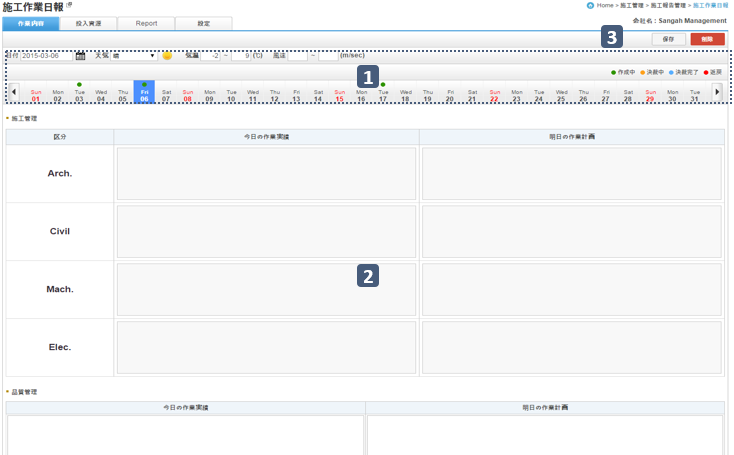
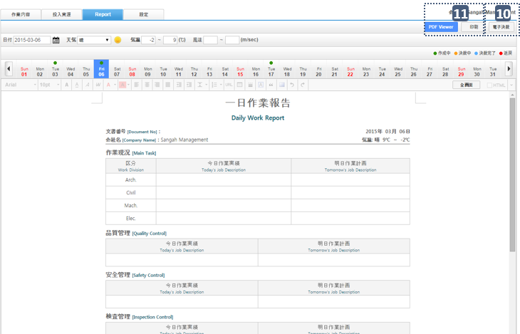
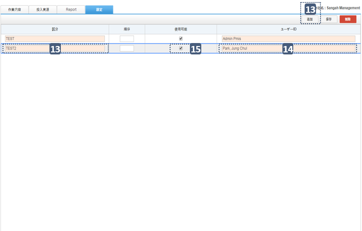
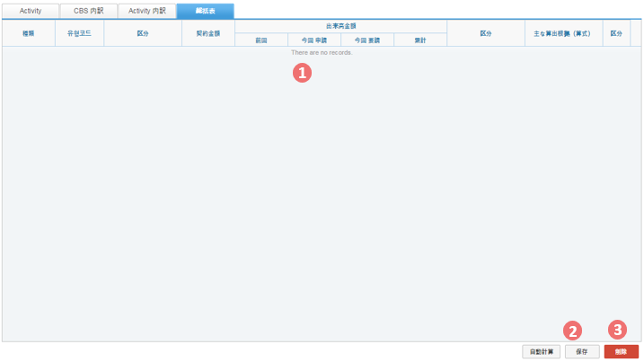
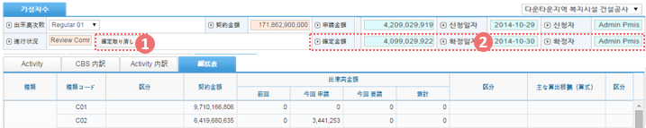
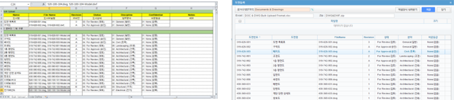
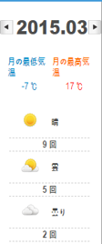

.. _menu_Construction:

시공관리
########

CM보고관리
**********

CM업무일지(1/5)
==================

 .. note::
  - CM업무일지를 작성, 조회합니다.
  - CM업무일지는 로그인 사용자의 권한에 따라 책임사업관리자 업무일지와 보조사업관리자 업무일지를 작성, 관리 할 수 있습니다.

 1. 일자 검색이 가능한 캘린더와 날씨정보, 작성 및 결재진행정보가 표시됩니다. 캘린더 양 옆의 화살표 버튼 클릭 시 이전월, 다음월로 이동 합니다.
 2. 리스트에서는 해당 사업의 사업관리자 목록이 나타나며, 리스트의 첫 라인에 책임사업관리자가 나타나며, 그 밑으로 분야별 보조사업관리자 리스트가 나타납니다. 상단의 [설정] 탭에서 사업관리자의 지정 및 관리가 가능합니다.
 3. ② 리스트에서 선택한 사용자가 해당 일자에 작성한 업무일지 내용이 나타납니다. 
    ② 리스트에서 선택한 사용자가 책임사업관리자면 책임사업관리자 업무일지가 나타나며, 그 외 사용자일 경우 보조사업관리자 업무일지가 나타납니다. 선택한 사용자 본인일 경우만 작성 및 수정이 가능하며 다른 사용자일 경우 조회만 가능 합니다.

 .. image:: ../_images/C_0001.png

일자검색
--------

 .. image:: ../_images/C_0002.png

 1. 상단의 일자 검색을 통해 해당일자로 바로 이동 할 수 있습니다.
 2. 날씨 및 기온 정보는 온라인 기상사이트에서 자동으로 가져와서 보여 주며 풍속 정보는 필요 시 사용자가 직접 입력 해야 합니다.
 3. 기상사이트에서 자동으로 가져온 기상 정보는 사용자가 수정 할 수 있으며, 수정 후에는 해당일자의 기상정보가 수정된 기상정보로 표시 됩니다.
 4. 수정된 기상정보는 해당 업무일지 저장 시 같이 저장 됩니다.

 .. image:: ../_images/C_0003.png

 5. ②리스트에서 선택한 사용자의 업무일지 작성여부 및 결재진행상황이 캘린더의 해당일자 상단에 아이콘으로 표시 됩니다
 6. 아이콘은 색상에 따라 -작성중, -결재중, -결재완료, -반려의 상태를 나타냅니다.
 7. 아이콘이 없는 일자는 업무일지가 작성되지 않은 날이며, 선택 시 ‘새로운 보고서 생성’ 라인이 나타나며 클릭하면 업무일지를 작성 할 수 있습니다. 

사업관리자 List
----------------

 .. image:: ../_images/C_0004.png

 1. ② 리스트의 사용자 별 업무일지 작성여부 및 결재진행상황이 ‘작성’ 컬럼에 아이콘으로 표시 됩니다
 2. 아이콘이 없는 사용자는 업무일지를 작성하지 않은 사용자를 의미 합니다.

CM업무일지(2/5)
=================

 4. 책임사업관리자 업무일지는 주요작업, 개별작업, 수신문서현황, 발신문서현황의 부문으로 구성되어 있으며 보조사업관리자 업무일지 내용이 자동 취합되어 보여 지므로 보조사업관리자의 업무일지 작성이 모두 끝난 후 작성해야 합니다.
 5. 주요작업 부문에서는 공종별 작업현황을 작성 합니다. 상단의 ‘+’, ‘_’ 버튼을 통해 새로운 작업항목을 추가하거나 기존 작업항목을 삭제 할 수 있습니다.
 6. 업무일지 작성 시 전일에 작성한 주요작업을 자동으로 가져오므로 일부 수정만으로 쉽게 작성이 가능 합니다.
 7. 개별작업 부문은 보조사업관리자 업무일지의 ‘금일요약’ 항목이 사용자 별로 자동으로 취합되어 ‘주요업무 수행내용’ 항목에 보여 집니다. 책임사업관리자는 자신의 ‘주요업무 수행내용’과 보조사업관리자의 ‘사업관리단장 지시사항’ 항목을 작성 합니다.
 8. 수신문서현황 부문은 해당 일자의 수신문서 목록을 자동으로 취합하여 보여 줍니다.
 9. 발신문서현황 부문은 해당 일자의 발신문서 목록을 자동으로 취합하여 보여 줍니다.

 .. image:: ../_images/C_0005.png

주요작업
---------

 1. 공종별 작업현황을 작성 합니다.
 2. 상단의 ‘+’ 버튼을 눌러 새로운 주요작업 항목을 추가 할 수 있습니다.
 3. 상단의 ‘-’ 버튼을 누르면 선택한 주요작업을 삭제 할 수 있습니다.
 4. 작성된 주요작업은 다음 일자의 업무일지 작성 시 자동으로 가져 옵니다. 

개별작업
---------

 .. image:: ../_images/C_0006.png

 1. 사업관리자 개개인의 주요업무 수행내용 및 지시사항을 작성, 조회 합니다.

수/발신문서현황
----------------

 .. image:: ../_images/C_0007.png

 1. 해당 일자의 문서 수/발신 내용이 있을 경우 목록을 자동으로 가져와 보여 줍니다.

CM업무일지(3/5)
=================

 10. 보조사업관리자 업무일지는 시간대별 업무내용, 특기사항, 금일요약의 부문으로 구성되어 있으며 보조사업관리자 업무일지 ‘금일요약’ 내용이 책임사업관리자 업무일지에 자동 취합되어 보여져 책임사업관리자 업무일지 보다 먼저 작성되어야 합니다.
 11. 시간대별 업무내용 부문에서는 보조사업관리자의 시간대별 작업내용을 작성 합니다. 상단의 ‘+’, ‘_’ 버튼을 통해 새로운 시간대 항목을 추가하거나 기존 시간대 항목을 삭제 할 수 있습니다.
 12. 업무일지 작성 시 전일에 작성한 업무내용을 자동으로 가져오므로 일부 수정만으로 쉽게 작성이 가능 합니다.
 13. 특기사항 부문은 해당일자의 특기사항이 있을 경우 작성 합니다.
 14. 금일요약 부문은 보조사업관리자 업무내용을 요약하여 작성하며 작성된 내용은 책임사업관리자 업무일지에 자동으로 취합 됩니다.

 .. image:: ../_images/C_0008.png

보조사업관리자 업무일지
------------------------

 1. ①리스트에서 보조사업관리자를 선택하면 해당일자의 보조사업관리자 업무일지가 나타납니다. 선택한 보조사업관리자 본인일 경우 업무일지의 등록, 수정이 가능하며, 다른 사용자일 경우 조회만 가능 합니다

시간대별 업무내용
-------------------

 .. image:: ../_images/C_0009.png

 1. 시간대별 업무내용을 작성 합니다.
 2. 상단의 ‘+’ 버튼을 눌러 새로운 시간대를 추가 할 수 있습니다
 3. 상단의 ‘-’ 버튼을 누르면 선택한 시간대를 삭제 할 수 있습니다.
 4. 작성된 시간대별 업무내용은 다음 일자의 업무일지 작성 시 자동으로 가져 옵니다. 

특기사항
----------

 .. image:: ../_images/C_00010.png

 1. 해당일자의 특기사항이 있을 경우 작성 합니다.

금일요약
----------

 .. image:: ../_images/C_00011.png

 1. 보조사업관리자 업무내용을 요약하여 작성하며 작성된 내용은 책임사업관리자 업무일지에 자동 취합 됩니다.

CM업무일지(4/5)
=================

 15. [Report]탭을 선택하면 작성된 업무일지를 자동으로 Report로 만들어 화면에 출력 합니다.
 16. Report 상단의 ‘전자결재’ 버튼을 누르면 해당 Report를 전재결재 합니다.
 17. 전자결재의 자세한 내용은 문서/자료관리 매뉴얼을 참고 하십시오.
 18. Report는 PDF문서나 Doc문서로 변환하여 저장 하거나 프린터를 통해 인쇄 가능 합니다.

 .. image:: ../_images/C_00013.png

Report 탭
-----------
 .. image:: ../_images/C_00012.png

 1. 작성된 업무일지 내용을 등록된 Report 폼에 맞추어 자동으로 문서로 만들어 줍니다.

Report 변환/인쇄
-----------------

 1. 등록된 업무일지 문서는 DOC 혹은 PDF로 변환하여 저장 할 수 있습니다.
 2. ‘인쇄’ 버튼을 클릭하면 Report를 프린터로 출력 합니다.
 3. ‘전자결재’ 버튼을 클릭하면 결재선 지정 팝업창이 나타나며 결재선 지정 후 저장 하면 결재 프로세스를 수행 합니다.

CM업무일지(5/5)
=================

 19. [설정]탭에서는 해당사업의 사업관리자를 등록, 관리 합니다.
 20. 설정 리스트의 ‘담당’ 항목은 책임사업관리자와 보조사업관리자, 단기사업관리자의 구분이며 등록된 담당에 맞는 업무일지를 작성할 수 있습니다.
 21. 설정 리스트의 ‘구분’ 에서는 담당 분야 혹은 업무를 선택 하십시오. 구분 코드는 공통코드에서 관리 할 수 있습니다.
 22. 사용자ID 항목에서 사용자를 지정하면 설정한 항목과 실제 사용자가 연결 됩니다. 
 23. 사용여부의 체크를 해제하면 해당 사용자는 일지작성 시 제외 됩니다.

설정 탭
---------

 .. image:: ../_images/C_00014.png

 1. 책임사업관리자 및 보조사업관리자를 등록, 관리 합니다.
 2. 책임사업관리자는 상단에 Default 항목으로 고정되어 나타나며 사용자 및 구분(담당업무) 만 지정 할 수 있습니다. 
 3. ‘추가’ 버튼을 클릭하면 하단에 새로운 Row가 추가되고 담당자를 지정 할 수 있습니다

 .. image:: ../_images/C_00015.png

 .. image:: ../_images/C_00016.png

 4. 구분’ 항목은 해당 사용자의 담당분야를 지정하는 것으로 공통코드에서 항목을 추가하거나 삭제 할 수 있습니다.
 5. ‘추가’ 버튼을 클릭하면 하단에 새로운 Row가 추가되고 담당자를 지정 할 수 있습니다

CM 주간/월간 보고(1/4) 
=======================

 - 해당 사업의 CM주간보고서, CM월간보고서를 등록, 관리 합니다. 
 - CM주간/월간 보고에 등록된 자료는 조직(업체)별로 등록, 관리 되며, 제출/승인 받아야 할 자료의 경우 관련 조직에 Transmittal을 통해 제출 혹은 승인 받을 수 있습니다.
   자료는 분류체계에 따라 등록 가능하며 자료의 Revision 관리 및 조회/다운로드 이력관리가 가능 합니다.
    
 1. 문서구분[FBS]에서는 자료분류체계를 Tree 형식으로 보여주며 상단의 검색기능을 통해 해당 분류로 바로 이동 할 수 있습니다.
    문서구분의 분류목록은 FBS 수정을 통해 사용자가 정의 할 수 있습니다.
 2. 자료목록에서는 ①에서 선택한 분류체계 및 하위 분류체계에 등록된 모든 자료의 목록이 보여집니다.
    자료목록에서 등록된 자료를 더블클릭 하면 해당자료의 상세정보 페이지로 이동합니다. 상세정보 페이지의 자세한 내용은 ②을 참고 하십시오

 .. image:: ../_images/C_00017.png

자료목록
---------

 .. image:: ../_images/C_00018.png

 1. 자료목록에서는 등록된 자료의 등록번호, 명칭, Revision번호, Version, 분야,등록자 등의 정보가 표시되며, 동일한 등록번호에 대해 최종 Revision 자료만 목록에 표시 됩니다
 2. ‘이력보기’를 체크하면 문서의 이전 Revision도 목록에 나타납니다.
 3. ‘Show Review Info’ 체크 시 문서의 Transmittal을 통한 검토결과 및 검토정보를 추가로 조회할 수 있습니다.
 4. 등록된 자료에 첨부파일이 있을 경우        아이콘이 표시되며,  해당 자료를 Transmittal을 통해 제출 혹은 승인요청 할 경우     아이콘이 표시됩니다. Transmittal을 통한 검토 및 승인이 진행중인 자료는      아이콘이 표시되며 검토 및 승인이 완료 되기 전까지 자료를 수정하거나 Revision 시킬 수 없습니다. 
 5. 등록된 자료를 더블클릭 하면 해당자료의 상세정보 페이지로 이동합니다. 

CM 주간/월간 보고(2/4) 
=======================

 3. 검색기능을 통해 조직구분, 결재상태, 조회기간, 작성자, 문서번호, 명칭 등 다양한 검색 조건으로 원하는 문서를 찾아 볼 수 있습니다.
 4. 버튼 기능을 통해 등록된 자료의 조회 및 수정, 신규 자료 등록, 등록된 자료의 삭제가 가능하며, 선택한 자료의 분류체계 이동, Transmittal  발송, 자료의 일괄등록 및 다운로드가 가능 합니다.
 5. ‘일괄등록’ 버튼 클릭 시 자료를 일괄 등록 할 수 있는 팝업 창이 나타나며 지정된 Excel 양식 및 압축첨부파일(.zip)을 통해 자료를 일괄등록 시킬 수 있습니다.

검색기
---------

 .. image:: ../_images/C_00019.png

 1. 검색기능을 이용하여 등록된 문서를 조회 할 수 있습니다. 검색조건 입력 후 ‘검색’버튼을 클릭 하면 해당 조건에 맞는 문서 목록이 조회 됩니다.
 2. ‘이력보기’를 체크하면 문서의 이전 Revision도 목록에 나타납니다.
 3. ‘Show Review Info’ 체크 시 문서의 Transmittal을 통한 검토결과 및   검토정보를 추가로 조회할 수 있습니다.
 4. 순서를 선택하면 자료목록이 선택한 컬럼으로 정렬되어 표시됩니다.

버튼기능
---------

 .. image:: ../_images/C_00020.png

 1. ‘상세정보’ 버튼을 클릭하면 선택한 자료의 상세정보 페이지로 이동 합니다.
 2.   등록된 자료를 선택하고 ‘분류이동’ 버튼을 클릭하면 선택한 자료를 다른 자료분류로 이동 시킬 수 있습니다.
 3. ‘등록’ 버튼을 클릭하면 새로운 자료를 등록 할 수 있는 상세정보 페이지로 이동합니다.
 4. ‘일괄등록’ 버튼을 클릭하면 자료를 일괄 등록 할 수 있는 팝업 창이 나타나며 지정된 Excel 양식 및 압축첨부파일(.zip)을 통해 자료를 일괄등록 시킬 수 있습니다.
 5. ‘삭제’ 버튼을 클릭하면 등록된 자료를 삭제 할 수 있습니다.
 6.   자료를 선택하고 ‘To Transmittal’ 혹은 ‘Auto Transmittal’ 버튼을 클릭하면 선택 자료를 Transmittal 할 수 있으며, ‘내려받기’ 버튼을 누르면 등록된 파일을 다운로드 합니다.

일괄등록
---------

 .. image:: ../_images/C_00021.png

 .. image:: ../_images/C_00022.png

 1. ‘엑셀양식 내려받기’ 버튼을 눌러 일괄등록 폼 양식을 내려 받은 후 양식 샘플을 참고하여 자료정보 및 파일 정보를 작성합니다.엑셀 파일과 함께 등록될 첨부파일을 압축하여 준비 합니다.
 2.   작성된 Excel 파일 및 압축첨부파일(.zip)을 선택하면 하단의 파일목록에 선택한 파일이 표시 되고 ‘임시저장’ 버튼을 클릭하면 파일을 서버에 업로드 합니다.
 3.   파일 업로드가 끝나면 자료목록이 나타나며 확인 후 이상 없을 시 상단의 ’저장’ 버튼을 클릭하면 자료로 등록 됩니다.저장 하지 않은 자료는 자료로 등록되지 않으며 창이 닫치면 삭제 됩니다

CM 주간/월간 보고(3/4) 
=======================

 6. To Transmittal 기능을 통해 선택한 자료를 타 조직(업체)에게 송부하거나 검토/승인을 요청 할 수 있습니다.
     자료목록에서 자료선택 후 ‘To Transmittal’ 버튼을 클릭하면 Transmittal 작성화면으로 바로 이동하므로 메뉴이동 없이 편하게 Transmittal을 보낼 수 있습니다.
 7. Auto Transmittal 기능을 이용하면 선택 자료를 이전에 보낸 Transmittal과 동일한 설정으로 다시 보낼 수 있습니다.
 8. 내려받기 기능을 통해 선택 자료의 다수의 첨부 파일을 압축하여 .zip 파일로 한번에 다운로드 받을 수 있습니다.

To Transmittal
-----------------

 .. image:: ../_images/C_00023.png

 1. 자료목록에서 자료선택 후 ‘To Transmittal’ 버튼을 클릭하면 Transmittal 작성화면으로 이동 합니다.
 2. 선택한 자료는 Transmittal의 전송 자료로 자동 입력되어 보여지며, Transmittal 정보 입력 후 발송 합니다. Transmittal 작성에 대한 상세내용은 본 매뉴얼 10.2.2 문서송부전 항목을 참고 하십시오.
 3. Transmittal을 통해 발송된 자료는 문서목록에       아이콘이 나타납니다.

Auto Transmittal
-----------------

 .. image:: ../_images/C_00024.png

 1. 이전 Revision의 자료가 이미 Transmittal을 통해 보내졌을 경우 신규 Revision된 자료는 이전 Transmittal 설정을 동일하게 사용할 수 있습니다. Auto Transmittal이 가능한 자료는 목록에        아이콘이 나타납니다.
 2. 자료 선택 후 ‘Auto Transmittal 버튼을 클릭하면 이전 Transmittal 이력이 나타나며 선택한 Transmittal과 동일한 설정으로 신규 Revision된 자료를 다시 보냅니다.
 3. Auto Transmittal 기능을 통해 자료의 검토/승인 과정 중 동일하게 발생하는 Transmittal 작성 작업을 줄일 수 있습니다. 

내려받기
---------

 1. 자료목록에서 다운받기를 원하는 항목을 선택한 후 ‘내려받기’ 버튼을 클릭하면 해당 자료의 첨부 파일을 압축하여 .zip 파일로 다운로드 받을 수 있습니다.
 2. 다수의 자료를 다운받아야 할 경우 내려받기 기능 통해 상세정보 페이지를 거치지 않고 간편하게 첨부파일을 다운 받을 수 있습니다.

CM 주간/월간 보고(4/4) 
=======================

 8. 자료의 신규등록 및 수정, 조회 시 상세정보 페이지로 전환되며 상세정보 페이지는 ‘상세내용’, ‘Revision’, ‘Event Log’의 탭 기능으로 구성되어 있습니다.
     ‘상세내용’ 탭에서는 목록에서 선택한 자료의 세부내용 조회, 수정 및 신규개정 이 가능 합니다.
     ‘Revision’  탭에서는 해당 자료의 Revision 이력 및 상세정보를 확인할 수 있습니다.
     ‘Event Log’ 탭에서는 해당 자료의 열람기록과 다운로드 기록을 확인 할 수 있습니다.

상세정보
---------

1. 상세정보 수정 후 ‘저장’ 버튼을 누르면 Revision 및 Version 변경 없이 수정된 내용으로 저장 됩니다. Revision을 새로 설정하거나 첨부파일을 교체 하였다면 일반저장이 불가능하며  ‘신규개정’ 버튼을 클릭하여 변경된 내용으로 신규 Revision을 생성 해야 합니다. Revision을 변경하지 않고
   ‘신규개정’ 버튼을 클릭 할 경우 Revision은 변화가 없고 Version만 올라가게 됩니다.‘닫기’ 버튼 클릭 시 자료목록 페이지로 돌아 갑니다.
2. 정보 영역에서는 등록번호(문서/도면 번호), 명칭, Revision 정보, 문서구분, 상태, 분야, 비문등급(보안등급)등 자료의 속성 정보를 관리 합니다.
3. 첨부파일 영역으로 해당 자료의 실 데이터인 파일을 등록 관리 합니다.첨부파일 변경 시 기존 첨부파일 폼에는 등록 할 수 없으며 
   반드시 ‘대체할 파일’ 버튼을 클릭하면 나타나는 새로운 첨부파일 등록 폼에 등록 해야 합니다.첨부파일이 변경되면 신규개정으로 저장 해야 하며, 일반 저장은 할 수 없습니다.
4. Transmittal 정보영역으로 Transmittal을 발송한 자료일 경우에만 정보가 나타납니다. 해당 자료의 검토/승인 결과 및 Transmittal 정보가 표시 됩니다.

   .. image:: ../_images/C_00026.png

5. 해당 자료의 Revision 이력 목록이 나타나며, Revision, Version, 명칭 등록자, 등록일자 정보가 표시 됩니다.
6. 선택한 Revision의 상세정보를 보여주며, 해당 Revision의 파일을 다운로드 받을 수 있습니다.

   .. image:: ../_images/C_00027.png

7. 해당 자료의 등록, 수정, Revision 이력 및 조회기록, 파일 다운로드 기록 등 자료에 관련된 모든 이벤트 Log를 발생 시간 순으로 보여 줍니다.

시공보고관리
************

시공작업일보(1/4)
===================

.. note::
  - 시공작업일보를 작성/조회 합니다.
  - 시공작업일보는 해당일의 작업내용을 작성할 수 있는 [작업내용] 탭과 자원투입 정보를 관리하는 [투입자원] 탭, 보고서 생성 및 결재기능을 제공하는 [Report] 탭, 업무구분 및 작업일보 작성자를 등록하는 [설정] 탭 기능으로 구성 되어 있습니다.

1. [작업내용] 탭의 ① 영역에서는 일자 검색이 가능한 캘린더와 날씨정보, 작성 및 결재진행정보가 표시됩니다.
2. ③ 영역에서는 ①에서 선택한 일자의 업무일지 내용이 나타납니다. 로그인 사용자의 담당 공종이 아닐 경우 조회만 가능 합니다. 
   해당 일자의 업무일지를 신규 작성하는 경우 ‘새로운 보고서 생성’ 라인이 나타나며 해당 라인을 클릭하면 신규 작업일보를 작성할 수 있습니다.
3. 내용을 작성한 뒤 ③ 의 ‘저장’ 버튼을 눌러 내용을 저장합니다. 아직 결재되지 않은 일보의 경우 ‘삭제’ 버튼을 눌러 작업내용을 삭제할 수 있습니다.

일자검색
---------

 .. image:: ../_images/C_00029.png

1. 상단의 일자 검색을 통해 해당일자로 바로 이동 할 수 있습니다.
2. 날씨 및 기온 정보는 온라인 기상사이트에서 자동으로 가져와서 보여 주며 풍속 정보는 필요 시 사용자가 직접 입력 해야 합니다.
3. 기상사이트에서 자동으로 가져온 기상 정보는 사용자가 수정 할 수 있으며, 수정 후에는 해당일자의 기상정보가 수정된 기상정보로 표시 됩니다.
4. 수정된 기상정보는 해당 업무일지 저장 시 같이 저장 됩니다.

   .. image:: ../_images/C_00030.png

5. ②리스트에서 선택한 사용자의 업무일지 작성여부 및 결재진행상황이 캘린더의 해당일자 상단에 아이콘으로 표시 됩니다.
6. 아이콘은 색상에 따라 작성중 / 결재중 / 결재완료 / 반려의 상태를 나타냅니다.
7. 아이콘이 없는 일자는 업무일지가 작성되지 않은 날이며, 선택 시 ‘새로운 보고서 생성’ 라인이 나타나며 클릭하면 업무일지를 작성 할 수 있습니다. 

Weekly Note
------------

 .. image:: ../_images/C_00031.png

 1. ②리스트 하단의 주간 [Weekly Note] 항목에 금일 작업내용의 요약정보를 입력하면 주간시공 보고서 작성 시 일간보고서 반영사항에 자동으로 취합하여 나타납니다.

시공작업일보(2/4)
===================

- [투입자원]탭을 클릭하여 해당일자의 자원투입현황을 조회, 입력 합니다.

4. 각 자원 별 ‘금일’ 항목에 해당일에 투입한 수량을 작성한 뒤 저장 합니다.
5. 각 인력, 장비, 자재 리스트 우측 상단의 ‘수정’ 버튼을 클릭 하면 자원관리 페이지로 이동되며, 투입자원의 항목을 추가 하거나 삭제 할 수 있습니다.
6. 자원관리 페이지의 ‘추가’ 버튼을 클릭하면 시스템 표준자원 리스트가 팝업 창으로 나타나며 추가 할 자원을 선택 뒤 ‘확인’ 버튼을 클릭 하면 투입자원 항목에 추가 됩니다.
7. 만일 표준자원 리스트에 추가하고자 하는 자원이 없다면 ‘시공관리 > 시공업무보고 > 자원기초코드’ 메뉴에서 표준자원을 등록 해야 합니다.
8. 자원관리 페이지의 ‘주간보고표시’ 항목이 체크된 자원은 주간시공보고서 작성 시 투입자원 목록에 표시 됩니다.
9. 수정된 투입자원 리스트는 이후 일보 작성 시에도 반영됩니다. 

.. image:: ../_images/C_00032.png

자원관리페이지
--------------

1. 자원관리 페이지는 투입자원의 추가, 삭제 및 주간보고서에 표시될 자원항목의 설정이 가능 합니다.
2. ‘주간보고표시’ 이 체크된 자원은 주간시공보고서 작성 시 투입자원 목록에 표시 됩니다.
   자원항목 삭제 시 이미 투입된 자원정보가 삭제 될 수 있으므로 주의 하십시오.

   .. image:: ../_images/C_00034.png

3. 자원관리 페이지는 투입자원의 추가, 삭제 및 주간보고서에 표시될 자원항목의 설정이 가능 합니다
4. ‘주간보고표시’ 항목이 체크된 자원은 주간시공보고서 작성 시 투입자원 목록에 표시 됩니다.
5. 자원항목 삭제 시 이미 투입된 자원정보가 삭제 될 수 있으므로 주의 하십시오.

시공작업일보(3/4)
===================

- [Report]탭을 클릭하면 작성된 업무일지를 자동으로 Report 문서로 만들어 화면에 출력 합니다.

10. Report 상단의 ‘전자결재’ 버튼을 누르면 결재선을 지정 팝업 창이 나타나며 결재선 지정 후 ‘확인’ 버튼을 클릭 하면 해당 Report를 전재결재 합니다. 문서 결재선 지정 및 결재 승인에 관련된 사항은 본 매뉴얼의 ‘10. 문서/자료 – 10.1 문서일반 – 10.1.3 문서결재’를 참고 하십시오.
11. Report 문서는 PDF 문서로 변환하여 저장 하거나 프린터를 통해 인쇄가 가능 합니다.
12. ‘삭제’ 버튼을 클릭하면 저장된 Report 문서를 삭제 하고 업무일지 데이터 기반으로 재생성 합니다. Report 문서 생성 후 작업내용이나 투입자원을 변경하였다면 삭제 후 다시 Report 문서를 만드십시오. 결재 중이거나 완료 Report 문서는 삭제 할 수 없습니다.

전자결재
----------

1. 전자결재’ 버튼을 클릭하면 결재선 지정 팝업 창이 나타나며 결재선 지정 후 ‘확인’ 버튼을 클릭 하면 결재 프로세스를 수행 합니다.
2. 해당 문서의 결재 승인에 관련된 사항은 문서/자료관리 매뉴얼의 전자결재 부분을 참고 하십시오.

PDF/인쇄
----------

1. PDF저장’ 버튼을 클릭하면 Report 문서를 PDF 문서로 변환하여 저장 할 수 있습니다.
2. ‘인쇄’ 버튼을 클릭하면 Report 문서를 프린터로 출력 합니다.

시공작업일보(4/4)
==================

.. note::
  - [설정]탭에서는 업무구분(공종) 및 담당자를 등록, 관리 합니다. 담당자로 등록된 사용자는 시공작업일보의 주요작업현황에서 자신이 담당하는 업무구분의 작업내용을 작성할 수 있습니다.

13. 상단의 ‘추가’ 버튼을 누르면 새로운 업무구분 및 담당자를 추가 할 수 있습니다.
14. 추가된 라인의 ‘구분’ 항목에는 업무구분(공종)을 입력 하십시오.
15. ‘사용자ID’ 항목에서 사용자를 지정하면 입력한 업무구분의 담당자로 지정됩니다. 
16. 사용여부의 체크를 해제하면 해당 업무구분이 시공작업일보 작성 시 주요작업현황 목록에 나타나지 않습니다.
17. 순번을 지정하면 작업내용 작성 시 주요작업현황이 설정된 순번대로 리스트에 표시 됩니다.

담당자 추가
------------

 .. image:: ../_images/C_00039.png

 1.   ‘추가’ 버튼을 클릭하면 하단에 새로운 Row가 추가되고 담당자를 지정 할 수 있습니다.

 2. ‘삭제’ 버튼을 클릭하면 해당 업무구분이 삭제 되며 이후 작성하는 시공작업일보의 주요작업현황 목록에 나타나지 않습니다.

사용자 ID
------------

1. '사용자ID’ 항목을 클릭하면 조직도 팝업 창이 나타나며 사용자를 선택한 후 ‘확인’ 버튼을 클릭하면 담당자가 지정 됩니다.

자원투입현황
============

.. note::
  - 해당 사업의 인력, 장비, 자재에 대한 투입현황을 보여 줍니다.

1. 인력, 장비, 자재에 대한 투입현황을 리스트로 보여주며, 각 자원 별  전일 누계수량 및 금일 투입수량, 금일 누계수량 정보를 조회 할 수 있습니다.
2. ① 의 자원 리스트에서 선택한 자원항목의 기간 별 투입현황을 그래프를 통해 보여 줍니다. 기간 별 투입자원 수량은 붉은색 Bar 그래프로, 누계수량은 푸른색 S-Curve 그래프로 표시됩니다.
3. ② 상단의 라디오 버튼 선택을 통해 해당 자원의 주별, 월별, 분기별 그래프를 조회 할 수 있습니다.
4. ① 상단의 기간 검색을 통해 해당기간에 대한 자원투입현황을 조회 할 수 있습니다. 기간 설정 후 ‘검색’버튼을 클릭 합니다.

기간검색
------------

 .. image:: ../_images/C_00042.png

 1. 상단의 기간 검색을 통해 해당기간의 투입자원에 대한 현황을 조회 할 수 있습니다. 기간 설정 후 ‘검색’버튼을 클릭 합니다.

그래프 조회
-------------

 .. image:: ../_images/C_00043.png

 1. ①에서 선택한 자원의 주별 투입현황을 S-Curve 그래프로 보여 줍니다.

 .. image:: ../_images/C_00044.png

 1. ①에서 선택한 자원의 분기별 투입현황을 S-Curve 그래프로 보여 줍니다.

자원기초정보
============

 .. note::
  - 해당 사업의 인력, 장비, 자재에 대한 표준자원정보를 등록, 관리 합니다.
  - 등록된 표준자원은 시공작업일보 작성 시 자원투입현황의 관리자원으로 등록 할 수 있습니다.

 1. [인력], [장비], [자재] 선택한 탭의 대한 표준자원 리스트를 보여주며, 자원명칭 및 규격, 단위 정보를 조회 할 수 있습니다.
 2. 검색기능을 통해 등록된 표준자원 목록을 조회 할 수 있습니다.
 3. ①에서 선택한 자원의 상세현황을 조회할 수 있습니다.
 4. [추가] 버튼을 통해 새 항목을 등록할 수 있으며 등록된 자원기초코드는 작업일보와 월보에 적용됩니다.
 5. [저장] 버튼을 클릭하여 추가하거나 수정한 내용을 저장합니다.

 .. image:: ../_images/C_00045.png

기간검색
---------

 .. image:: ../_images/C_00046.png

 1. 검색기능을 이용하여 등록된 자원목록 검색조건에 따라 조회 할 수 있습니다. 검색조건 입력 후 ‘검색’버튼을 클릭하면 해당 내용이 조회 됩니다

장비 탭
---------

 .. image:: ../_images/C_00047.png

 1. ‘장비’ 탭에서는 등록된 표준 장비 자원 목록을 조회, 관리 합니다. 장비명, 단위, 규격 정보 항목 관리 및 사용자 정의한 속성 지정이 가능 합니다.

자재 탭
---------

 .. image:: ../_images/C_00048.png

 1. ‘자재’ 탭에서는 등록된 표준 자재 자원 목록을 조회, 관리 합니다. 장비명, 단위, 규격 정보 항목 관리 및 사용자 정의한 속성 지정이 가능 합니다.

주간/월간 시공보고(1/4) 
========================

 .. note::
  - 해당 사업의 주간시공보고서, 월간시공보고서를 등록, 관리 합니다.
  - 주간/월간시공보고에 등록된 자료는 조직(업체)별로 등록, 관리 되며, 제출/승인 받아야 할 자료의 경우 관련 조직에 Transmittal을 통해 제출 혹은 승인 받을 수 있습니다. 자료는 분류체계에 따라 등록 가능하며 자료의 Revision 관리 및 조회/다운로드 이력관리가 가능 합니다. 

 1. 문서구분[FBS]에서는 자료분류체계를 Tree 형식으로 보여주며 상단의 검색기능을 통해 해당 분류로 바로 이동 할 수 있습니다.
    문서구분의 분류목록은 FBS 수정을 통해 사용자가 정의 할 수 있습니다.
 2. 자료목록에서는   ①에서 선택한 분류체계 및 하위 분류체계에 등록된 모든 자료의 목록이 보여집니다.
    자료목록에서 등록된 자료를 더블클릭 하면 해당자료의 상세정보 페이지로 이동합니다. 상세정보 페이지의 자세한 내용은 ②을 참고 하십시오

 .. image:: ../_images/C_00049.png

자료목록
----------

 .. image:: ../_images/C_00050.png

 1. 자료목록에서는 등록된 자료의 등록번호, 명칭, Revision번호, Version, 분야,등록자 등의 정보가 표시되며, 동일한 등록번호에 대해 최종 Revision 자료만 목록에 표시 됩니다
 2. ‘이력보기’를 체크하면 문서의 이전 Revision도 목록에 나타납니다.
 3. ‘Show Review Info’ 체크 시 문서의 Transmittal을 통한 검토결과 및 검토정보를 추가로 조회할 수 있습니다.
 4. 등록된 자료에 첨부파일이 있을 경우        아이콘이 표시되며,  해당 자료를 Transmittal을 통해 제출 혹은 승인요청 할 경우     아이콘이 표시됩니다. Transmittal을 통한 검토 및 승인이 진행중인 자료는      아이콘이 표시되며 검토 및 승인이 완료 되기 전까지 자료를 수정하거나 Revision 시킬 수 없습니다. 
 5. 등록된 자료를 더블클릭 하면 해당자료의 상세정보 페이지로 이동합니다. 

주간/월간 시공보고(2/4) 
========================

 3. 검색기능을 통해 조직구분, 결재상태, 조회기간, 작성자, 문서번호, 명칭 등 다양한 검색 조건으로 원하는 문서를 찾아 볼 수 있습니다.
 4. 버튼 기능을 통해 등록된 자료의 조회 및 수정, 신규 자료 등록, 등록된 자료의 삭제가 가능하며, 선택한 자료의 분류체계 이동, Transmittal  발송, 자료의 일괄등록 및 다운로드가 가능 합니다.
 5. ‘일괄등록’ 버튼 클릭 시 자료를 일괄 등록 할 수 있는 팝업 창이 나타나며 지정된 Excel 양식 및 압축첨부파일(.zip)을 통해 자료를 일괄등록 시킬 수 있습니다.

검색기능
----------

 .. image:: ../_images/C_00051.png

 1. 검색기능을 이용하여 등록된 문서를 조회 할 수 있습니다. 검색조건 입력 후 ‘검색’버튼을 클릭 하면 해당 조건에 맞는 문서 목록이 조회 됩니다.
 2. ‘이력보기’를 체크하면 문서의 이전 Revision도 목록에 나타납니다.
 3. ‘Show Review Info’ 체크 시 문서의 Transmittal을 통한 검토결과 및   검토정보를 추가로 조회할 수 있습니다.
 4. 순서를 선택하면 자료목록이 선택한 컬럼으로 정렬되어 표시됩니다.

버튼기능
----------

 .. image:: ../_images/C_00052.png

 1. ‘상세정보’ 버튼을 클릭하면 선택한 자료의 상세정보 페이지로 이동 합니다.
 2. 등록된 자료를 선택하고 ‘분류이동’ 버튼을 클릭하면 선택한 자료를 다른 자료분류로 이동 시킬 수 있습니다.
 3. ‘등록’ 버튼을 클릭하면 새로운 자료를 등록 할 수 있는 상세정보 페이지로 이동합니다
 4. ‘일괄등록’ 버튼을 클릭하면 자료를 일괄 등록 할 수 있는 팝업 창이 나타나며 지정된 Excel 양식 및 압축첨부파일(.zip)을 통해 자료를 일괄등록 시킬 수 있습니다.
 5. ‘삭제’ 버튼을 클릭하면 등록된 자료를 삭제 할 수 있습니다.
 6. 자료를 선택하고 ‘To Transmittal’ 혹은 ‘Auto Transmittal’ 버튼을 클릭하면 선택 자료를 Transmittal 할 수 있으며, ‘내려받기’ 버튼을 누르면 등록된 파일을 다운로드 합니다.

일괄등록
----------

 .. image:: ../_images/C_00053.png

 .. image:: ../_images/C_00054.png

 1. ‘엑셀양식 내려받기’ 버튼을 눌러 일괄등록 폼 양식을 내려 받은 후 양식 샘플을 참고하여 자료정보 및 파일 정보를 작성합니다.엑셀 파일과 함께 등록될 첨부파일을 압축하여 준비 합니다.
 2. 작성된 Excel 파일 및 압축첨부파일(.zip)을 선택하면 하단의 파일목록에 선택한 파일이 표시 되고 ‘임시저장’ 버튼을 클릭하면 파일을 서버에 업로드 합니다.
 3. 파일 업로드가 끝나면 자료목록이 나타나며 확인 후 이상 없을 시 상단의 ’저장’ 버튼을 클릭하면 자료로 등록 됩니다. 저장 하지 않은 자료는 자료로 등록되지 않으며 창이 닫치면 삭제 됩니다.

주간/월간 시공보고(3/4) 
========================

 6. To Transmittal 기능을 통해 선택한 자료를 타 조직(업체)에게 송부하거나 검토/승인을 요청 할 수 있습니다.
    자료목록에서 자료선택 후 ‘To Transmittal’ 버튼을 클릭하면 Transmittal 작성화면으로 바로 이동하므로 메뉴이동 없이 편하게 Transmittal을 보낼 수 있습니다.
 7. Auto Transmittal 기능을 이용하면 선택 자료를 이전에 보낸 Transmittal과 동일한 설정으로 다시 보낼 수 있습니다.
 8. 내려받기 기능을 통해 선택 자료의 다수의 첨부 파일을 압축하여 .zip 파일로 한번에 다운로드 받을 수 있습니다.

To Transmittal
---------------

 .. image:: ../_images/C_00055.png

 1. 자료목록에서 자료선택 후 ‘To Transmittal’ 버튼을 클릭하면 Transmittal 작성화면으로 이동 합니다.
 2. 선택한 자료는 Transmittal의 전송 자료로 자동 입력되어 보여지며, Transmittal 정보 입력 후 발송 합니다. Transmittal 작성에 대한 상세내용은 본 매뉴얼 10.2.2 문서송부전 항목을 참고 하십시오.
 3. Transmittal을 통해 발송된 자료는 문서목록에       아이콘이 나타납니다.

Auto Transmittal
-----------------

 .. image:: ../_images/C_00056.png

 1. 이전 Revision의 자료가 이미 Transmittal을 통해 보내졌을 경우 신규 Revision된 자료는 이전 Transmittal 설정을 동일하게 사용할 수 있습니다. Auto Transmittal이 가능한 자료는 목록에        아이콘이 나타납니다.
 2. 자료 선택 후 ‘Auto Transmittal 버튼을 클릭하면 이전 Transmittal 이력이 나타나며 선택한 Transmittal과 동일한 설정으로 신규 Revision된 자료를 다시 보냅니다.
 3. Auto Transmittal 기능을 통해 자료의 검토/승인 과정 중 동일하게 발생하는 Transmittal 작성 작업을 줄일 수 있습니다. 

내려받기
---------

 1. 자료목록에서 다운받기를 원하는 항목을 선택한 후 ‘내려받기’ 버튼을 클릭하면 해당 자료의 첨부 파일을 압축하여 .zip 파일로 다운로드 받을 수 있습니다.
 2. 다수의 자료를 다운받아야 할 경우 내려받기 기능 통해 상세정보 페이지를 거치지 않고 간편하게 첨부파일을 다운 받을 수 있습니다.

주간/월간 시공보고(4/4) 
========================

 9. 자료의 신규등록 및 수정, 조회 시 상세정보 페이지로 전환되며 상세정보 페이지는 ‘상세내용’, ‘Revision’, ‘Event Log’의 탭 기능으로 구성되어 있습니다.
    ‘상세내용’ 탭에서는 목록에서 선택한 자료의 세부내용 조회, 수정 및 신규개정 이 가능 합니다.
    ‘Revision’  탭에서는 해당 자료의 Revision 이력 및 상세정보를 확인할 수 있습니다.
    ‘Event Log’ 탭에서는 해당 자료의 열람기록과 다운로드 기록을 확인 할 수 있습니다.

상세정보
---------

 .. image:: ../_images/C_00057.png

 1. 상세정보 수정 후 ‘저장’ 버튼을 누르면 Revision 및 Version 변경 없이 수정된 내용으로 저장 됩니다. Revision을 새로 설정하거나 첨부파일을 교체 하였다면 일반저장이 불가능하며  ‘신규개정’ 버튼을 클릭하여 변경된 내용으로 신규 Revision을 생성 해야 합니다.
    Revision을 변경하지 않고 ‘신규개정’ 버튼을 클릭 할 경우 Revision은 변화가 없고 Version만 올라가게 됩니다.‘닫기’ 버튼 클릭 시 자료목록 페이지로 돌아 갑니다.
 2. 정보 영역에서는 등록번호(문서/도면 번호), 명칭, Revision 정보, 문서구분, 상태, 분야, 비문등급(보안등급)등 자료의 속성 정보를 관리 합니다.
 3. 첨부파일 영역으로 해당 자료의 실 데이터인 파일을 등록 관리 합니다.첨부파일 변경 시 기존 첨부파일 폼에는 등록 할 수 없으며 반드시 ‘대체할 파일’ 버튼을 클릭하면 나타나는 새로운 첨부파일 등록 폼에 등록 해야 합니다.
    첨부파일이 변경되면 신규개정으로 저장 해야 하며, 일반 저장은 할 수 없습니다.
 4. Transmittal 정보영역으로 Transmittal을 발송한 자료일 경우에만 정보가 나타납니다. 해당 자료의 검토/승인 결과 및 Transmittal 정보가 표시 됩니다. 

 .. image:: ../_images/C_00058.png

 5. 해당 자료의 Revision 이력 목록이 나타나며, Revision, Version, 명칭 등록자, 등록일자 정보가 표시 됩니다.
 6. 선택한 Revision의 상세정보를 보여주며, 해당 Revision의 파일을 다운로드 받을 수 있습니다.

 .. image:: ../_images/C_00059.png

 7. 해당 자료의 등록, 수정, Revision 이력 및 조회기록, 파일 다운로드 기록 등 자료에 관련된 모든 이벤트 Log를 발생 시간 순으로 보여 줍니다.

기성관리
********

기성신청(1/4)
==============

 .. note::
  - 해당 사업의 계약 별 기성을 신청, 관리 합니다.
  - 기성신청 메뉴에서는 마지막으로 작업한 기성신청 정보가 표시됩니다.

 1. 담당하는 시공계약을 선택합니다.
 2. 화면 상단의 [기성차수] 탭은 현재 기성차수의 기성정보 및 진행상황을 보여 주며 ‘기성차수’ 항목을 선택하여 과거 기성정보를 조회 할 수 있습니다.
 3. 화면 중간영역의 각 탭들은 순서에 따라 선택된 기성차수에 대한 승인완료 Activity 정보, CBS내역정보, Activity별 내역정보, 총괄표 정보를 보여 줍니다.
 4. [CBS내역] 탭에서는 해당 기성차수의 CBS내역 목록을 보여줍니다.
 5. [Activity내역]탭에서는 해당 기성차수의 Activity내역 목록을 보여줍니다.

 .. image:: ../_images/C_00060.png

기성차수
----------

 .. image:: ../_images/C_00061.png

 1. 진행상황은 차수생성 후 기성신청 진행상태에 따라 ‘작성중’ -> ‘검토요청’ –> ‘검토중’ -> ‘확정’의 상태 값을 가집니다. ‘작성중’ 상태는 시공사에서 기성차수 생성 후 
    검토요청 하기 전까지의 상태 이며, PMC에 검토요청 시 ‘검토요청’상태로 바뀝니다. 이 후 PMC가 기성율을 조정하거나 총괄표를 수정 작성 할 경우 ‘검토중’ 상태로 바뀌며 최종적으로
    발주처의 승인을 받아 ‘확정’ 버튼을 누르면 ‘확정’상태가 됩니다.

CBS내역
----------

 .. image:: ../_images/C_00062.png

 1.해당 기성차수에 해당하는 CBS내역정보를 보여줍니다.

Activity내역
-------------

 .. image:: ../_images/C_00063.png

 1.해당 기성차수에 해당하는 Activity내역정보를 보여줍니다.

기성신청(2/4)
==============
 
 .. note::
  - 해당 사업의 계약 별 기성을 신청, 관리 합니다.
  - 기성신청 메뉴에서는 마지막으로 작업한 기성신청 정보가 표시됩니다.

 6. [총괄표]탭에서는 해당 기성차수의 총괄표을 관리합니다.각 항목의 금액을 확인하고 ‘저장’ 버튼을 클릭하여 변경된 정보를 저장합니다. 저장된 총괄표 정보를 초기화 시키려면 ‘삭제’ 버튼을  클릭하여 저장된 총괄표 정보를 삭제합니다.
 7. ③ 에서 선택한 Activity의 내역정보를 보여 줍니다.
 8. ③ 에서 선택한 Activity가 Step 으로 진도관리기준이 설정되어있을 경우 선택한 Activity의 Step 정보를 보여 줍니다.

총괄표
-------

 .. image:: ../_images/C_00064.png

 1. 해당 기성차수의 비용총괄표를 조회합니다.
 2. 총괄표 항목의 금액을 수정한 후 ‘저장’ 버튼을 클릭하여 변경된 정보를 저장합니다.
 3. ‘삭제’ 버튼을 클릭하면 저장된 총괄표 정보를 삭제합니다.

내 역
-------

 .. image:: ../_images/C_00065.png

Step
-------

 .. image:: ../_images/C_00066.png

기성신청(3/4)
==============

기성차수생성
------------

 .. image:: ../_images/C_00067.png

 1. 해당 기성차수의 비용총괄표를 조회합니다.
 2. 총괄표 항목의 금액을 수정한 후 ‘저장’ 버튼을 클릭하여 변경된 정보를 저장합니다.
 3. 기성차수 생성 시 현재 시점까지 승인완료 된 Activity 목록을 해당 기성 신청 대상 Activity로 가져옵니다. [Activity] 탭에서 가져온 Activity의 목록과 금액 정보가 올바른지 확인 하십시오.

 .. image:: ../_images/C_00068.png

기성신청
---------

 1. 총괄표] 탭을 선택하면 해당 기성의  총괄내역서가 나타나며 Activity의 내역정보를 기반으로 직접비 항목의 금회신청 금액이 자동 계산되어 보여 집니다.
 2. 자동입력 된 직접비 외 간접비 항목을 입력 합니다. 간접비 항목의 금회기성금액란에 해당 금액을 기입하거나 비율(%) 항목에 입력하십시오. 금액을 입력하면 비율이 , 비율을 입력하면 금액이 자동계산 되어 나타납니다.
 3. 총괄표 내용 확인 후 이상이 없을 시 ‘저장’ 버튼을 눌려 총괄표를 저장 합니다.
 4. 기성신청금액은 총괄표의 총공사비 항목의 금액으로 자동설정 됩니다.
 5. Activity정보 확인 및 총괄표 작성을 완료 한 후 ‘검토요청’ 버튼을 누르면 진행상황이 ‘검토중’로 표시되며 시공사의 기성신청이 완료 됩니다.
 6. 기성신청금액은 총괄표 작성완료 시 ④총공사비 항목의 금액이 자동 설정 됩니다.

 .. image:: ../_images/C_00069.png

기성신청(4/4)
==============

검토요청 취소 및 기성차수 삭제
--------------------------------

 1. 기성 신청한 내용에 오류가 있거나 수정할 필요가 있을 경우, PMC에서 진행상황이‘검토의뢰’상태일 경우,  ‘요청취소’ 버튼을 눌러 검토요청을 취소 할 수 있습니다.

 .. image:: ../_images/C_00070.png

 2. PMC에서 이미 ‘검토중’ 이거나 ‘확정’한 기성신청을 취소 시키려면 PMC의 기성 승인자에게 확정취소를 요청 해야 합니다. 확정취소 된 기성신청은 ‘검토요청’ 상태가 되어 검토요청을 취소 할 수 있습니다. 
 3. 검토요청을 취소하면 기성신청은 ‘작성중’ 상태로 돌아가며 직접비 부분에 문제가 없다면 총괄표를 수정하여 재 요청 할 수 있습니다.
 4. 직접비를 수정해야 할 경우 Activity승인 내용을 수정해야 하므로 기성차수를 삭제하고 Activity 승인요청 및 Activity 승인관리 메뉴에서 필요한 조치를 취한 후 다시 기성신청 하여야 합니다.
 5. 기성신청상태가 ⑥ ‘작성중’ 일 경우 ‘차수삭제’ 버튼을 누르면 모든 기성신청 정보가 삭제 됩니다.

 .. image:: ../_images/C_00071.png

기성확정(1/4)
=============

 .. note::
  - 해당 사업의 계약 별 사공사의 금회 기성신청에 대한 검토 및 확정 합니다.
  - 기성확정 메뉴에서는 마지막으로 작업한 기성 정보가 표시됩니다.

 1. 담당하는 시공계약을 선택합니다.
 2. 화면 상단의 [기성차수] 탭은 현재 기성차수의 기성정보 및 진행상황을 보여 주며 ‘기성차수’ 항목을 선택하여 과거 기성정보를 조회 할 수 있습니다.
 3. 화면 중간영역의 각 탭들은 순서에 따라 선택된 기성차수에 대한 승인완료 Activity 정보, CBS내역정보, Activity별 내역정보, 총괄표 정보를 보여 줍니다.
 4. [CBS내역] 탭에서는 해당 기성차수의 CBS내역 목록을 보여줍니다.
 5. [Activity내역]탭에서는 해당 기성차수의 Activity내역 목록을 보여줍니다.

 .. image:: ../_images/C_00072.png

기성차수
---------

 .. image:: ../_images/C_00073.png

 1. 진행상황은 차수생성 후 기성신청 진행상태에 따라 ‘작성중’ -> ‘검토요청’ –> ‘검토중’ -> ‘확정’의 상태 값을 가집니다. ‘작성중’ 상태는 시공사에서 기성차수 생성 후 검토요청 하기 전까지의 상태 이며, PMC에 검토요청 시 ‘검토요청’상태로 바뀝니다. 
    이 후 PMC가 기성율을 조정하거나 총괄표를 수정 작성 할 경우 ‘검토중’ 상태로 바뀌며 최종적으로 발주처의 승인을 받아 ‘확정’ 버튼을 누르면 ‘확정’상태가 됩니다.

CBS내역
----------

 .. image:: ../_images/C_00074.png

 1. 해당 기성차수에 해당하는 CBS내역정보를 보여줍니다.

Activity내역
-------------

 .. image:: ../_images/C_00075.png

 1. 해당 기성차수에 해당하는 Activity내역정보를 보여줍니다.

기성확정(2/4)
=============

 .. note::
  - 해당 사업의 계약 별 사공사의 금회 기성신청에 대한 검토 및 확정 합니다.
  - 기성확정 메뉴에서는 마지막으로 작업한 기성 정보가 표시됩니다.

 6. [총괄표]탭에서는 해당 기성차수의 총괄표을 관리합니다.각 항목의 금액을 확인하고 ‘저장’ 버튼을 클릭하여 변경된 정보를 저장합니다. 저장된 총괄표 정보를 초기화 시키려면 ‘삭제’ 버튼을  클릭하여 저장된 총괄표 정보를 삭제합니다.
 7. ③ 에서 선택한 Activity의 내역정보를 보여 줍니다.
 8. ③ 에서 선택한 Activity가 Step 으로 진도관리기준이 설정되어있을 경우 선택한 Activity의 Step 정보를 보여 줍니다.

총괄표
--------

1. 해당 기성차수의 비용총괄표를 조회합니다.
2. 총괄표 항목의 금액을 수정한 후 ‘저장’ 버튼을 클릭하여 변경된 정보를 저장합니다.
3. ‘삭제’ 버튼을 클릭하면 저장된 총괄표 정보를 삭제합니다.

내 역
-------

 .. image:: ../_images/C_00077.png

Step
-----

 .. image:: ../_images/C_00078.png

기성확정(3/4)
=============

기성신청검토
-------------

 1. 검토요청 된 기성에 대해 금액조정이 필요할 경우 [Activity] 탭의 Activity 기성% 수정을 통하여 조정이 가능 합니다.
 2. 기성%를 수정하면 해당 기성% 맞추어 ⑥ 금회 확정금액이 변경되며, 금회 신청금액과 비교가 가능 합니다.
 3. 기성%는 진도%보다 높게 설정 할 수 없으며, 상단의 누계 정보는 수정된 값을 저장하여야 반영됩니다. 
  
    - 진도% 보다 기성%가 낮게 설정된 Activity는 금회 조정된 진도%의 금액이 다음 기성차수 신청 시 합산되어 신청 됩니다.

 .. image:: ../_images/C_00079.png

총괄표 작성
-------------

 1. [총괄표] 탭을 선택하면 해당 기성의 총괄내역서가 나타나며 시공사에서 작성한 총괄내역과 PMC 검토과정에서 조정된 총괄내역 정보를 비교하여 볼 수 있습니다.
 2. 기성검토를 통해 조정된 Activity의 기성%를 기반으로 ② 확인금액 영역의 직접비 항목이 자동 계산되어 보여 집니다.

 .. image:: ../_images/C_00080.png

 3. 자동입력 된 직접비 외 간접비 항목을 입력 합니다. 간접비 항목의 금회기성금액란에 해당 금액을 기입하거나 비율(%) 항목에 입력하십시오. 금액을 입력하면 비율이,
    비율을 입력하면 금액이 자동계산 되어 나타납니다.
 4. 총괄표 내용 확인 후 이상이 없을 시 ‘저장’ 버튼을 눌려 총괄표를 저장 합니다.- 총괄표의 확인금액 영역의 ④ 총공사비가 최종 기성확정 금액이 됩니다.

기성확정(4/4)
=============

기성확정
---------

 1. Activity정보 검토 및 총괄표 작성을 완료 한 후 ① ‘확정’ 버튼을 누르면 진행상황이 ‘확정’으로 표시되며 해당 기성차수의 처리가 완료 됩니다.
 2. ‘확정’ 처리 시 총괄표의 총공사비가 ② 확정금액으로 자동설정 됩니다.
 3. ‘계약/ 기성 >계약관리 > 주사업계약’ 메뉴의 [기성이력] 탭에 해당 기성이 추가 됩니다.

 .. image:: ../_images/C_00081.png

검토요청 반려
-------------

 1. 기성 신청한 내용에 오류가 있거나 수정할 필요가 있을 경우, PMC의 기성담당자는 ① ‘요청반려’ 버튼을 눌러 검토요청을 반려 시키고 시공사로 되돌려 보낼 수 있습니다.
 2. 기성 검토과정에서 금액을 조정하거나 총괄표를 수정 하셨다면 해당 검토자료를 삭제하여야 요청반려 할 수 있습니다. ② ‘검토자료삭제’ 버튼을 누르면 검토정보가 삭제 되고 진행상황이 ‘검토요청’으로 바뀌며 ‘요청반려’ 버튼이 나타납니다.
  
    - 검토자료 삭제 시 검토과정 중 Activity에 대해 입력한 기성%정보 및 총괄표의  확인금액 영역의 정보가 삭제 됩니다.

 .. image:: ../_images/C_00082.png

기성확정 취소
--------------

1. 승인완료 된 기성차수에 대해 불가피하게 수정해야 할 상황이 발생할 경우 PMC의 기성 담당자는 이미 ‘확정’한 기성신청을 취소 시킬 수 있습니다.
    ① ‘확정취소’ 버튼을 클릭하면 확정된 기성을 ‘검토중’ 상태로 되돌리며, 확정 시 자동 생성 된 ② 확정정보 및 관련데이트는 초기화 됩니다.
2. 이후 해당 기성차수의 기성금액조정 후 다시 ‘확정’ 시키거나 검토요청을 반려하여 시공사로 되돌려 보낼 수 있습니다.
   
   - 확정취소 기능은 승인 완료된 사항에 대한 취소 이므로 반드시 QAR 및 CQC, 비용일정관리자가 합의하여 진행해야 하며 관련자가 적절한 후속 조치를 취할 수 있도록 관리 하여야 합니다.

기성자료(1/4)
==============

 .. note::
  - 해당 사업의 기성자료를 등록, 관리 합니다.
  - 기성자료에 등록된 자료는 조직(업체)별로 등록, 관리 되며, 제출/승인 받아야 할 자료의 경우 관련 조직에 Transmittal을 통해 제출 혹은 승인 받을 수 있습니다.자료는 분류체계에 따라 등록 가능하며 자료의 Revision 관리 및 조회/다운로드 이력관리가 가능 합니다. 

 1. 문서구분[FBS]에서는 자료분류체계를 Tree 형식으로 보여주며 상단의 검색기능을 통해 해당 분류로 바로 이동 할 수 있습니다.
 2. 자료목록에서는  ①에서 선택한 분류체계 및 하위 분류체계에 등록된 모든 자료의 목록이 보여집니다.자료목록에서 등록된 자료를 더블클릭 하면 해당자료의 상세정보 페이지로 이동합니다. 
    상세정보 페이지의 자세한 내용은 ②을 참고 하십시오

 .. image:: ../_images/C_00084.png

자료목록
----------

 .. image:: ../_images/C_00085.png

 1. 자료목록에서는 등록된 자료의 등록번호, 명칭, Revision번호, Version, 분야,등록자 등의 정보가 표시되며, 동일한 등록번호에 대해 최종 Revision 자료만 목록에 표시 됩니다.
 2. ‘이력보기’를 체크하면 문서의 이전 Revision도 목록에 나타납니다.
 3. ‘Show Review Info’ 체크 시 문서의 Transmittal을 통한 검토결과 및 검토정보를 추가로 조회할 수 있습니다.
 4. 등록된 자료에 첨부파일이 있을 경우        아이콘이 표시되며,  해당 자료를 Transmittal을 통해 제출 혹은 승인요청 할 경우     아이콘이 표시됩니다. Transmittal을 통한 검토 및 승인이 진행중인 자료는      아이콘이 표시되며 검토 및 승인이 완료 되기 전까지 자료를 수정하거나 Revision 시킬 수 없습니다. 
 5. 등록된 자료를 더블클릭 하면 해당자료의 상세정보 페이지로 이동합니다. 

 
기성자료(2/4)
==============

 3. 검색기능을 통해 조직구분, 결재상태, 조회기간, 작성자, 문서번호, 명칭 등 다양한 검색 조건으로 원하는 문서를 찾아 볼 수 있습니다.
 4. 버튼 기능을 통해 등록된 자료의 조회 및 수정, 신규 자료 등록, 등록된 자료의 삭제가 가능하며, 선택한 자료의 분류체계 이동, Transmittal  발송, 자료의 일괄등록 및 다운로드가 가능 합니다.
 5. ‘일괄등록’ 버튼 클릭 시 자료를 일괄 등록 할 수 있는 팝업 창이 나타나며 지정된 Excel 양식 및 압축첨부파일(.zip)을 통해 자료를 일괄등록 시킬 수 있습니다.

검색기능
----------

 .. image:: ../_images/C_00086.png

 1. 검색기능을 이용하여 등록된 문서를 조회 할 수 있습니다. 검색조건 입력 후 ‘검색’버튼을 클릭 하면 해당 조건에 맞는 문서 목록이 조회 됩니다.
 2. ‘이력보기’를 체크하면 문서의 이전 Revision도 목록에 나타납니다.
 3. ‘Show Review Info’ 체크 시 문서의 Transmittal을 통한 검토결과 및   검토정보를 추가로 조회할 수 있습니다.
 4. 순서를 선택하면 자료목록이 선택한 컬럼으로 정렬되어 표시됩니다.

버튼기능
----------

1. ‘상세정보’ 버튼을 클릭하면 선택한 자료의 상세정보 페이지로 이동 합니다.
2. 등록된 자료를 선택하고 ‘분류이동’ 버튼을 클릭하면 선택한 자료를 다른 자료분류로 이동 시킬 수 있습니다.
3. ‘등록’ 버튼을 클릭하면 새로운 자료를 등록 할 수 있는 상세정보 페이지로 이동합니다.
4. ‘일괄등록’ 버튼을 클릭하면 자료를 일괄 등록 할 수 있는 팝업 창이 나타나며 지정된 Excel 양식 및 압축첨부파일(.zip)을 통해 자료를 일괄등록 시킬 수 있습니다.
5. ‘삭제’ 버튼을 클릭하면 등록된 자료를 삭제 할 수 있습니다.
6. 자료를 선택하고 ‘To Transmittal’ 혹은 ‘Auto Transmittal’ 버튼을 클릭하면 선택 자료를 Transmittal 할 수 있으며, ‘내려받기’ 버튼을 누르면 등록된 파일을 다운로드 합니다.

일괄등록
----------

1. ‘엑셀양식 내려받기’ 버튼을 눌러 일괄등록 폼 양식을 내려 받은 후 양식 샘플을 참고하여 자료정보 및 파일 정보를 작성합니다.엑셀 파일과 함께 등록될 첨부파일을 압축하여 준비 합니다.
2. 작성된 Excel 파일 및 압축첨부파일(.zip)을 선택하면 하단의 파일목록에 선택한 파일이 표시 되고 ‘임시저장’ 버튼을 클릭하면 파일을 서버에 업로드 합니다.
3. 파일 업로드가 끝나면 자료목록이 나타나며 확인 후 이상 없을 시 상단의 ’저장’ 버튼을 클릭하면 자료로 등록 됩니다. 저장 하지 않은 자료는 자료로 등록되지 않으며 창이 닫치면 삭제 됩니다.

기성자료(3/4)
==============

 6. To Transmittal 기능을 통해 선택한 자료를 타 조직(업체)에게 송부하거나 검토/승인을 요청 할 수 있습니다.
    자료목록에서 자료선택 후 ‘To Transmittal’ 버튼을 클릭하면 Transmittal 작성화면으로 바로 이동하므로 메뉴이동 없이 편하게 Transmittal을 보낼 수 있습니다.
 7. Auto Transmittal 기능을 이용하면 선택 자료를 이전에 보낸 Transmittal과 동일한 설정으로 다시 보낼 수 있습니다.
 8. 내려받기 기능을 통해 선택 자료의 다수의 첨부 파일을 압축하여 .zip 파일로 한번에 다운로드 받을 수 있습니다.

To Transmittal
---------------

 .. image:: ../_images/C_00090.png

 1. 자료목록에서 자료선택 후 ‘To Transmittal’ 버튼을 클릭하면 Transmittal 작성화면으로 이동 합니다.
 2. 선택한 자료는 Transmittal의 전송 자료로 자동 입력되어 보여지며, Transmittal 정보 입력 후 발송 합니다. Transmittal 작성에 대한 상세내용은 본 매뉴얼 10.2.2 문서송부전 항목을 참고 하십시오.
 3. Transmittal을 통해 발송된 자료는 문서목록에       아이콘이 나타납니다

Auto Transmittal
-----------------

 .. image:: ../_images/C_00091.png

 1. 이전 Revision의 자료가 이미 Transmittal을 통해 보내졌을 경우 신규 Revision된 자료는 이전 Transmittal 설정을 동일하게 사용할 수 있습니다. Auto Transmittal이 가능한 자료는 목록에        아이콘이 나타납니다.
 2. 자료 선택 후 ‘Auto Transmittal 버튼을 클릭하면 이전 Transmittal 이력이 나타나며 선택한 Transmittal과 동일한 설정으로 신규 Revision된 자료를 다시 보냅니다.
 3. Auto Transmittal 기능을 통해 자료의 검토/승인 과정 중 동일하게 발생하는 Transmittal 작성 작업을 줄일 수 있습니다. 

내려받기
---------

 1. 자료목록에서 다운받기를 원하는 항목을 선택한 후 ‘내려받기’ 버튼을 클릭하면 해당 자료의 첨부 파일을 압축하여 .zip 파일로 다운로드 받을 수 있습니다.
 2. 다수의 자료를 다운받아야 할 경우 내려받기 기능 통해 상세정보 페이지를 거치지 않고 간편하게 첨부파일을 다운 받을 수 있습니다.

기성자료(4/4)
==============

 9. 자료의 신규등록 및 수정, 조회 시 상세정보 페이지로 전환되며 상세정보 페이지는 ‘상세내용’, ‘Revision’, ‘Event Log’의 탭 기능으로 구성되어 있습니다.
   
   | ‘상세내용’ 탭에서는 목록에서 선택한 자료의 세부내용 조회, 수정 및 신규개정 이 가능 합니다.
   | ‘Revision’  탭에서는 해당 자료의 Revision 이력 및 상세정보를 확인할 수 있습니다.
   | ‘Event Log’ 탭에서는 해당 자료의 열람기록과 다운로드 기록을 확인 할 수 있습니다.

상세정보
---------

 .. image:: ../_images/C_00092.png

 1. 상세정보 수정 후 ‘저장’ 버튼을 누르면 Revision 및 Version 변경 없이 수정된 내용으로 저장 됩니다. Revision을 새로 설정하거나 첨부파일을 교체 하였다면 일반저장이 불가능하며  ‘신규개정’ 버튼을 클릭하여 변경된 내용으로 신규 Revision을 생성 해야 합니다.
    Revision을 변경하지 않고 ‘신규개정’ 버튼을 클릭 할 경우 Revision은 변화가 없고 Version만 올라가게 됩니다.‘닫기’ 버튼 클릭 시 자료목록 페이지로 돌아 갑니다.
 2. 정보 영역에서는 등록번호(문서/도면 번호), 명칭, Revision 정보, 문서구분, 상태, 분야, 비문등급(보안등급)등 자료의 속성 정보를 관리 합니다.
 3. 첨부파일 영역으로 해당 자료의 실 데이터인 파일을 등록 관리 합니다.첨부파일 변경 시 기존 첨부파일 폼에는 등록 할 수 없으며 반드시 ‘대체할 파일’ 버튼을 클릭하면 나타나는 새로운 첨부파일 등록 폼에 등록 해야 합니다.첨부파일이 변경되면 신규개정으로 저장 해야 하며, 일반 저장은 할 수 없습니다.
 4. Transmittal 정보영역으로 Transmittal을 발송한 자료일 경우에만 정보가 나타납니다. 해당 자료의 검토/승인 결과 및 Transmittal 정보가 표시 됩니다.
 
 .. image:: ../_images/C_00093.png

 5. 해당 자료의 Revision 이력 목록이 나타나며, Revision, Version, 명칭 등록자, 등록일자 정보가 표시 됩니다.
 6. 선택한 Revision의 상세정보를 보여주며, 해당 Revision의 파일을 다운로드 받을 수 있습니다.

 .. image:: ../_images/C_00094.png

 7. 해당 자료의 등록, 수정, Revision 이력 및 조회기록, 파일 다운로드 기록 등 자료에 관련된 모든 이벤트 Log를 발생 시간 순으로 보여 줍니다.

하도급관리
**********

하도급작업일보(1/3)
====================

 .. note::
  - 하도급작업일보를 작성,조회 합니다.
  - 하도급작업일보는 해당일의 작업내용을 작성할 수 있는 [작업내용] 탭과 보고서 생성 및 결재기능을 제공하는 [Report] 탭, 업무구분 및 작업일보 작성자를 등록하는 [설정] 탭 기능으로 구성 되어 있습니다.

 1. [작업내용] 탭의 ① 영역에서는 일자 검색이 가능한 캘린더와 날씨정보, 작성 및 결재진행정보가 표시됩니다.
 2. ③ 영역에서는 ①에서 선택한 일자의 업무일지 내용이 나타납니다. 로그인 사용자의 담당 공종이 아닐 경우 조회만 가능 합니다. 
    해당 일자의 업무일지를 신규 작성하는 경우 ‘새로운 보고서 생성’ 라인이 나타나며 해당 라인을 클릭하면 신규 작업일보를 작성할 수 있습니다.
 3. 내용을 작성한 뒤 ③ 의 ‘저장’ 버튼을 눌러 내용을 저장합니다. 아직 결재되지 않은 일보의 경우 ‘삭제’ 버튼을 눌러 작업내용을 삭제할 수 있습니다.

 .. image:: ../_images/C_00095.png

일자검색
---------

 .. image:: ../_images/C_00096.png

 1. 상단의 일자 검색을 통해 해당일자로 바로 이동 할 수 있습니다.
 2. 날씨 및 기온 정보는 온라인 기상사이트에서 자동으로 가져와서 보여 주며 풍속 정보는 필요 시 사용자가 직접 입력 해야 합니다.
 3. 기상사이트에서 자동으로 가져온 기상 정보는 사용자가 수정 할 수 있으며, 수정 후에는 해당일자의 기상정보가 수정된 기상정보로 표시 됩니다.
 4. 수정된 기상정보는 해당 업무일지 저장 시 같이 저장 됩니다

 .. image:: ../_images/C_00097.png

 5. ② 리스트에서 선택한 사용자의 업무일지 작성여부 및 결재진행상황이 캘린더의 해당일자 상단에 아이콘으로 표시 됩니다.
 6. 아이콘은 색상에 따라                                                             의 상태를 나타냅니다.
 7. 아이콘이 없는 일자는 업무일지가 작성되지 않은 날이며, 선택 시 ‘새로운 보고서 생성’ 라인이 나타나며 클릭하면 업무일지를 작성 할 수 있습니다. 

Weekly Note
-------------

 .. image:: ../_images/C_00098.png

 1. ② 리스트 하단의 금일작업실적, 명일작업계획을 작성하면 시공작업일보 작성 시 공종별 작업내역에 해당 하도급 업체가 담당한 공종 영역에 작성된 내용이 취합 되어 나타납니다. 옵션에 의해 시공작업일보로 취합 하지 않도록 설정 할 수 있습니다.

하도급작업일보(2/3)
====================

 .. note::
  - [Report]탭을 클릭하면 작성된 업무일지를 자동으로 Report 문서로 만들어 화면에 출력 합니다.

 4. Report 상단의 ‘전자결재’ 버튼을 누르면 결재선을 지정 팝업 창이 나타나며 결재선 지정 후 ‘확인’ 버튼을 클릭 하면 해당 Report를 전재결재 합니다. 문서 결재선 지정 및 결재 승인에 관련된 사항은 본 매뉴얼의 ‘10. 문서/자료 – 10.1 문서일반 – 10.1.3 문서결재’를 참고 하십시오.
 5. Report 문서는 PDF 문서로 변환하여 저장 합니다.
 6. ‘인쇄’ 버튼을 클릭하면 저장된 Report 문서를 인쇄합니다.

 .. image:: ../_images/C_00099.png

전자결재
----------

 .. image:: ../_images/C_000100.png

 1. ‘Step추가’ 버튼을 누르면 결재란이 생성 됩니다. 결재상신자인 작성자를 제외한 문서의 결재자 수만큼 결재란을 생성 합니다.
 2. 상단의 조직도에서 결재자를 마우스로 드레그하여 결재란에 가져다 놓으면 결재선이 지정 됩니다.
 3. ‘확인’ 버튼을 누르면 결재상신 합니다.

PDF/인쇄
----------

 .. image:: ../_images/C_000101.png

 1.‘PDF저장’ 및 ‘DOC저장’ 버튼을 누르면 사업비 보고서를 PDF 파일, DOC 파일로 변환 저장 할 수 있습니다.
 2.‘인쇄’ 버튼을 클릭하면 해당 사업비 보고서를 프린트로 인쇄 합니다.

하도급작업일보(3/3)
====================

 .. note::
  - [설정]탭에서는 업무구분(공종) 및 담당자를 등록, 관리 합니다. 담당자로 등록된 사용자는 시공작업일보의 주요작업현황에서 자신이 담당하는 업무구분의 작업내용을 작성할 수 있습니다.

 7. 상단의 ‘추가’ 버튼을 누르면 새로운 업무구분 및 담당자를 추가 할 수 있습니다.
 8. 추가된 라인의 ‘구분’ 항목에는 업무구분(공종)을 입력 하십시오.
 9. ‘사용자ID’ 항목에서 사용자를 지정하면 입력한 업무구분의 담당자로 지정됩니다. 
 10. 사용여부의 체크를 해제하면 해당 업무구분이 시공작업일보 작성 시 주요작업현황 목록에 나타나지 않습니다.

 .. image:: ../_images/C_000102.png

설정 탭
--------

 1. 업무구분 별 담당자를 등록, 관리 합니다.
 2. 순번을 지정하면 작업내용 작성 시 주요작업현황이 설정된 순번대로 리스트에 표시 됩니다.
 3. 사용여부 체크를 해제하면 해당 업무구분이 작업내용의 주요작업현황 목록에 일시적으로 나타나지 않으며, 체크 시 다시 보이게 됩니다.

담당자 추가
------------

 .. image:: ../_images/C_000103.png

 1. '추가’ 버튼을 클릭하면 하단에 새로운 Row가 추가되고 담당자를 지정 할 수 있습니다.
 2. ‘삭제’ 버튼을 클릭하면 해당 업무구분이 삭제 되며 이후 작성하는 시공작업일보의 주요작업현황 목록에 나타나지 않습니다.

사용자 ID
------------

 .. image:: ../_images/C_000104.png

 1. ‘사용자ID’ 항목을 클릭하면 조직도 팝업 창이 나타나며 사용자를 선택한 후 ‘확인’ 버튼을 클릭하면 담당자가 지정 됩니다.

하도급 SMS
===========

 1. 하도급 업체의 등록된 인력에게 SMS를 발송합니다.
 2. ① 화면에서 발신정보는 로그인 사용자의 이름과 휴대폰정보를 표시하고, ② 화면에서 수신정보는 하도급관리에 등록된 인력정보 리스트를 표시합니다.
 3. ① 화면에서 보내는 사람, 보내는 번호, 내용 항목을 필수로 입력하고, ② 화면 SMS발송 대상자에게 체크 되면 ③ SMS 보내기 버튼을 클릭하여 SMS를 발송할 수 있습니다.
 4. ① 발신정보 내용을 새로 작성할 때는 ③ 초기화 버튼을 클릭합니다.
 5. ‘SMS이력’ 탭에서는 하도급 업체 근로자에게 발송된 SMS 이력을 조회 할 수 있습니다.
 6. SMS이력 리스트 상단 검색 기능을 이용하여 발송한 이력현황을 조회 할 수 있습니다.

 .. image:: ../_images/C_000105.png

내용입력
---------

 .. image:: ../_images/C_000106.png

 1. SMS 내용은 한글 40자/영문,숫자,기호는 80자까지 입력 가능합니다.

SMS이력
---------

 .. image:: ../_images/C_000107.png

 1. ‘SMS이력’ 탭에서는 하도급 근로자에 대한 SMS발송이력을 확인 할 수 있습니다. 

검색기능
---------

 .. image:: ../_images/C_000108.png

 1. 수신리스트 전체 또는 하도급 업체별로 검색할 수 있습니다.
 2. 수신리스트에서 체크된 인력에게 SMS가 발송됩니다.

하도급자료(1/4)
================

 .. note::
  - 해당 사업의 하도급자료를 등록, 관리 합니다.
  - 하도급자료에 등록된 자료는 조직(업체)별로 등록, 관리 되며, 제출/승인 받아야 할 자료의 경우 관련 조직에 Transmittal을 통해 제출 혹은 승인 받을 수 있습니다.
    자료는 분류체계에 따라 등록 가능하며 자료의 Revision 관리 및 조회/다운로드 이력관리가 가능 합니다. 

 1. 문서구분[FBS]에서는 자료분류체계를 Tree 형식으로 보여주며 상단의 검색기능을 통해 해당 분류로 바로 이동 할 수 있습니다.
 2. 자료목록에서는      에서 선택한 분류체계 및 하위 분류체계에 등록된 모든 자료의 목록이 보여집니다.
    자료목록에서 등록된 자료를 더블클릭 하면 해당자료의 상세정보 페이지로 이동합니다. 상세정보 페이지의 자세한 내용은       을 참고 하십시오

 .. image:: ../_images/C_000109.png

검색기능
---------

 .. image:: ../_images/C_000110.png

 1. 자료목록에서는 등록된 자료의 등록번호, 명칭, Revision번호, Version, 분야,등록자 등의 정보가 표시되며, 동일한 등록번호에 대해 최종 Revision 자료만 목록에 표시 됩니다.
 2. ‘이력보기’를 체크하면 문서의 이전 Revision도 목록에 나타납니다.
 3. ‘Show Review Info’ 체크 시 문서의 Transmittal을 통한 검토결과 및 검토정보를 추가로 조회할 수 있습니다.
 4. 등록된 자료에 첨부파일이 있을 경우        아이콘이 표시되며,  해당 자료를 Transmittal을 통해 제출 혹은 승인요청 할 경우     아이콘이 표시됩니다. Transmittal을 통한 검토 및 승인이 진행중인 자료는      아이콘이 표시되며 검토 및 승인이 완료 되기 전까지 자료를 수정하거나 Revision 시킬 수 없습니다. 
 5. 등록된 자료를 더블클릭 하면 해당자료의 상세정보 페이지로 이동합니다. 

하도급자료(2/4)
================

 3. 검색기능을 통해 조직구분, 결재상태, 조회기간, 작성자, 문서번호, 명칭 등 다양한 검색 조건으로 원하는 문서를 찾아 볼 수 있습니다.
 4. 버튼 기능을 통해 등록된 자료의 조회 및 수정, 신규 자료 등록, 등록된 자료의 삭제가 가능하며, 선택한 자료의 분류체계 이동, Transmittal  발송, 자료의 일괄등록 및 다운로드가 가능 합니다.
 5. ‘일괄등록’ 버튼 클릭 시 자료를 일괄 등록 할 수 있는 팝업 창이 나타나며 지정된 Excel 양식 및 압축첨부파일(.zip)을 통해 자료를 일괄등록 시킬 수 있습니다.

검색기능
---------

 .. image:: ../_images/C_000111.png

 1. 검색기능을 이용하여 등록된 문서를 조회 할 수 있습니다. 검색조건 입력 후 ‘검색’버튼을 클릭 하면 해당 조건에 맞는 문서 목록이 조회 됩니다.
 2. ‘이력보기’를 체크하면 문서의 이전 Revision도 목록에 나타납니다.
 3. ‘Show Review Info’ 체크 시 문서의 Transmittal을 통한 검토결과 및   검토정보를 추가로 조회할 수 있습니다.
 4. 순서를 선택하면 자료목록이 선택한 컬럼으로 정렬되어 표시됩니다.

버튼기능
---------

 .. image:: ../_images/C_000112.png

 1. ‘상세정보’ 버튼을 클릭하면 선택한 자료의 상세정보 페이지로 이동 합니다.
 2. 등록된 자료를 선택하고 ‘분류이동’ 버튼을 클릭하면 선택한 자료를 다른 자료분류로 이동 시킬 수 있습니다.
 3. ‘등록’ 버튼을 클릭하면 새로운 자료를 등록 할 수 있는 상세정보 페이지로 이동합니다.
 4. ‘일괄등록’ 버튼을 클릭하면 자료를 일괄 등록 할 수 있는 팝업 창이 나타나며 지정된 Excel 양식 및 압축첨부파일(.zip)을 통해 자료를 일괄등록 시킬 수 있습니다.
 5. ‘삭제’ 버튼을 클릭하면 등록된 자료를 삭제 할 수 있습니다.
 6. 자료를 선택하고 ‘To Transmittal’ 혹은 ‘Auto Transmittal’ 버튼을 클릭하면 선택 자료를 Transmittal 할 수 있으며, ‘내려받기’ 버튼을 누르면 등록된 파일을 다운로드 합니다.

일괄등록
---------

 .. image:: ../_images/C_000113.png

 .. image:: ../_images/C_000114.png

 1. ‘엑셀양식 내려받기’ 버튼을 눌러 일괄등록 폼 양식을 내려 받은 후 양식 샘플을 참고하여 자료정보 및 파일 정보를 작성합니다.엑셀 파일과 함께 등록될 첨부파일을 압축하여 준비 합니다.
 2. 작성된 Excel 파일 및 압축첨부파일(.zip)을 선택하면 하단의 파일목록에 선택한 파일이 표시 되고 ‘임시저장’ 버튼을 클릭하면 파일을 서버에 업로드 합니다.
 3. 파일 업로드가 끝나면 자료목록이 나타나며 확인 후 이상 없을 시 상단의 ’저장’ 버튼을 클릭하면 자료로 등록 됩니다. 저장 하지 않은 자료는 자료로 등록되지 않으며 창이 닫치면 삭제 됩니다.

하도급자료(3/4)
================

 6. To Transmittal 기능을 통해 선택한 자료를 타 조직(업체)에게 송부하거나 검토/승인을 요청 할 수 있습니다.
    자료목록에서 자료선택 후 ‘To Transmittal’ 버튼을 클릭하면 Transmittal 작성화면으로 바로 이동하므로 메뉴이동 없이 편하게 Transmittal을 보낼 수 있습니다.
 7. Auto Transmittal 기능을 이용하면 선택 자료를 이전에 보낸 Transmittal과 동일한 설정으로 다시 보낼 수 있습니다.
 8. 내려받기 기능을 통해 선택 자료의 다수의 첨부 파일을 압축하여 .zip 파일로 한번에 다운로드 받을 수 있습니다.

To Transmittal
----------------

 .. image:: ../_images/C_000115.png

 1. 자료목록에서 자료선택 후 ‘To Transmittal’ 버튼을 클릭하면 Transmittal 작성화면으로 이동 합니다.
 2. 선택한 자료는 Transmittal의 전송 자료로 자동 입력되어 보여지며, Transmittal 정보 입력 후 발송 합니다. Transmittal 작성에 대한 상세내용은 본 매뉴얼 10.2.2 문서송부전 항목을 참고 하십시오.
 3. Transmittal을 통해 발송된 자료는 문서목록에       아이콘이 나타납니다.

Auto Transmittal
------------------

 .. image:: ../_images/C_000116.png

 1. 이전 Revision의 자료가 이미 Transmittal을 통해 보내졌을 경우 신규 Revision된 자료는 이전 Transmittal 설정을 동일하게 사용할 수 있습니다. Auto Transmittal이 가능한 자료는 목록에        아이콘이 나타납니다.
 2. 자료 선택 후 ‘Auto Transmittal 버튼을 클릭하면 이전 Transmittal 이력이 나타나며 선택한 Transmittal과 동일한 설정으로 신규 Revision된 자료를 다시 보냅니다.
 3. Auto Transmittal 기능을 통해 자료의 검토/승인 과정 중 동일하게 발생하는 Transmittal 작성 작업을 줄일 수 있습니다. 

내려받기
-----------

 1. 자료목록에서 다운받기를 원하는 항목을 선택한 후 ‘내려받기’ 버튼을 클릭하면 해당 자료의 첨부 파일을 압축하여 .zip 파일로 다운로드 받을 수 있습니다.
 2. 다수의 자료를 다운받아야 할 경우 내려받기 기능 통해 상세정보 페이지를 거치지 않고 간편하게 첨부파일을 다운 받을 수 있습니다.

하도급자료(4/4)
================

 9. 자료의 신규등록 및 수정, 조회 시 상세정보 페이지로 전환되며 상세정보 페이지는 ‘상세내용’, ‘Revision’, ‘Event Log’의 탭 기능으로 구성되어 있습니다.
    | ‘상세내용’ 탭에서는 목록에서 선택한 자료의 세부내용 조회, 수정 및 신규개정 이 가능 합니다.
    | ‘Revision’  탭에서는 해당 자료의 Revision 이력 및 상세정보를 확인할 수 있습니다.
    | ‘Event Log’ 탭에서는 해당 자료의 열람기록과 다운로드 기록을 확인 할 수 있습니다.

상세정보
---------

 .. image:: ../_images/C_000117.png

 1. 상세정보 수정 후 ‘저장’ 버튼을 누르면 Revision 및 Version 변경 없이 수정된 내용으로 저장 됩니다. 
    Revision을 새로 설정하거나 첨부파일을 교체 하였다면 일반저장이 불가능하며  ‘신규개정’ 버튼을 클릭하여 변경된 내용으로 신규 Revision을 생성 해야 합니다.
    Revision을 변경하지 않고 ‘신규개정’ 버튼을 클릭 할 경우 Revision은 변화가 없고 Version만 올라가게 됩니다.‘닫기’ 버튼 클릭 시 자료목록 페이지로 돌아 갑니다.
 2. 정보 영역에서는 등록번호(문서/도면 번호), 명칭, Revision 정보, 문서구분, 상태, 분야, 비문등급(보안등급)등 자료의 속성 정보를 관리 합니다.
 3. 첨부파일 영역으로 해당 자료의 실 데이터인 파일을 등록 관리 합니다.첨부파일 변경 시 기존 첨부파일 폼에는 등록 할 수 없으며 반드시 ‘대체할 파일’ 버튼을 클릭하면 나타나는 새로운 첨부파일 등록 폼에 등록 해야 합니다.
    첨부파일이 변경되면 신규개정으로 저장 해야 하며, 일반 저장은 할 수 없습니다.
 4. Transmittal 정보영역으로 Transmittal을 발송한 자료일 경우에만 정보가 나타납니다. 해당 자료의 검토/승인 결과 및 Transmittal 정보가 표시 됩니다. 

    .. image:: ../_images/C_000118.png

 5. 해당 자료의 Revision 이력 목록이 나타나며, Revision, Version, 명칭 등록자, 등록일자 정보가 표시 됩니다.
 6. 선택한 Revision의 상세정보를 보여주며, 해당 Revision의 파일을 다운로드 받을 수 있습니다.

    .. image:: ../_images/C_000119.png

 7. 해당 자료의 등록, 수정, Revision 이력 및 조회기록, 파일 다운로드 기록 등 자료에 관련된 모든 이벤트 Log를 발생 시간 순으로 보여 줍니다.

기상정보관리
************

천후표
======

.. note::
  - 해당 사업지역의 월간 기상 정보를 등록, 관리 합니다.
  - 기상정보는 온라인 기상정보 사이트에서 해당 사업지역의 기상정보를 자동으로 가져와 보여 주며 가져온 기상정보를 수정하거나 상세 기상정보를 입력 할 수 있습니다.

1. 캘린더에는 일 별 날씨정보 및 최저/최고기온 정보가 표시되어 나타납니다.
2. 해당 날짜를 클릭하면 상세 기상정보 팝업 창이 나타나며, 해당 일자의 날씨 및 기온을 수정하거나 상세 기상정보를 입력 할 수 있습니다.
3. 상단의 월 검색기능을 통해 이전월, 이후월의 천후표로 이동 할 수 있습니다.
4. 월 최저, 최고 기온 정보 및 날씨 별 일수 현황을 집계하여 보여 줍니다. 
  
- 천후표에서 관리되는 기상정보는 작업일보 작성 시 기상정보와 연계 됩니다.

날씨입력
---------

1. 선택 일자의 날씨 정보를 수정하거나 상세 기상정보를 입력 할 수 있습니다.
2. 내용수정 후 하단의 ‘저장’ 버튼을 누르면 기상정보가 저장 됩니다.

검색기능
---------

1. 현재 천후표의 선택 연, 월 정보를 표시 합니다. 좌, 우 화살표 버튼을 클릭하면 이전월, 이후 월 천후표로 이동 할 수 있습니다.

날씨집계
---------

1. 상단에 해당월의 최저기온 정보와 최고기온 정보를 보여 줍니다. 하단에 해당월의 날씨 별 일수 현황을 보여 줍니다.

