.. _menu_Document:

문서/자료
#########

문서일반
********

문서현황
========

 .. note::
  - 사용자 소속조직(업체)의 관련 문서 현황 및 조회 기능을 제공 합니다.

 1. 문서현황의 문서목록에서는 사용자 소속조직이 수/발신한 모든 문서 목록 및 개인 결재 문서 목록을 보여줍니다.
 2. 문서목록에서는 문서구분, 문서번호, 제목 등 문서 기본 정보와 보낸사람, 받는사람, 상태, 발송일 등 문서 수/발신 정보, 회신기한, 회신일 등 문서회신 정보를 확인 할 수 있습니다.
 3. 새로 도착한 수신문서는 수신문서 리스트에 굵은 폰트로 표시되고 제목 앞에 ‘NEW’아이콘이 나타납니다.
 4. 수신자가 조회 한 문서는 문서목록에 읽은 날짜가 표시되고, ‘NEW’ 아이콘도 사라집니다.
 5. 조회 한 문서는 문서목록에 읽은 날짜가 표시되고, ‘NEW’ 아이콘도 사라집니다.
 6. 검색기능을 통해 조직구분, 결재상태, 조회기간, 작성자, 문서번호, 명칭 등 다양한 검색 조건으로 원하는 문서를 찾아 볼 수 있습니다.
 7. ‘엑셀 내려받기’ 버튼을 누르면 문서 목록을 Excel 파일로 다운 받을 수 있습니다.
 8. ‘열기’ 버튼을 클릭하면 선택한 수신문서의 상세내용을 확인 할 수 있는 문서조회 페이지로 이동 합니다.
 9. 문서현황의 문서목록을 더블클릭 하거나 문서선택 후 상단의 ‘열기’ 버튼을 클릭하면 문서 조회 페이지로 이동 합니다.
 10. 문서 조회 페이지는 문서내용을 보여주는 본문 영역과 결재정보, 수신정보, 배포정보를 보여주는 정보 영역으로 나누어 지며, 상단에는 문서보기, 배포처리, 회신이 가능한 버튼기능으로 구성되어 있습니다. 
 11. 본문 영역 상단의 문서정보에서는 작성할 문서의 문서구분, 제목, 수신처 정보, 결재선 정보 등의 문서정보를 보여 줍니다.
 12. 문서본문 영역은 문서의 본 내용을 보여주는 부분으로  웹에디터를 통해 웹문서 형태로 보여 집니다.
 13. 첨부파일 및 문서이력 영역에서는 해당 문서의 첨부 자료가 있을 경우 등록 합니다.
 14. 이력 항목에서는 관련문서로 연결될 문서관계를 트리 형태로 보여 줍니다.
 15. 정보 영역에서는 해당 문서의 결재정보 및 수신정보 및 배포정보를 확인 할 수 있으며, 각 정보 항목 별 사용자의 결재일자 혹은 문서 확인날짜, 관련 의견을 확인 할 수 있습니다.
 16. 버튼 기능을 통해 작성된 문서의 문서보기, 발신 및 상신, 임시저장, 삭제가 가능하며, ‘닫기’ 버튼 클릭 시 문서목록으로 되돌아 갑니다.

 .. image:: ../_images/D_0001.png

문서목록
--------

 .. image:: ../_images/D_0002.png

 1. 신규로 수신된 문서의 경우 목록에 굵은 폰트로 표시되며, 제목 앞에 ‘NEW’ 아이콘이 붙어서 표시 됩니다.
 2. 발신한 문서의 수신자가 여러명일 경우 ‘받는사람’ 항목의 목록아이콘을 클릭하면 수신자목록이 팝업으로 나타나며, 수신자 성명, 수신타입, 읽은날짜가 표시됩니다. 수신타입은 수신자(TO), 참조자(CC), 배포자(DIST)로 구분 되어 표시 됩니다.
 3. 회신기한이 설정된 문서일 경우 회신기한이 표시되며, 기한이 지났을 경우 일자 앞에 붉은색의 경고등이 나타납니다. 회신할 경우 회신일이 표시 됩니다.
 4. 등록된 문서를 더블클릭 하면 상세 문서 정보를 확인 할 수 있는 문서조회 페이지로 이동 합니다.

검색기능
--------

 .. image:: ../_images/D_0003.png

 1. 검색기능을 이용하여 조건에 맞는 문서를 조회 할 수 있습니다. 검색조건 입력 후 ‘검색’버튼을 클릭 하면 해당 조건에 맞는 문서 목록이 조회 됩니다.

 .. image:: ../_images/D_0004.png

 2. 조직구분에는 해당 사업의 관련 업체 목록이 나타나며, 업체 선택 시 해당 업체로 부터 수신하거나 발신한 문서 목록이 조회 됩니다.

 .. image:: ../_images/D_0005.png

 3. 관련자는 ‘작성자’, ‘보낸사람’, ‘받는사람’, ‘참조’로 지정된 사용자 성명을 통한 조회가 가능하며, 조회기간 설정 시 해당 조회기간에 수신되거나 발신된 문서 목록이 조회 됩니다.

 .. image:: ../_images/D_0006.png

 4. 검색 옵션은 ‘문서번호’ 및 ‘문서제목’을 통한 문서 목록 조회가 가능하며, 개인 항목에 체크 시 조직에 수신된 문서 혹은 발신 문서 중 자신이 수신자(TO), 참조자(CC), 배포자(DIST)로 지정된 문서 및 자신이 발신한 문서 목록만 조회 됩니다.

버튼기능
--------

 .. image:: ../_images/D_0007.png

 1. ‘엑셀 내려받기’ 버튼을 누르면 현재 수신 문서 목록을 Excel 파일로 다운 받을 수 있습니다.

 .. image:: ../_images/D_0008.png

 2. ‘열기’ 버튼을 클릭하면 선택한 문서의 상세내용을 확인 할 수 있는 문서조회 페이지로 이동 합니다. 문서조회 페이지는 10.2.1 서신문서의 ⑰ 문서조회를 참고 하십시오.

 .. image:: ../_images/D_0009.png

 3. ‘문서작성’ 버튼을 클릭하면 새로운 서신문서를 작성 할 수 있는 문서작성 페이지로 이동 합니다. 문서작성 페이지는 10.2.1 서신문서의 ⑪ 서신문서작성을 참고 하십시오.

문서조회
--------

 .. image:: ../_images/D_0010.png
 
 .. image:: ../_images/D_0011.png

문서정보
--------

 1. 문서정보에서는 문서구분, 관련문서, 보낸사람, 발송일, 받는사람, 참조자, 회신기한, 알림설정, 문서번호, 문서번호, 작성일자, 문서제목 등 문서 속성 정보의 확인이 가능합니다.

 .. image:: ../_images/D_0012.png

 2. 관련문서를 클릭하면 관련문서를 조회 페이지로 이동 합니다.

 .. image:: ../_images/D_0013.png

 3. 받는사람 및 참조 항목에 지정된 사용자가 여러명일 경우 ‘+’ 버튼을 누르면 지정된 모든 사용자가 표시 됩니다.

문서본문
--------

 .. image:: ../_images/D_0014.png

 1. ‘전체화’ 버튼을 클릭 하면 웹에디터가 전체화면 모드로 변경 되며 전체화면에서 ‘축소’ 버튼을 클릭하면 원래 크기로 되돌아 옵니다.
 2. 일반모드에서 웹에디터 하단의 화면크기조정 라인을 마우스로 드래그 하여 화면의 크기를 조절 할 수 있습니다.

첨부파일 및 이력
------------------

 .. image:: ../_images/D_0015.png
 
 
 .. image:: ../_images/D_0016.png

 1. 첨부파일 탭의 ‘내려받기’ 버튼을 클릭하면 선택한 파일을 로컬PC로 다운로드 합니다.
 2. 이력 탭에서는 해당 문서의 관련문서 및 회신기능으로 연결되 이력을 시간에 따른 Tree형태로 보여 줍니다.

정보 영역
----------

 .. image:: ../_images/D_0017.png

 1. 승인선이 지정된 문서일 경우 결재정보가 표시되며, 결재진행상태 및 결재자 별 결재상태 및 결재일자, 결재의견을 확인 할 수 있습니다.
 2. 수신정보는 받은사람(TO) 및 참조자(CC) 를 지정하였을 경우 표시되며, 수신자 별 문서를 읽은날짜와 의견을 확인할 수 있습니다. 자신이 수신자일 경우 의견을 달 수 있습니다.
 3. 배포정보는 해당 문서의 관계자가 문서를 배포하였을 경우 배포자 명단을 보여주며 배포받은 문서의 읽은 날짜 및 의견을 확인할 수 있습니다.

버튼기능
--------

 .. image:: ../_images/D_0018.png
 
 .. image:: ../_images/D_0019.png
 
 .. image:: ../_images/D_0020.png

 1. ‘문서보기’ 버튼을 누르면 작성중인 문서 본문을 웹문서 형식으로 보여줍니다. 웹문서 보기에서 하단의 ‘Save As PDF’ 버튼을 클릭하면 화면에 보이는 웹문서를 PDF파일로 변환하여 저장 할 수 있으며, ‘인쇄’ 버튼을 클릭하면 프린트 할 수 있습니다.
 2. ‘배포처리’ 버튼을 클릭 하면  현재 조회 중인 문서를 다른 조직에 배포 할 수 있습니다. 같은 조직(업체) 사용자의 경우 문서가 공유 되므로 배포 하실 필요가 없습니다. 문서배포에 대한 자세한 내용은 본 메뉴얼 10.2.1 서신문서의 문서배포를 참고 하십시오.
 3. 배포정보는 해당 문서의 관계자가 문서를 배포하였을 경우 배포자 명단을 보여주며 배포받은 문서의 읽은 날짜 및 의견을 확인할 수 있습니다.

 .. image:: ../_images/D_0021.png
 
 .. image:: ../_images/D_0022.png

 4. ‘닫기’ 버튼을 누르면 변경사항에 대한 저장 없이 문서목록 으로 돌아 갑니다.

 

문서관리
********

서신문서
========

 .. note::
  - 사업관계자간 서신문서를 작성하고 발송하는 기능을 제공 합니다.
  - 서신문서 메뉴는 문서의 분류를 선택 조회 할 수 있는 문서구분 탭과 수신문서 목록을 보여주는 수신함과 발신문서 목록을 보여주는 발신함, 작성 중인 임시문서 목록을 보여주는 문서작성함으로 구성되어 있습니다.

 1. 문서구분에서는 서신문서에 대한 분류목록을 보여 주며, 최상위인 Official Document 항목을 선택하면 하위분류에 속한 전체 문서가 ② 문서목록에 취합되어 보여집니다.
 2. 최상위 항목에서는 문서등록을 할 수 없으며, 하위 분류를 선택 하셔야 합니다.
 3. 문서구분의 분류목록은 FBS 수정을 통해 사용자가 정의 할 수 있습니다. 
 4. 수신함의 문서목록에서는 사용자 소속조직이 수신한 모든 문서 목록을 보여줍니다.
 5. 새로 도착한 수신문서는 수신문서 리스트에 굵은 폰트로 표시되고 제목 앞에 ‘NEW’아이콘이 나타납니다.
 6. 수신문서를 더블 클릭 하면 문서 상세조회 페이지로 이동합니다.
 7. 조회 한 문서는 문서목록에 읽은 날짜가 표시되고, ‘NEW’ 아이콘도 사라집니다.
 8. 검색기능을 통해 조직구분, 결재상태, 조회기간, 작성자, 문서번호, 명칭 등 다양한 검색 조건으로 원하는 문서를 찾아 볼 수 있습니다.
 9.  ‘엑셀 내려받기’ 버튼을 누르면 문서 목록을 Excel 파일로 다운 받을 수 있습니다.
 10. ‘열기’ 버튼을 클릭하면 선택한 수신문서의 상세내용을 확인 할 수 있는 문서조회 페이지로 이동 합니다.
 11. ‘문서작성’ 버튼을 누르면 새로운 서신문서를 작성 할 수 있는 문서작성 페이지로 이동 합니다.
 12. 발신함의 문서목록에서는 사용자 소속조직이 발신한 모든 문서 목록을 보여줍니다.
 13. 발신문서를 더블 클릭 하면 문서 상세조회 페이지로 이동합니다.
 14. 검색기능을 통해 조직구분, 결재상태, 조회기간, 작성자, 문서번호, 명칭 등 다양한 검색 조건으로 원하는 문서를 찾아 볼 수 있습니다.
 15. ‘엑셀 Download’ 버튼을 누르면 문서 목록을 Excel 파일로 다운 받을 수 있습니다.
 16. 발신문서 목록에서 문서 선택 후 ‘열기’ 버튼을 클릭하면 상세내용을 확인 할 수 있는 문서조회 페이지로 이동 합니다.
 17. ‘문서작성’ 버튼을 누르면 새로운 서신문서를 작성 할 수 있는 문서작성 페이지로 이동 합니다.
 18. 문서작성함의 문서목록에서는 로그인 사용자가 작성 중 임시 저장한 문서 목록을 보여주며, 등록된 임시저장 문서를 더블 클릭 하면 문서를 이어서 작성할 수 있는 문서작성 페이지로 이동합니다.
 19. 검색기능을 통해 조직구분, 결재상태, 조회기간, 작성자, 문서번호, 명칭 등 다양한 검색 조건으로 원하는 문서를 찾아 볼 수 있습니다.
 20. ‘엑셀 Download’ 버튼을 누르면 문서 목록을 Excel 파일로 다운 받을 수 있습니다.
 21. 임시저장 문서 목록에서 문서 선택 후 ‘열기’ 버튼을 클릭하면 선택한 문서를 이어서 작성할 수 있는 문서작성 페이지로 이동 합니다.
 22. ‘문서작성’ 버튼을 누르면 새로운 서신문서를 작성 할 수 있는 문서작성 페이지로 이동 합니다.
 23. 문서목록 상단의 ‘문서작성’ 버튼을 클릭하거나 문서작성함의 임시저장 문서를 더블클릭 하면 서신문서작성 페이지로 이동 합니다. 
 24. 서신문서작성 페이지는 크게 문서내용을 관리하는 본문 영역과 결재정보, 수신정보, 배포정보를 보여주는 정보 영역으로 나누어 지며, 본문 상단에는 문서의 기안, 발신, 인쇄, 미리보기가 가능한 버튼기능으로 구성되어 있습니다. 
 25. 본문 영역 상단의 문서정보에서는 작성할 문서의 문서구분, 제목, 수신처 정보, 결재선 정보 등의 문서정보를 입력 합니다.
 26. ‘문서구분’ 항목은 해당 문서의 분류를 보여주며 문서작성 시 변경 할 수 있습니다.
 27. ‘관련문서’ 항목은 작성하고자 하는 문서의 참조 문서를 해당조직(업체)의 수발신문서 목록에서 지정 합니다.  
 28. ‘받는사람’ 및 ‘참조’ 항목에서는 문서의 수신자를 받는사람(TO)과 참조자(CC)로 지정할 수 있습니다.
 29. ‘회신기한’ 항목은  수신자의 회신이 필요한 문서일 경우 체크 하며, 체크 시 회신일자를 지정할 수 있는 켈린더 항목이  나타납니다.
 30. ‘알림’ 항목을 설정하면 문서 발송 및 결재 시 수신자, 승인자에게 문서 및 e-mail을 통해 알려 줍니다.
 31. ‘승인선지정’ 항목은 작성 문서가 내부 결재가 필요한 문서일 경우 지정 합니다. 
 32. 승인선이 지정된 문서는 승인이 완료 되면 자동으로 수신자에게 발송 됩니다.
 33. ‘문서번호’는 결재완료 혹은 발신완료 시 시스템에서 자동 부여 되며, 문서번호 부여규칙은 자료분류체계에서 지정 할 수 있습니다.
 34. 본문 영역 문서본문 영역은 문서의 본 내용을 작성하는 부분으로  웹에디터를 통한 손쉬운 문서 편집 기능을 지원 합니다.
 35. 서신문서 작성 시 시스템에서 제공하는 서신문서 기본 양식이 웹에디터를 통해 나타나며 사용자는 양식에 맞춰 문서 작성이 가능 합니다.
 36. 기본양식에 서는 황색테두리 영역의 문서 내용만 작성 가능하며, 상단의 문서 헤더 정보는 작성자의 소속업체정보 및 문서정보 영역에서 자동으로 가져와 보여 줍니다.
 37. 기본양식은 사용자 양식으로 변경 등록이 가능하며, 사용자 양식은 시스템관리의 양식관리 메뉴에서 문서구분에 따라 지정 가능 합니다.
 38. ‘그림삽입’ 버튼을 클릭 하면 작성문서에 이미지를 삽입 할 수 있습니다.
 39. ‘전체화’ 버튼을 클릭하여 문서본문영역을 전체화면으로 볼 수 있습니다.
 40. ‘HTML’ 항목을 체크하면 작성문서의 HTML 소스 코드를 확인 할 수 있습니다.
 41. 첨부파일 및 문서이력 영역에서는 해당 문서의 첨부 자료가 있을 경우 등록 합니다.
 42. 이력 항목에서는 관련문서로 연결될 문서관계를 트리 형태로 보여 줍니다.
 43. 정보 영역에서는 해당 문서의 결재정보 및 수신정보 및 배포정보를 확인 할 수 있으며, 각 정보 항목 별 사용자의 결재일자 혹은 문서 확인날짜, 관련 의견을 확인 할 수 있습니다.
 44. 버튼 기능을 통해 작성된 문서의 문서보기, 발신 및 상신, 임시저장, 삭제가 가능하며, ‘닫기’ 버튼 클릭 시 문서목록으로 되돌아 갑니다.
 45. 수신함 및 발신함의 문서목록을 더블클릭 하거나 문서선택 후 상단의 ‘열기’ 버튼을 클릭하면 서신문서 조회 페이지로 이동 합니다.
 46. 서신문서 조회 페이지의 구성은 ⑪ 서신문서작성 페이지와 동일하며, 단지 조회만 가능 합니다. 자세한 항목별 구성 내용은 ⑪ 서신문서작성 페이지를 참고 하십시오.
 47. 본인에게 수신된 수신문서 조회의 경우 정보영역의 수신정보 항목에서 수신의견을 작성 할 수 있습니다.
 48. 본인이 수신자로 지정된 모든 수신문서는 조회 페이지의 상단에 ‘회신’ 버튼이 나타나며, 버튼 클릭 시 회신문서를 작성 할 수 있는 문서작성 페이지로 이동 합니다.
 49. 회신문서 작성 시 수신문서의 정보가 회신문서의 필요정보에 자동으로 지정되므로 손쉽게 회신문서를 작성 할 수 있습니다. 그 외 문서작성의 자세한 내용은 ⑪ 서신문서작성 페이지를 참고 하십시오.
 50. 배포받은 문서를 포함하여 본인이 수신자로 지정된 수신문서 및 자신이 작성한 발신문서는 문서조회 페이지의 ‘배포처리’ 버튼 기능을 통해 관계자에게 배포 할 수 있습니다. 문서배포는 배포 횟수나 대상에 상관없이 배포가 가능 합니다.
 51. 배포 받은 문서는 수신함의 문서목록에서 확인 가능 합니다.
 52. 본인이 수신자로 지정된 배포 수신문서의 경우 조회 페이지 정보영역의 배포정보 항목에서 수신의견을 작성 할 수 있습니다.

 .. image:: ../_images/D_0023.png

수신함
--------

 .. image:: ../_images/D_0024.png

 1. 신규로 수신된 문서의 경우 목록에 굵은 폰트로 표시되며, 제목 앞에 ‘NEW’ 아이콘이 붙어서 표시 됩니다.
 2. 수신된 문서는 접수 구분에 따라 수신자(TO), 참조자(CC), 배포자(DIST)로 구분 되어 표시 됩니다.
 3. 수신문서가 회신을 요하는 문서일 경우 회신기한이 표시되며, 기한이 지났을 경우 일자 앞에 붉은색의 경고등이 나타납니다. 회신할 경우 회신일이 표시 됩니다.

 .. image:: ../_images/D_0025.png

 4. 등록된 수신문서를 더블클릭 하면 상세 문서 정보를 확인 할 수 있는 문서조회 페이지로 이동 합니다. 문서조회 페이지는 ⑰ 문서조회를 참고 하십시오.

검색기능
--------

 .. image:: ../_images/D_0026.png

 1. 검색기능을 이용하여 조건에 맞는 수신문서를 조회 할 수 있습니다. 검색조건 입력 후 ‘검색’버튼을 클릭 하면 해당 조건에 맞는 문서 목록이 조회 됩니다.

 .. image:: ../_images/D_0027.png

 2. 조직구분에는 해당 사업의 관련 업체 목록이 나타나며, 업체 선택 시 해당 업체로 부터 수신한 문서 목록이 조회 됩니다.

 .. image:: ../_images/D_0028.png

 3. 관련자는 ‘작성자’, ‘보낸사람’, ‘받는사람’, ‘참조’로 지정된 사용자 성명을 통한 조회가 가능하며, 조회기간 설정 시 해당 조회기간에 수신된 문서 목록이 조회 됩니다.

 .. image:: ../_images/D_0029.png

 4. 검색 옵션은 ‘문서번호’ 및 ‘문서제목’을 통한 문서 목록 조회가 가능하며, 개인 항목에 체크 시 조직에 수신된 문서 중 자신이 수신자(TO), 참조자(CC), 배포자(DIST)로 지정된 문서 목록만 조회 됩니다.

버튼기능
--------

 .. image:: ../_images/D_0030.png

 1. ‘엑셀 내려받기’ 버튼을 누르면 현재 수신 문서 목록을 Excel 파일로 다운 받을 수 있습니다.

 .. image:: ../_images/D_0031.png
 
 .. image:: ../_images/D_0032.png

 2. ‘열기’ 버튼을 클릭하면 선택한 문서의 상세내용을 확인 할 수 있는 문서조회 페이지로 이동 합니다. 문서조회 페이지는 ⑰ 문서조회를 참고 하십시오.
 3. ‘문서작성’ 버튼을 클릭하면 새로운 서신문서를 작성 할 수 있는 문서작성 페이지로 이동 합니다. 문서작성 페이지는 ⑪ 서신문서작성을 참고 하십시오.

발신함
--------

 .. image:: ../_images/D_0033.png

 1. 발신문서의 받는사람이 여러명일 경우 받는사람 앞의 목록 아이콘을 클릭하면 받는사람 목록이 팝업으로 나타납니다.
 2. 받는사람 팝업에서는 수신자 성명과 수신타입, 읽은 날짜가 표시되며, 수신타입은 수신자(TO), 참조자(CC), 배포자(DIST)로 구분 되어 표시 됩니다.
 3. 발신문서 작성 시 회신기한을 지정하면 회신기한이 표시되며, 회신기한이 지났을 경우 일자 앞에 붉은색의 경고등이 표시 됩니다. 회신할 경우 회신일이 표시 됩니다.

 .. image:: ../_images/D_0034.png

 4. 등록된 발신문서를 더블클릭 하면 상세 문서 정보를 확인 할 수 있는 문서조회 페이지로 이동 합니다. 문서조회 페이지의 상세 내용은 ⑰ 문서조회를 참고 하십시오.

검색기능
--------

 .. image:: ../_images/D_0035.png

 1. 검색기능을 이용하여 등록된 발신문서를 조회 할 수 있습니다. 검색조건 입력 후 ‘검색’버튼을 클릭 하면 해당 조건에 맞는 문서 목록이 조회 됩니다.

 .. image:: ../_images/D_0036.png

 2. 조직구분에는 해당 사업의 관련 업체 목록이 나타나며, 업체 선택 시 해당 업체로 발신 한 문서 목록이 조회 됩니다.
 3. 검색 조건에 대한 상세 내용은 ③ 검색기능과 동일 합니다.

버튼기능
--------

 1. ‘엑셀 내려받기’ 버튼을 누르면 현재 발신 문서 목록을 Excel 파일로 다운 받을 수 있습니다.
 2. ‘열기’ 버튼을 클릭하면 선택한 문서의 상세내용을 확인 할 수 있는 문서조회 페이지로 이동 합니다. 문서조회 페이지는 ⑰ 문서조회를 참고 하십시오.
 3. ‘문서작성’ 버튼을 클릭하면 새로운 서신문서를 작성 할 수 있는 문서작성 페이지로 이동 합니다. 문서작성 페이지는 ⑪ 서신문서작성을 참고 하십시오.

문서작성함
-----------

 .. image:: ../_images/D_0037.png

 1. 임시저장문서는 로그인 사용자 개인이 작성 중 임시 저장한 문서만 나타나며, 조직에게는 보이지 않습니다.
 2. 임시저장문서는 제목 앞에 ‘임시저장’으로 표시 되며 작성 완료하여 결재 기안 혹은 문서 발신 시 목록에서 사라집니다.
 
 .. image:: ../_images/D_0038.png

 3. 임시저장 문서를 더블클릭 하면 문서를 이어서 작성할 수 있는 문서등록 페이지로 이동 합니다. 문서작성에 관한 상세 내용은 ⑪ 서신문서작성을 참고 하십시오.

검색기능
---------

 .. image:: ../_images/D_0039.png

 1. 검색기능을 이용하여 임시 저장된 문서를 조회 할 수 있습니다. 검색조건 입력 후 ‘검색’버튼을 클릭 하면 해당 조건에 맞는 문서 목록이 조회 됩니다.
 2. 검색 조건에 대한 상세 내용은 ③ 검색기능과 동일 하며, 임시저장 문서에 해당되지 않는 검색 조건은 검색 시 설정하지 마시기 바랍니다.
 

버튼기능
--------

 1. ‘엑셀 내려받기’ 버튼을 누르면 현재 발신 문서 목록을 Excel 파일로 다운 받을 수 있습니다.
 2. ‘열기’ 버튼을 클릭하면 선택한 문서의 상세내용을 확인 할 수 있는 문서조회 페이지로 이동 합니다. 문서조회 페이지는 ⑰ 문서조회를 참고 하십시오.
 3. ‘문서작성’ 버튼을 클릭하면 새로운 서신문서를 작성 할 수 있는 문서작성 페이지로 이동 합니다. 문서작성 페이지는 ⑪ 서신문서작성을 참고 하십시오.

서신문서작성
-------------

 .. image:: ../_images/D_0040.png
 
 .. image:: ../_images/D_0041.png

문서정보
---------

 .. image:: ../_images/D_0042.png
 
 .. image:: ../_images/D_0043.png

 1. 문서구분[FBS]의 ‘돋보기’ 버튼을 클릭 하면 해당 문서의 분류를 지정 할 수 있는 팝업 창이 나타납니다.
 2. 문서분류는 사업의 특성에 따라 사용자가 구성 관리 할 수 있으며, 문서분류에 양식을 지정할 경우 기본 서신문서 양식이 문서분류에 지정된 양식으로 교체 됩니다.
 
 .. image:: ../_images/D_0044.png

 3. 관련문서의 ‘돋보기’ 버튼을 클릭 하면 관련문서를 지정 할 수 있는 팝업 창이 나타납니다.
 4. 관련문서 팝업에서는 사용자의 수발신문서 목록이 나타나며, 관련문서를 선택한 후 ‘확인’ 버튼을 누르면 관련문서로 지정 됩니다.

수신자 지정
-------------

 .. image:: ../_images/D_0045.png
 
 .. image:: ../_images/D_0046.png
 
 .. image:: ../_images/D_0047.png
 
 .. image:: ../_images/D_0048.png
 
 .. image:: ../_images/D_0049.png

 1. ‘받는사람’ 및 ‘참조’ 항목의 ‘돋보기’ 버튼 클릭 시 수신자 지정 팝업을 호출 합니다. 수신자지정 팝업의 좌측 조직도에서 수신자를 선택한 후 중앙의 ‘+’ 버튼을 클릭 하여 TO, CC 목록에 등록 합니다. ‘-’ 버튼을 누르면 목록에서 제외 됩니다.
 2. 수신자 지정 후 상단의 ‘그룹지정’ 버튼을 클릭하면 현재 지정된 수신자 목록을 수신자 그룹으로 저장 합니다.
 3. ‘그룹선택’ 버튼을 클릭하면 수신자 그룹 목록을 호출 하고 그룹 선택 시 저장된 수신자 목록이 자동으로 지정 됩니다.
 4. 수신자지정 후 하단의 ‘확인’ 버튼을 누르면 수신자지정 팝업이 닫치고 ‘받는사람’ 및 ‘참조’ 항목에 수신자가 지정 됩니다.
 5. ‘받는사람’ 및 ‘참조’ 항목의 입력란에 사용자 성명을 2자 이상 입력하면 입력란 하단에 검색된 사용자 목록이 나타납니다. 목록에서 사용자를 선택하면 수신자로 지정 됩니다.
 6. 지정된 수신자 성명 및 조직(업체)명이 목록으로 나타나며 성명 우측의 휴지통 아이콘을 클릭하면 수신자 목록에서 삭제 합니다.
 

결재선 지정
-------------

 .. image:: ../_images/D_0050.png

 1. 관련문서의 ‘돋보기’ 버튼을 클릭 하면 관련문서를 지정 할 수 있는 팝업 창이 나타납니다.

 .. image:: ../_images/D_0051.png
 
 .. image:: ../_images/D_0052.png
 
 .. image:: ../_images/D_0053.png

 2. 승인선 지정 팝업의 좌측 조직도에서 결재자를 더블 클릭하거나 중앙의 ‘+’ 버튼을 클릭 하여 결재자 목록에 등록 합니다. 등록된 결재자는 우측의 ▲, ▼ 버튼을 통해 순서를 조정 할 수 있습니다.
 3. 결재선 지정 시 승인조건을 ‘승인’, ‘합의’, ‘열람’으로 지정할 수 있으며, ‘열람’으로 지정 된 사용자는 결재 문서에 대한 조회 및 의견 작성만 가능하며 문서에 대한 승인 권한은 없습니다.
 4. ‘승인선 저장’ 및 ‘승인선 선택’ 버튼을 통해 지정된 승인선을 저장하거나 불러올 수 있습니다.

 .. image:: ../_images/D_0054.png
 
 5. 결재선 지정 후 하단의 ‘확인’ 버튼을 누르면 결재선 지정 팝업이 닫치고 승인선지정 항목에 결재선정보가 표시 됩니다.

문서본문
---------

 .. image:: ../_images/D_0055.png

 1. 업체로고 및 업체정보는 시스템에 등록된 작성자의 소속업체정보 및 업체로고 이미지를 자동으로 가져와 보여 줍니다.
 2. 상단의 문서정보 영역에 작성된 내용을 자동으로 가져와 보여 주며, 문서정보 영역에서 받는사람 및 참조자 설정 시 문서본문의 양식에도 자동으로 표기 됩니다. 
 3. 기본양식에서 사용자는 문서내용에 해당하는 황색 테두리 영역만 입력, 수정 할 수 있으며, 황색 테두리는 문서 프린트 시에는 보이지 않습니다.
 4. 웹에디터 하단의 화면크기조정 라인을 마우스로 드래그 하여 에디터 화면의 크기를 조절 할 수 있습니다.

 .. image:: ../_images/D_0056.png

 5. ‘전체화’ 버튼을 클릭 하면 웹에디터가 전체화면 모드로 변경 되며 전체화면에서 ‘축소’ 버튼을 클릭하면 원래 크기로 되돌아 옵니다.
 6. ‘HTML’을 체크하면 해당 웹에디터의 문서양식을 HTML 코드 문서로 확인 할 수 있습니다.

 .. image:: ../_images/D_0057.png
 
 .. image:: ../_images/D_0058.png

 7. ‘그림삽입’ 버튼을 클릭 하여 문서양식에 이미지를 삽입 할 수 있습니다.
 8. 그림삽입 팝업에서 ‘파일추가’ 혹은 ‘웹하드’ 버튼을 눌러 이미지 파일을 서버에 업로드 하면 이미지파일 목록에 등록 됩니다.
 9. 목록에서 이미지 파일을 선택하면 좌측에 이미지 미리보기가 나오며 해당 이미지를 더블 클릭 하면 문서에 이미지가 삽입 됩니다.

첨부파일 및 이력
-----------------

 .. image:: ../_images/D_0059.png

 1. ‘파일추가’ 버튼을 클릭 하여  사용자 PC에 있는 파일을 등록하거나 ‘웹하드’ 버튼을 클릭
 2. 클릭하여 웹하드에 등록된 파일을 가져 올 수 있습니다.‘내려받기’ 버튼을 클릭하면 선택한 파일을 로컬PC로 다운로드 합니다.

정보
------

 .. image:: ../_images/D_0060.png

 1. 결재정보는 승인선이 지정된 문서일 경우 표시되며, 결재진행상태 및 결재자 별 결재상태 및 결재일자, 결재의견을 확인 할 수 있습니다.
 2. 수신정보는 받은사람(TO) 및 참조자(CC) 를 지정하였을 경우 표시되며, 수신자 별 문서를 읽은날짜와 의견을 확인할 수 있습니다.
 3. 배포정보는 해당 문서의 관계자가 문서를 배포하였을 경우 배포자 명단을 보여주며 배포받은 문서의 읽은 날짜 및 의견을 확인할 수 있습니다.

 
버튼기능
---------

 .. image:: ../_images/D_0061.png
 
 .. image:: ../_images/D_0062.png
 
 .. image:: ../_images/D_0063.png

 1. ‘문서보기’ 버튼을 누르면 작성중인 문서 본문을 웹문서 형식으로 보여줍니다. 웹문서 보기에서 하단의 ‘Save As PDF’ 버튼을 클릭하면 화면에 보이는 웹문서를 PDF파일로 변환하여 저장 할 수 있으며, ‘인쇄’ 버튼을 클릭하면 웹문서를 프린트 할 수 있습니다.
 2. 문서작성을 완료하고 페이지 상단의 ‘발신’ 버튼을 누르면 수신처로 문서를 발송 합니다. 승인선을 지정한 문서의 경우 내부결재 프로세스가 먼저 수행되고 승인이 완료된 후 문서를 발송합니다. 수신처 지정이 없는 결재문서는 내부 결재 문서로서 결재상신 되며 결재완료 후 문서 발신 없이 종료 됩니다. 처리가 끝나면 자동으로 문서 목록으로 이동 합니다.
 3. ‘저장’ 버튼을 누르면 작성중인 문서를 임시저장 합니다. 임시저장 된 문서는 문서작성함에서 확인 가능하며, 더블 클릭 시 문서작성 페이지에서 이어서 작업 할 수 있습니다.
 4. ‘삭제’ 버튼을 누르면 작성중인 문서를 삭제하고 문서목록으로 돌아 갑니다.
 5. ‘닫기’ 버튼을 누르면 변경사항에 대한 저장 없이 문서목록 으로 돌아 갑니다.

서신문서조회
-------------

 .. image:: ../_images/D_0064.png

 1. 본인에게 수신된 수신문서 및 배포문서의 경우 조회 시 수신문서의 정보 영역에 읽은 날짜가 자동으로 기록 되며, 읽은 문서로 표시 됩니다.
 2. 본인이 수신자로 지정된  수신문서의 경우 수신정보에 의견을 작성할 수 있으며, 의견작성 후 ‘저장’ 버튼을 클릭하면 작성한 의견이 문서에 저장 됩니다.
 3. 수신 받은 문서는 수신 받은 사용자 조직(업체)에 공유 되며 조회 할 수 있습니다.

회신문서
---------

 .. image:: ../_images/D_0065.png

 1. ‘회신’ 버튼을 클릭 하면  수신문서에 대한 회신문서를 작성 할 수 있습니다.
 2. 회신 문서작성  시 수신문서가 자동으로 관련문서로 지정되며, 받는사람 항목에도 수신문서의 보낸사람이 자동으로 지정 됩니다.
 3. 문서 제목은 수신문서 제목 앞에 회신을 의미하는  ‘Re:’ 표시가 붙어서 표시 됩니다.
 4. 문서 작성에 대한 자세한 내용은 ⑪ 서신문서 작성을 참고 하십시오.

문서배포
---------

 .. image:: ../_images/D_0066.png

 1. ‘배포처리’ 버튼을 클릭 하면  현재 조회 중인 문서를 다른 조직에 배포 할 수 있습니다.
 2. 같은 조직(업체) 사용자의 경우 문서가 공유 되므로 배포 하실 필요가 없습니다.

 .. image:: ../_images/D_0067.png
 
 .. image:: ../_images/D_0068.png
 
 .. image:: ../_images/D_0069.png

 3. 배포처리 팝업의 좌측 조직도에서 배포 수신자를 선택한 후 중앙의 ‘+’ 버튼을 클릭 하여 목록에 등록 합니다. ‘-’ 버튼을 누르면 목록에서 제외 됩니다.
 4. ‘그룹지정’ 버튼을 클릭하면 현재 수신자 목록을 배포그룹으로 저장 합니다.
 5. ‘그룹선택’ 버튼을 클릭하면  배포그룹 목록을 호출 하고 그룹 선택 시 저장된 수신자 목록이 자동으로 수신자로 지정 됩니다.
 6. 수신자지정 후 하단의 ‘확인’ 버튼을 누르면 배포처리 팝업이 닫치고 해당 문서가 바로 배포 됩니다.

배포수신
---------

 .. image:: ../_images/D_0070.png

 1. 배포 수신 한 문서는 문서 목록의 접수구분에 ‘DIST’로 표시 되어 나타납니다.
 2. 배포 받은 문서는 배포 받은 사용자 조직(업체)에 공유 되며 조회 할 수 있습니다.

 .. image:: ../_images/D_0071.png

 3. 본인이 수신자로 지정된 배포 수신문서 조회 시 문서의 배포정보에 읽은 날짜가 자동으로 기록 되며, 읽은 문서로 표시 됩니다.
 4. 본인이 수신자로 지정된 배포 수신문서의 경우 배포정보에 의견을 작성 할 수 있으며, 의견 작성 후 ‘저장’ 버튼을 클릭하면 작성한 의견이 문서에 저장 됩니다.
 

문서송부전
==========

 .. note::
  - 사업관계자간 Transmittal 을 작성하고 발송하는 기능을 제공 합니다.

 1. 문서송부전 메뉴는 수신 Transmittal 목록을 보여주는 수신함과 발신 Transmittal 목록을 보여주는 발신함, 작성 중인 Transmittal 의 임시저장 목록을 보여주는 문서작성함으로 구성되어 있습니다.
 2. 문서송부전 메뉴의 수신함, 발신함, 문서저장함에 대한 내용은 서신문서 메뉴와 동일 하며 자세한 사항은 본 매뉴얼 10.2.1 서신문서를 참고 하십시오. 
 3. Transmittal에서는 서신문서의 기본기능 외에 문서파일 메뉴에서 작성, 등록한 문서/도면을 Transmittal을 통해 타 조직(업체)으로 전송 할 수 있으며 Workflow 설정 시 첨부한 문서/도면을 타 조직(업체)으로 제출 및 검토/승인이 가능 합니다.
 4. Workflow는 조직(업체)간 검토/승인을 위한 결재선 지정 기능으로 검토/승인 단계에 대한 설정 및 기간, 담당자 지정 기능이 포함 됩니다.
 5. Workflow에 대한 자세한 내용은 본 매뉴얼 10.4 Workflow를 참고 하십시오.
 6. Transmittal 목록 상단의 ‘문서작성’ 버튼을 클릭하거나 문서작성함의 임시저장 된 Transmittal 을 더블클릭 하면 Transmittal 작성 페이지로 이동 합니다. Transmittal 작성 페이지는 크게 Transmittal 내용을 관리하는 본문 영역과 Workflow정보, 결재정보, 수신정보, 배포정보를 보여주는 정보 영역, Transmittal 의 기안, 발신, 인쇄, 미리보기 등의 기능을 제공하는 버튼 영역으로 나누어 집니다.
 7. 본문영역의 상단 문서정보에서는 작성할 Transmittal 의 문서구분, 제목, 수신처 정보, 결재선 정보 등의 문서정보를 입력 합니다.
 8. Transmittal의 문서정보에서는 서신문서의 기본 설정 외에 Transmittal 제출사유를 필수 입력 해야 하며, 검토/승인용 Transmittal일 경우 Workflow 를 설정해야 합니다.
 9. 그 외 Transmittal  문서정보의 기본 설정에 대한 내용은 서신문서 메뉴의 문서정보와 동일 하며 자세한 사항은 본 매뉴얼 10.2.1 서신문서를 참고 하십시오.
 10. Transmittal의 문서본문 영역은 문서의 본 내용을 작성하는 부분으로 문서파일 메뉴에서 작성, 등록한 문서/도면을 Transmittal에 추가 하는 자료등록 기능과 웹에디터를 통해 제공되는 본문 편집 기능을 지원 합니다.
 11. 자료등록 기능을 통해 등록된 문서/도면은 해당 Transmittal 수신자 혹은 Workflow의 검토/승인자 및 조직(업체)에게 전송 됩니다.
 12. Transmittal 작성 시에는 기본 양식이 나타나지 않으나, 미리보기 혹은 인쇄 시에는 양식이적용 되어 보여 집니다.
 13. 그 외 Transmittal  본문영역의 기본 기능에 대한 내용은 서신문서 메뉴의 본문 영역과 동일 하며 자세한 사항은 본 매뉴얼 10.2.1 서신문서를 참고 하십시오.
 14. Transmittal  정보 영역에서는 해당 문서의 결재정보 및 수신정보, 배포정보 외에 Workflow정보를 추가로 확인 할 수 있으며, 각 정보 항목 별 사용자의 결재일자 혹은 문서 확인날짜, 관련 의견을 확인 할 수 있습니다.
 15. 버튼 기능을 통해 작성된 Transmittal 의 문서보기, 발신 및 상신, 임시저장, 삭제가 가능하며, ‘닫기’ 버튼 클릭 시 Transmittal 목록으로 되돌아 갑니다.
 16. 수신함 및 발신함의 Transmittal 목록을 더블클릭 하거나 Transmittal 선택 후 상단의 ‘열기’ 버튼을 클릭하면 Transmittal 조회 페이지로 이동 합니다.
 17. Transmittal 조회 페이지의 구성은 ③ Transmittal 작성 페이지와 동일하며, 단지 조회만 가능 합니다. 자세한 내용은 ③ Transmittal 작성 페이지를 참고 하십시오.
 18. 배포 받은 Transmittal 을 포함하여 본인이 수신자로 지정된 수신 Transmittal 및 자신이 작성한 발신 Transmittal 은 Transmittal 조회 페이지의 ‘배포처리’ 버튼 기능을 통해 관계자에게 배포 할 수 있습니다. Transmittal 배포에 관한 자세한 내용은 서신문서 메뉴의 배포기능과 동일하며, 본 매뉴얼 10.2.1 서신문서를 참고 하십시오.
 19. 본인이 승인자 혹은 검토자로 지정되어 있는 Transmittal은 첨부된 문서/도면에 대해 검토 결과를 작성 할 수 있습니다.
 20. Transmittal 조회 페이지의 문서/도면 자료 목록 상단의 ‘검토’ 버튼을 누르면 해당 문서/도면을 검토 할 수 있는 문서검토 창이 나타납니다.
 21. Workflow가 설정된 Transmittal 의 경우 Transmittal 조회 페이지의 Workflow번호를 클릭하면 설정된 Workflow의 상세 정보 창이 나타납니다.
 22. Workflow 상세정보 창에서는 현재 Workflow의 진행상태  및 첨부 문서/도면 자료의 검토 현황을 확인 할 수 있습니다.

 .. image:: ../_images/D_0072.png

Transmittal 주요기능
------------------------

 .. image:: ../_images/D_0073.png

 1. Transmittal에서는 등록된 문서/도면 자료를 수신자 및 수신자 조직에게 전송 가능 하며 문서 작성 시 자료등록 항목에서 등록된 문서/도면을 추가 할 수 있습니다.
 2. Transmittal 작성 시 제출사유를 지정하여 수신자에게 어떠한 목적의 Transmittal 인지 확인할 수 있도록 합니다.
 3. Workflow를 지정하면 첨부된 문서/도면을 검토/승인  할 수 있으며, Workflow 조회 항목의 검토설정에서 Workflow의 내용을 확인 할 수 있습니다.

 .. image:: ../_images/D_0074.png

 4. Workflow 지정 시 정보영역에 Workflow 검토/승인 결과 정보가 표시 됩니다.
 

Transmittal 작성
---------------------

 .. image:: ../_images/D_0075.png

 1. Transmittal 본문영역
 2. Transmittal 정보영역
 3. Transmittal 버튼영역

문서정보
---------

 .. image:: ../_images/D_0076.png

 1. Transmittal 작성 시 제출사유를 지정하여 수신자에게 어떠한 목적의 Transmittal 인지 확인할 수 있도록 합니다.  제출 사유는 ‘승인’, ‘검토’, ‘정보’ 중 선택 할 수 있습니다.

 .. image:: ../_images/D_0077.png

 2. Workflow를 지정하면 첨부된 문서/도면을 검토/승인  할 수 있습니다. ‘추가/편집’ 버튼을 클릭하면 Workflow설정 팝업이 나타나며 Workflow를 신규 설정 하거나 수정 할 수 있습니다.
 3. Template 항목에서는 Workflow정의 메뉴에서 지정한 Workflow목록을 보여주며 선택 시 지정된 Workflow Template를 불러 옵니다.
 4. ‘신규작성’ 선택 시 작성자가 Workflow를 직접 구성 합니다. ‘Step추가’ 버튼을 클릭하여 Workflow Step을 생성하고 기간 설정 및 검토/승인자 지정 후 ‘확인’ 버튼을 클릭하면 Workflow가 설정 됩니다.
 5. Workflow에 대한 자세한 사항은  본 매뉴얼 10.4 Workflow을 참고 하십시오.

문서본문
---------

 .. image:: ../_images/D_0078.png

 .. image:: ../_images/D_0079.png

 1. ‘자료추가’ 버튼을 누르면 시스템에 등록된 문서/도면을 선택 할 수 있는 팝업 창이 나타납니다.
 2. 목록에서 등록할 문서/도면을 검색하여 선택한 후 상단의 ‘등록’ 버튼을 클릭 합니다.
 3. 선택한 자료가 목록에 등록 되고 창이 닫칩니다.
 4. 배포정보는 해당 문서의 관계자가 문서를 배포하였을 경우 배포자 명단을

문서정보
---------

 .. image:: ../_images/D_0080.png

 1. 결재정보는 승인선이 지정된 Transmittal 일 경우 표시되며, 결재진행상태 및 결재자 별 결재상태 및 결재일자, 결재의견을 확인 할 수 있습니다.
 2. 수신정보는 받은사람(TO) 및 참조자(CC) 를 지정하였을 경우 표시되며, 수신자 별 Transmittal 을 읽은날짜와 의견을 확인할 수 있습니다.
 3. 배포정보는 해당 Transmittal 의 관계자가 Transmittal 을 배포하였을 경우 배포자 명단을 보여주며 배포받은 Transmittal 의 읽은 날짜 및 의견을 확인할 수 있습니다.

 .. image:: ../_images/D_0081.png

 4. Workflow가 지정된 Transmittal일 경우 Workflow에 대한 상세 정보를 확인 할 수 있습니다.
 5. Workflow정보에서는 첨부된 자료 별 검토 및 승인자의 검토일자와 검토 결과 및 검토의견을 확인할 수 있습니다.

버튼기능
---------

 .. image:: ../_images/D_0082.png
 
 .. image:: ../_images/D_0083.png

 1. ‘문서보기’ 버튼을 누르면 작성중인 Transmittal 본문을 웹문서 형식으로 보여줍니다. 웹문서 보기에서 하단의 ‘Save As PDF’ 버튼을 클릭하면 화면에 보이는 웹문서를 PDF파일로 변환하여 저장 할 수 있으며, ‘인쇄’ 버튼을 클릭하면 웹문서를 프린트 할 수 있습니다.
 2. Transmittal 작성을 완료하고 페이지 상단의 ‘발신’ 버튼을 누르면 수신처로 문서를 발송 하며, Workflow를 지정한 Transmittal일 경우 Workflow를 시작 합니다. 승인선을 지정한 Transmittal 의 경우 내부결재 프로세스가 먼저 수행되고 승인이 완료된 후 문서를 발송합니다. 
 3. ‘저장’ 버튼을 누르면 작성중인 Transmittal 을 임시저장 합니다. 임시저장 된 Transmittal 은 문서작성함에 서 확인 할 수 있으며, 더블 클릭 시 Transmittal 작성 페이지에서 이어서 작업 할 수 있습니다.
 4. ‘삭제’ 버튼을 누르면 작성중인 Transmittal 을 삭제합니다.
 5. ‘닫기’ 버튼을 누르면 변경사항에 대한 저장 없이 Transmittal 목록 으로 돌아 갑니다.

Transmittal 조회
--------------------

 .. image:: ../_images/D_0084.png

 1. Workflow가 지정된 Transmittal일 경우 Workflow 번호가 보이며 클릭 시 상세 Workflow 조회 창이 나타납니다. Workflow 작성자 및 검토/승인자는 진행중인 Workflow를 중지 시킬 수 있습니다.
 2. 수신 받은 Transmittal에 첨부된 문서/도면 자료는 상단의 ‘자료저장’ 버튼을 클릭하면 수신자 조직의 문서파일로 자동 저장 되며 Workflow가 지정된 Transmittal일 경우 본인이 승인자 혹은 검토자로 지정되어 있다면 ‘검토’ 버튼을 클릭하여  첨부자료에 대한 검토 /승인을 할 수 있습니다. 
 3. Workflow 검토 정보에서는 첨부된 문서/도면 별로 Workflow 검토/승인자의 검토결과 및 의견을 확인 할 수 있습니다 .
 4. 본인이 수신자로 지정된 Transmittal 수신문서의 경우 수신정보에 의견을 작성 할 수 있으며, 의견 작성 후 ‘저장’ 버튼을 클릭하면 작성한 의견이 문서에 저장 됩니다.

문서/도면 검토
---------------

 .. image:: ../_images/D_0085.png

 1. Transmittal에 첨부된 문서/도면 자료 목록 상단의 ‘검토’ 버튼을 누르면 해당 문서/도면을 검토 할 수 있는 문서검토 창이 나타납니다.
 
 .. image:: ../_images/D_0086.png

 2. ‘Zip’ 버튼을 클릭하면 등록된 모든 문서/도면 파일을 .zip 파일로 압축하여 내려 받습니다.
 3. 문서검토 창의 문서/도면목록의 각 항목에 검토결과 및 검토의견을 설정 할 수 있으며, 등록된 문서/도면이 많다면 ‘대량검토’ 버튼을 눌러 선택한 자료를 일괄 검토 할 수 있습니다.
 4. 검토결과 및 의견 작성 후 ‘저장’ 버튼을 눌러 검토 결과를 저장 합니다.
 5. 검토결과에 대한 확인 후 이상 없을 시 ‘제출’ 버튼을 누르면 다음 검토/승인자에게 발송 되며, 마지막 검토/승인자일 경우 Workflow를 종료하고 자료에 대한 최종 검토 결과가 업데이트 됩니다. 

Workflow확인
-----------------

 .. image:: ../_images/D_0087.png

 1. Workflow 번호를 클릭하면  해당 Transmittal 에 설정된 Workflow정보를 확인 할 수 있는 정보 창이 나타나며,  Workflow 작성자 및 검토/승인자는 진행중인 Workflow를 중지 시킬 수 있습니다.
 
 .. image:: ../_images/D_0086.png

 2. 설정된 Workflow의 번호 및 명칭, 승인진행상태, 작성자, 시작일, 종료일, 현재 단계, 조치기한, 지연일수의 정보를 확인 할 수 있습니다.
 3. 설정된 Workflow에 등록된 문서/도면 자료의 등록번호, 명칭, Revision, Transmittal정보, 단계별 진행현황 및 조치기한, 검토자, 검토결과, 검토일자 정보를 보여 줍니다.
 

문서파일
========

 .. note::
  - 해당 사업의 산출물 및 제출 도서를 등록, 관리 합니다.
  - 문서파일에 등록된 자료는 조직(업체)별로 등록, 관리 되며, 제출/승인 받아야 할 자료의 경우 관련 조직에 Transmittal을 통해 제출 혹은 승인 받을 수 있습니다.
  - 자료는 분류체계에 따라 등록 가능하며 자료의 Revision 관리 및 조회/다운로드 이력관리가 가능 합니다.

 1. 문서구분[FBS]에서는 자료분류체계를 Tree 형식으로 보여주며 상단의 검색기능을 통해 해당 분류로 바로 이동 할 수 있습니다.
 2. 문서구분의 분류목록은 FBS 수정을 통해 사용자가 정의 할 수 있습니다.
 3. 자료목록에서는 ① 에서 선택한 분류체계 및 하위 분류체계에 등록된 모든 자료의 목록이 보여집니다.
 4. 자료목록에서 등록된 자료를 더블클릭 하면 해당자료의 상세정보 페이지로 이동합니다. 상세정보 페이지의 자세한 내용은 ② 을 참고 하십시오
 5. 검색기능을 통해 조직구분, 결재상태, 조회기간, 작성자, 문서번호, 명칭 등 다양한 검색 조건으로 원하는 문서를 찾아 볼 수 있습니다.
 6. 버튼 기능을 통해 등록된 자료의 조회 및 수정, 신규 자료 등록, 등록된 자료의 삭제가 가능하며, 선택한 자료의 분류체계 이동, Transmittal  발송, 자료의 일괄등록 및 다운로드가 가능 합니다.
 7. ‘일괄등록’ 버튼 클릭 시 자료를 일괄 등록 할 수 있는 팝업 창이 나타나며 지정된 Excel 양식 및 압축첨부파일(.zip)을 통해 자료를 일괄등록 시킬 수 있습니다.
 8. To Transmittal 기능을 통해 선택한 자료를 타 조직(업체)에게 송부하거나 검토/승인을 요청 할 수 있습니다.
 9. 자료목록에서 자료선택 후 ‘To Transmittal’ 버튼을 클릭하면 Transmittal 작성화면으로 바로 이동하므로 메뉴이동 없이 편하게 Transmittal을 보낼 수 있습니다.
 10. Auto Transmittal 기능을 이용하면 선택 자료를 이전에 보낸 Transmittal과 동일한 설정으로 다시 보낼 수 있습니다.
 11. 내려받기 기능을 통해 선택 자료의 다수의 첨부 파일을 압축하여 .zip 파일로 한번에 다운로드 받을 수 있습니다.

 .. image:: ../_images/D_0089.png

자료목록
---------

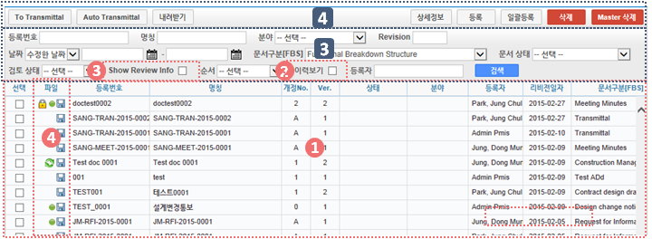

1. 자료목록에서는 등록된 자료의 등록번호, 명칭, Revision번호, Version, 분야,등록자 등의 정보가 표시되며, 동일한 등록번호에 대해 최종 Revision 자료만 목록에 표시 됩니다.
2. ‘이력보기’를 체크하면 문서의 이전 Revision도 목록에 나타납니다.
3. ‘Show Review Info’ 체크 시 문서의 Transmittal을 통한 검토결과 및 검토정보를 추가로 조회할 수 있습니다.
4. 등록된 자료에 첨부파일이 있을 경우
 
   .. image:: ../_images/D_0091.png
 
   아이콘이 표시되며,  해당 자료를 Transmittal을 통해 제출 혹은 승인요청 할 경우
    
   .. image:: ../_images/D_0092.png
 
   아이콘이 표시됩니다. Transmittal을 통한 검토 및 승인이 진행중인 자료는
        
   .. image:: ../_images/D_0093.png
   
   아이콘이 표시되며 검토 및 승인이 완료 되기 전까지 자료를 수정하거나 Revision 시킬 수 없습니다. 
5. 등록된 자료를 더블클릭 하면 해당자료의 상세정보 페이지로 이동합니다. 

검색기능
---------

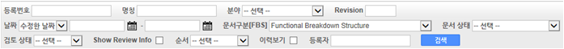

1. 검색기능을 이용하여 등록된 문서를 조회 할 수 있습니다. 검색조건 입력 후 ‘검색’버튼을 클릭 하면 해당 조건에 맞는 문서 목록이 조회 됩니다.
2. ‘이력보기’를 체크하면 문서의 이전 Revision도 목록에 나타납니다.
3. ‘Show Review Info’ 체크 시 문서의 Transmittal을 통한 검토결과 및 검토정보를 추가로 조회할 수 있습니다.
4. 순서를 선택하면 자료목록이 선택한 컬럼으로 정렬되어 표시됩니다.

버튼기능
---------

1. ‘상세정보’ 버튼을 클릭하면 선택한 자료의 상세정보 페이지로 이동 합니다.
2. 등록된 자료를 선택하고 ‘분류이동’ 버튼을 클릭하면 선택한 자료를 다른 자료분류로 이동 시킬 수 있습니다.
3. ‘등록’ 버튼을 클릭하면 새로운 자료를 등록 할 수 있는 상세정보 페이지로 이동합니다.
4. ‘일괄등록’ 버튼을 클릭하면 자료를 일괄 등록 할 수 있는 팝업 창이 나타나며 지정된 Excel 양식 및 압축첨부파일(.zip)을 통해 자료를 일괄등록 시킬 수 있습니다.
5. ‘삭제’ 버튼을 클릭하면 등록된 자료를 삭제 할 수 있습니다.
6. 자료를 선택하고 ‘To Transmittal’ 혹은 ‘Auto Transmittal’ 버튼을 클릭하면 선택 자료를 Transmittal 할 수 있으며, ‘내려받기’ 버튼을 누르면 등록된 파일을 다운로드 합니다.

일괄등록
---------

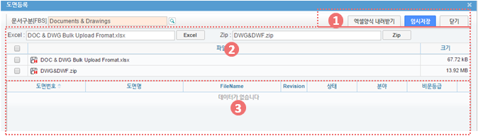

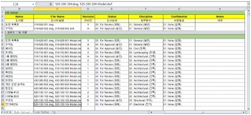

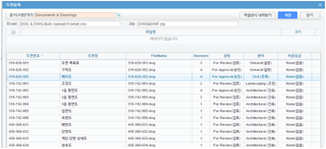

1. ‘엑셀양식 내려받기’ 버튼을 눌러 일괄등록 폼 양식을 내려 받은 후 양식 샘플을 참고하여 자료정보 및 파일 정보를 작성합니다.엑셀 파일과 함께 등록될 첨부파일을 압축하여 준비 합니다.
2. 작성된 Excel 파일 및 압축첨부파일(.zip)을 선택하면 하단의 파일목록에 선택한 파일이 표시 되고 ‘임시저장’ 버튼을 클릭하면 파일을 서버에 업로드 합니다.
3. 파일 업로드가 끝나면 자료목록이 나타나며 확인 후 이상 없을 시 상단의 ’저장’ 버튼을 클릭하면 자료로 등록 됩니다. 저장 하지 않은 자료는 자료로 등록되지 않으며 창이 닫치면 삭제 됩니다.

To Transmittal
-------------------

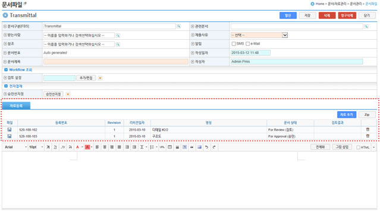

1. 자료목록에서 자료선택 후 ‘To Transmittal’ 버튼을 클릭하면 Transmittal 작성화면으로 이동 합니다.
2. 선택한 자료는 Transmittal의 전송 자료로 자동 입력되어 보여지며, Transmittal 정보 입력 후 발송 합니다. Transmittal 작성에 대한 상세내용은 본 매뉴얼 10.2.2 문서송부전 항목을 참고 하십시오.
3. Transmittal을 통해 발송된 자료는 문서목록에

아이콘이 나타납니다.

Auto Transmittal
----------------------

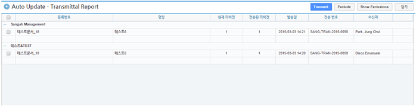

1. 이전 Revision의 자료가 이미 Transmittal을 통해 보내졌을 경우 신규 Revision된 자료는 이전 Transmittal 설정을 동일하게 사용할 수 있습니다. Auto Transmittal이 가능한 자료는 목록에

아이콘이 나타납니다.
2. 자료 선택 후 ‘Auto Transmittal 버튼을 클릭하면 이전 Transmittal 이력이 나타나며 선택한 Transmittal과 동일한 설정으로 신규 Revision된 자료를 다시 보냅니다.
3. Auto Transmittal 기능을 통해 자료의 검토/승인 과정 중 동일하게 발생하는 Transmittal 작성 작업을 줄일 수 있습니다. 

내려받기
---------

 1. 자료목록에서 다운받기를 원하는 항목을 선택한 후 ‘내려받기’ 버튼을 클릭하면 해당 자료의 첨부 파일을 압축하여 .zip 파일로 다운로드 받을 수 있습니다.
 2. 다수의 자료를 다운받아야 할 경우 내려받기 기능 통해 상세정보 페이지를 거치지 않고 간편하게 첨부파일을 다운 받을 수 있습니다.

상세정보
---------

 .. image:: ../_images/D_0102.png

 1. 상세정보 수정 후 ‘저장’ 버튼을 누르면 Revision 및 Version 변경 없이 수정된 내용으로 저장 됩니다.
 2. Revision을 새로 설정하거나 첨부파일을 교체 하였다면 일반저장이 불가능하며  ‘신규개정’ 버튼을 클릭하여 변경된 내용으로 신규 Revision을 생성 해야 합니다.
 3. Revision을 변경하지 않고 ‘신규개정’ 버튼을 클릭 할 경우 Revision은 변화가 없고 Version만 올라가게 됩니다.
 4. ‘닫기’ 버튼 클릭 시 자료목록 페이지로 돌아 갑니다.
 5. 정보 영역에서는 등록번호(문서/도면 번호), 명칭, Revision 정보, 문서구분, 상태, 분야, 비문등급(보안등급)등 자료의 속성 정보를 관리 합니다.
 6. 첨부파일 영역으로 해당 자료의 실 데이터인 파일을 등록 관리 합니다.
 7. 첨부파일 변경 시 기존 첨부파일 폼에는 등록 할 수 없으며 반드시 ‘대체할 파일’ 버튼을 클릭하면 나타나는 새로운 첨부파일 등록 폼에 등록 하셔야 합니다.
 8. 첨부파일이 변경되면 신규개정으로 저장 하셔야 하며, 일반 저장은 할 수 없습니다.
 9. Transmittal 정보영역으로 Transmittal을 발송한 자료일 경우에만 정보가 나타납니다.
 10. 해당 자료의 검토/승인 결과 및 Transmittal 정보가 표시 됩니다. 

 .. image:: ../_images/D_0103.png

 11. 해당 자료의 Revision 이력 목록이 나타나며, Revision, Version, 명칭 등록자, 등록일자 정보가 표시 됩니다.
 12. 선택한 Revision의 상세정보를 보여주며, 해당 Revision의 파일을 다운로드 받을 수 있습니다.

 .. image:: ../_images/D_0104.png

 13. 해당 자료의 등록, 수정, Revision 이력 및 조회기록, 파일 다운로드 기록 등 자료에 관련된 모든 이벤트 Log를 발생 시간 순으로 보여 줍니다.

승인함관리
**********

승인문서함
==========

 .. note::
  - 조직(업체)내부 결재문서의 조회 및 결재 기능을 제공 합니다.
  - 승인문서함 메뉴는 본인이 결재한 문서 및 결재대기문서 목록을 보여주는 수신함과 본인이 결재 기안한 문서 목록을 보여주는 발신함으로 구성되어 있습니다.

 1. 수신함의 결재문서 목록에서는 본인의 결재문서 및 결재대기문서를 보여줍니다.
 2. 새로 도착한 결재문서는 수신함의 결재문서 목록에 굵은 폰트로 표시되고 제목 앞에 ‘NEW’아이콘이 나타납니다. 
 3. 수신함의 검색기능 및 버튼기능은 서신문서 메뉴의 수신함 기능과 동일하며, 상세 기능 설명은 본 매뉴얼 10.2.1 서신문서의 검색기능 및 버튼기능 참고 하십시오.
 4. 결재대기문서 항목을 더블 클릭하거나  문서 선택 후 상단의 ‘열기’ 버튼을 클릭하면 상세내용을 확인하고 결재처리를 할 수 있는 결재문서조회 페이지로 이동 합니다. 
 5. 결재문서조회 페이지는 기본적으로 문서조회 페이지와 유사하며 결재문서의 검토, 수정 및 승인, 반려 기능을 제공 합니다.
 6. 결재문서조회 페이지는 문서정보를 보여주는 본문 영역과 결재정보, 수신정보, 배포정보를 보여주는 정보 영역으로 나누어 지며, 상단에는 문서보기 및 닫기 버튼 기능으로 구성되어 있습니다.
 7. 문서의 결재는 정보영역의 결재정보에서 ‘승인’ 혹은 ‘반려’ 버튼을 눌러 결재 합니다.
 8. 기안자 및 이전결재자의 결재의견이나 첨부파일이 등록되어 있다면 확인 가능하며, 결재 시 참고 할 수 있습니다.
 9. 결재자는 해당 문서 검토 후 본문내용 중 잘못된 부분이 있을 경우 수정이 가능 하며, 결재의견 및 이에 대한 첨부파일 등록이 가능 합니다.
 10. 결재자가 해당문서를 승인하면 결재선에 지정된 다음 결재자에게 넘어 가게 되며, 최종 승인자일 경우 문서는 결재완료 됩니다.
 11. 결재자가 해당문서를 반려시킬 경우 해당문서는 기안자에게 반려되어 돌아가며 기안자는 문서 수정 후 재 기안 할 수 있습니다.
 12. 발신함의 문서 목록에서는 본인이 기안한 문서 목록을 보여 줍니다.
 13. 발신함의 검색기능 및 버튼기능은 서신문서 메뉴의 기능과 동일하며, 상세 기능 설명은 본 매뉴얼 10.2.1 서신문서의 검색기능 및 버튼기능을 참고 하십시오.
 14. 기안문서를 더블 클릭하거나  문서 선택 후 상단의 ‘열기’ 버튼을 클릭하면 기안문서의 상세내용을 확인 할 수 있는 결재문서조회 페이지로 이동 합니다. 
 15. 결재문서조회 페이지는 기본구성은 ② 결재문서조회를 참고 하십시오.
 16. 기안자는 결재선상의 결재자가 부재중일 경우 부재자로 지정 할 수 있으며 부재자로 지정된 결재자는 건너뛰고 다음 결재자에게 결재권한이 넘어 갑니다.
 17. 기안자는 자신이 기안한 문서가 반려되었을 경우 발신함의 승인진행상태를 통해 확인 할 수 있으며, 반려된 기안문서는 결재문서조회 페이지에서 수정 후 상단의 ‘재기안’ 버튼을 클릭하여 재기안 할 수 있습니다.

수신함
-------

 .. image:: ../_images/D_0105.png

 1. 신규로 수신된 결재문서의 경우 목록에 굵은 폰트로 표시되며, 제목 앞에 ‘NEW’ 아이콘이 붙어서 표시 됩니다.
 2. 수신된 결재문서는 본인승인여부 항목이 공란으로 표기되며, 본인이 해당 문서를 결재할 경우 본인의 결재구분에 따라 ‘승인완료’, ‘협의완료’, ‘열람완료’, ‘반려’로 표기 됩니다. 또한 본인이 결재한 일자가 본인승인일 항목에 표시됩니다.
 3. 승인진행상태 항목에서는 문서의 결재진행상태에 따라 ‘진행중’, ‘승인완료’, ‘반려’, ‘취소’의 상태 값이 표시 됩니다.
 
 .. image:: ../_images/D_0106.png
 
 .. image:: ../_images/D_0107.png

 4. 검색기능을 이용하여 수신된 결재문서를 조회 할 수 있습니다.
 5. 검색조건 입력 후 ‘검색’버튼을 클릭 하면 해당 조건에 맞는 문서 목록이 조회 됩니다.
 6. 결재상태는 해당 문서의 결재진행상태에 따라 ‘진행중’, ‘승인완료’, ‘반려’, ‘취소’ 문서의 조회가 가능 합니다.
 7. ‘엑셀 내려받기’ 버튼을 누르면 현재 결재 문서 목록을 Excel 파일로 다운 받을 수 있습니다.
 8. ‘열기’ 버튼을 클릭하면 선택한 문서 상세내용을 확인 및 결재가 가능한 결재문서조회 페이지로 이동 합니다

결재문서조회
-------------

 .. image:: ../_images/D_0108.png

 1. 본문영역에서는 문서정보 및 문서본문, 첨부파일 정보를 확인 할 수 있습니다.
 2. 정보 영역에서는 해당 문서의 결재정보 및 수신자 정보, 배포자 정보 확인이 가능 합니다
 3. ‘문서보기’ 버튼을 누르면 작성중인 문서 본문을 웹문서 형식으로 보여줍니다. 웹문서는 PDF파일로 변환하여 저장 하거나 인쇄 할 수 있습니다.
 4. ‘닫기’ 버튼을 누르면 결재문서목록으로 돌아 갑니다.
 5. 기타 문서조회에 대한 상세한 내용은 10.2.1 서신문서 메뉴의 서신문서조회를 참고 하십시오.

 
결재정보
---------

 .. image:: ../_images/D_0109.png

 1. 결재의견이 있을 경우 의견란에 입력 합니다.
 2. ‘파일추가’ 버튼을 클릭하면 결재에 관련된 파일을 첨부할 수 있으며 ‘승인’ 혹은 ‘반려’ 버튼을 눌러 해당 문서를 결재 합니다.
 3. 결재상태에 따라 ‘승인완료’ 혹은 ‘반려’ 아이콘이 상태 항목에 나타나고 결재일자 항목에 결재일시가 표시 됩니다.
 4. 해당 결재 문서의 현재 결재 진행상태, 기안일, 결재완료일, 현재 결재 단계 결재 기한 및 지연일수 등의 정보를 취합하여 보여 줍니다.

발신함
-------

 .. image:: ../_images/D_0110.png

 1. 본인이 기안한 결재문서 목록이 상신일 순서로 정렬되어 나타납니다.
 2. 승인진행상태 항목에서는 문서의 결재진행상태에 따라 ‘진행중’, ‘승인완료’, ‘반려’, ‘취소’의 상태 값이 표시 됩니다.
 3. 검색기능을 이용하여 등록된 기안문서 목록을 조회 할 수 있습니다.
 4. 검색조건 입력 후 ‘검색’버튼을 클릭 하면 해당 조건에 맞는 문서 목록이 조회 됩니다.
 5. ‘엑셀 내려받기’ 버튼을 누르면 현재 기안문서 목록을 Excel 파일로 다운 받을 수 있습니다.
 6. ‘열기’ 버튼을 클릭하면 선택한 기안문서의 문서조회 페이지로 이동 합니다.

결재정보
---------

 .. image:: ../_images/D_0111.png
 
 .. image:: ../_images/D_0112.png

 1. 부재 체크 시 부재 사유를 지정 하는 선택목록이 나타나며 ‘휴가’, ‘출장’, ‘기타’ 중 선택 할 수 있습니다.
 2. ‘저장’ 버튼을 클릭하여 부재자 지정을 완료 합니다.
 3. 부재자로 지정된 결재자는 결재 시 건너뛰고 다음 결재자에게 결재권한이 넘어 갑니다.

Workflow
********

Workflow현황
============

.. note::
  - PMIS의 문서관리 모듈에서 Workflow에 의해 유통되는 문서송부전 문서 현황을 조회 할 수 있습니다.

1. 시스템에서  Workflow에 의해서 유통되는 전체 문서송부전 문서 목록을 조회 할 수 있습니다.
2. ① 목록을 클릭하여 해당 Workflow 문서송부전에 대한 상세정보를 조회 할 수 있습니다.
3. Workflow번호, 승인진행상태 의 검색 조건으로 Workflow 문서송부전 목록을 조회 할 수 있습니다.
4. ① 목록중 Workflow 문서송부전의 승인진행상태를 ‘취소’ 버튼을 눌러 취소 합니다.
5. ① 목록중 선택한 Workflow 문서송부전의 Step 정보를 ‘열기’ 버튼을 눌러 조회 합니다.

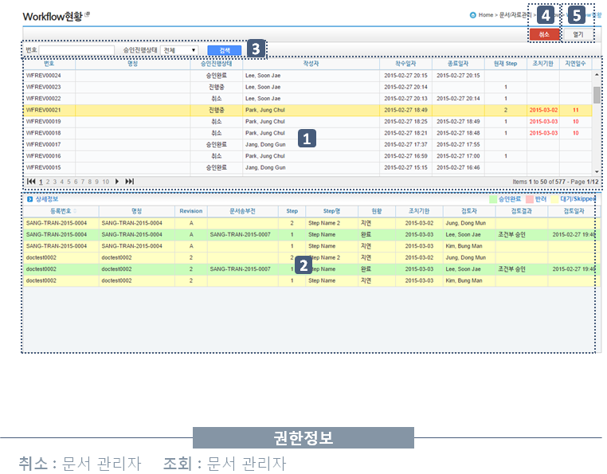

검색기능
---------

 .. image:: ../_images/D_0114.png

 1. 검색기능을 이용하여 Workflow 문서송부전 목록을 조회 할 수 있습니다.

Workflow 문서송부전 Step 조회
------------------------------------

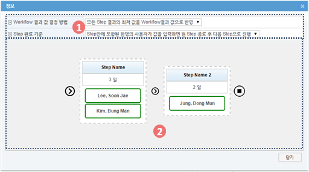

1. Workflow의 설정 정보를 조회 합니다.
2. Workflow 의 Step 별 정보를 조회 합니다.

Workflow정의
============

.. note::
  - 본 PMIS의 문서관리 모듈중 문서송부전에서 사용될 모든 Workflow 템플릿을 등록, 관리 합니다. 

1. 등록된 Workflow 목록을 조회 합니다.
2. ① 의 Workflow 목록에서 선택된 Workflow의 Step 정보를 조회 합니다.
3. 번호, 명칭 등의 검색어를 입력하여 Workflow 목록을 조회 합니다.
4. ‘추가’ 버튼을 클릭하면 ① 목록 최하위 에 Row 가 추가가 되며 추가할 Workflow 의 번호, 명칭 및 내용을 입력하고 ‘저장’ 버튼을 클릭하여 저장 합니다.
5. ①의 목록중 삭제할 Workflow 를 선택한 후 ‘삭제’ 버튼을 클릭하면 해당 Workflow가 삭제 됩니다.
6. ①의 목록중 변경할 Workflow의 정보의 Cell을 클릭하여 정보를 변경한 후 ④의 ‘저장’을 클릭하여 변경된 정보를 저장 합니다. 
7. 선택한 Workflow 의 Step 정보를 변경합니다.

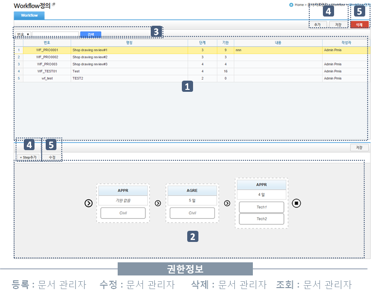

검색기능
---------

 .. image:: ../_images/D_0117.png

 1. 검색기능을 이용하여 Workflow 목록을 조회 할 수 있습니다.

Workflow 추가
------------------

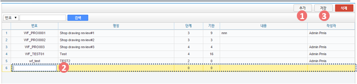

1. ‘추가’ 버튼을 클릭합니다.
2. 목록중 최하위에 빈 Row 가 생기면 번호, 명칭 및 내용을 입력합니다.
3. ‘저장’ 버튼을 클릭하여 입력된 Workflow 를 저장 합니다.

Workflow 수정
------------------

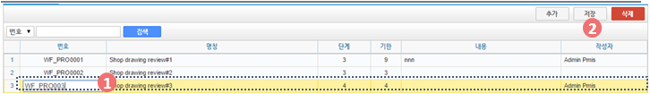

1. 변경할 Workflow 의 정보의 Cell를 클릭하여 정보를 변경합니다.
2. ‘저장’ 버튼을 클릭하여 변경된 Workflow 정보를 저장 합니다.

Workflow Step 정보 변경
------------------------------

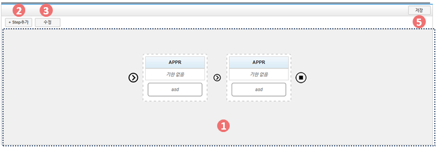

1. 선택한 Workflow 의 Step 정보를 조회합니다.
2. ‘Step추가’  버튼을 클릭하여 ① 화면에서 ⑥ 화면과 같이 오른쪽 마지막에서 Step 이 추가되어 집니다.

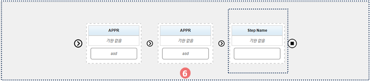

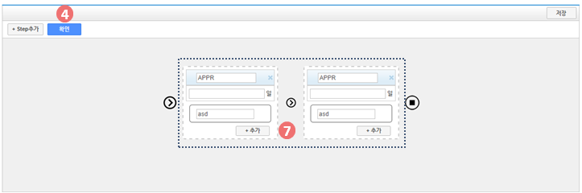

3. Workflow 조회모드에서 ‘수정’ 버튼을 클릭하여 Workflow 편집모드로 화면을 전환 합니다.
4. ⑦ 의 각 Step 의 항목(Step별 기한일,Step별 명칭) 을 입력한 후 ‘확인’ 버튼을 클릭하여 편집모드를 종료 합니다.
5. ‘저장’ 버튼을 클릭하여 입력된 Workflow Step 정보를 저장합니다.

Workflow Step 편집 모드
------------------------------

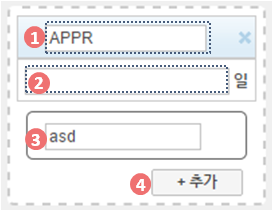

1. Step 의 명칭을 입력합니다.
2. 기한일을 입력합니다.
3. 검토 행위 명칭을 입력합니다.
4. ‘추가’ 버튼을 클릭하면 해당 Step 의 검토 행위를 추가할 수 있습니다.
