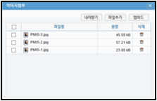
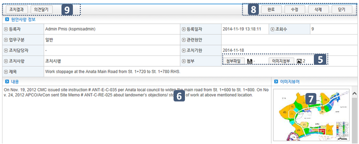
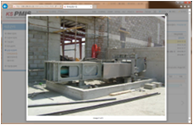
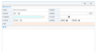
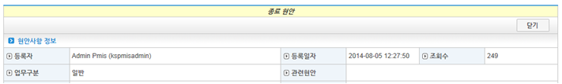
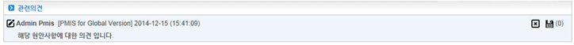
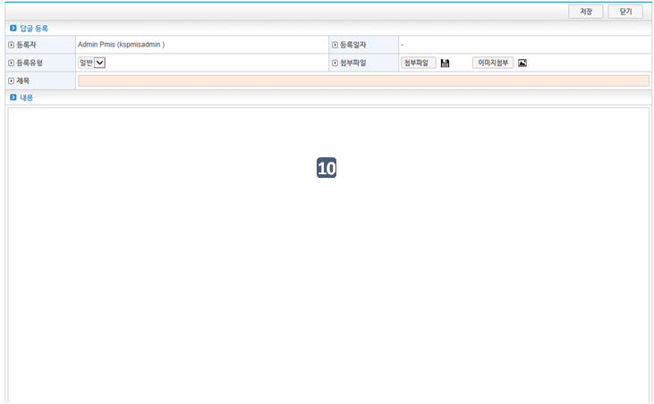

.. _menu_Collaboration:

협업관리
#########

공지/현안관리
*************

공지사항
========

 .. note::
  - 해당사업의 공지사항을 등록, 관리 합니다.
  - 최근에 등록된 5건의 공지사항은 메인 페이지의 공지사항 영역에 표시 됩니다.

 1. 등록된 공지사항 목록을 보여 줍니다.  공지사항 목록에서는 제목, 등록자, 등록일자, 조회수 등의 기본정보와 해당 공지사항 관련 첨부파일 및 이미지파일 정보가 표시 됩니다.
 2. 검색영역에서는 등록된 공지사항을 제목, 내용의 조회조건에 따라 검색 할 수 있습니다.
 3. ‘등록’ 버튼을 클릭하면 신규 공지사항 등록할 수 있는 ④ 공지사항 등록/수정 페이지로 이동 합니다.
 4. 등록된 공지사항의 제목을 더블클릭 하거나, 해당 공지사항 선택 후 상단의  ‘열기’ 버튼을 클릭하면 해당 공지사항의 내용 조회 및 수정, 삭제가 가능한 ④ 상세정보 페이지로 이동 합니다.
 5. 등록/수정 페이지에서는 신규 공지사항의 등록 및 등록된 공지사항의 수정이 가능 하며, 등록유형, 제목, 내용을 등록한 후 상단의 ‘저장’ 버튼을 눌러 저장 합니다.
 6. 관련 첨부파일 및 이미지 파일이 있을 경우 첨부파일 기능을 통해 등록 할 수 있습니다. 
 7. 상세조회 페이지에서는 해당 공지사항의 상세정보 조회가 가능하며, 등록된 첨부파일 및 이미지파일이 있다면 다운로드 받을 수 있습니다. 
 8. 등록된 이미지 파일은 상세조회 페이지에서 썸네일 목록으로 보여지며 썸네일 이미지 클릭 시 이미지 뷰어를 통해 원본크기로 볼 수 있습니다.
 9. 상세조회 페이지 상단의 ‘수정’ 버튼을 클릭하여 등록된 공지사항을 수정 하거나 ‘삭제’ 버튼을 클릭하여 등록된 공지사항을 삭제 할 수 있습니다.

공지사항목록
-------------

 .. image:: ../_images/W_0001.png

 1. 해당 공지사항의 기본정보 및 첨부파일 정보를 확인 할 수 있습니다.
 2. 공지사항 관련 첨부파일이나 이미지파일이 존재할 경우 리스트에 아이콘으로 표시되며 우측에 파일개수가 표시 됩니다.
 
 .. image:: ../_images/W_0002.png

 .. image:: ../_images/W_0003.png

 3. 공지사항 목록 중 최근에 등록된 5건은 메인 페이지의 공지사항 항목에 표시 됩니다.

검색기능
---------

 .. image:: ../_images/W_0004.png

 1. 검색기능을 이용하여 등록된 공지사항 목록을 조회 할 수 있습니다.
 2. 검색조건 선택 후 검색어 입력란에 검색어를  입력하신 후 ‘검색’버튼을 클릭 합니다.
 

버튼기능
---------

 .. image:: ../_images/W_0005.png

 1. ③‘등록’ 버튼을 클릭하면 신규 현안사항 등록할 수 있는 등록/수정 페이지로 이동 합니다.
 2. 현안사항의 제목을 더블클릭 하거나, 공지사항 선택 후 ③‘열기’ 버튼을 클릭하면 해당 현안사항의 내용 조회 및 수정, 삭제가 가능한  상세정보 페이지로 이동 합니다.

공지사항 등록/수정
-------------------

 .. image:: ../_images/W_0006.png

 1. 등록/수정 페이지에서는 공지사항의 등록 및 등록된 공지사항의 수정이 가능 합니다.
 2. ‘첨부파일’, ‘이미지파일’ 버튼을 누르면 첨부파일 및 이미지파일을 등록할 수 있습니다.

첨부파일, 이미지첨부
---------------------

 .. image:: ../_images/W_0007.png

 1. ‘파일추가’ 버튼을 클릭 하면 로컬PC의 파일을 등록 할 수 있습니다.
 2. ‘웹하드’ 버튼을 클릭하면 웹하드에 등록된 파일을 등록 하실  수 있습니다.
 3. 등록된 파일 항목 우측의 휴지통 버튼을 더블 클릭하면 등록된 파일을 삭제합니다.
 4. 등록된 파일 선택 후 ‘내려받기’ 버튼을 클릭하면 선택한 파일을 로컬PC로 다운로드 합니다.

공지사항 상세조회
-------------------

 .. image:: ../_images/W_0008.png

 1. 상세조회 페이지에서는 공지사항의 내용 조회 및 수정, 삭제가 가능 하며 등록된 첨부파일 및 이미지파일의 다운로드가 가능 합니다.
 2. 이미지파일이 등록되어 있을 경우 ⑦ 썸네일 목록에 보여 지며, 클릭 시 이미지 뷰어를 통해 원본크기로 볼 수 있습니다.

이미지 뷰어
------------

 .. image:: ../_images/W_0009.png

 1. ⑦ 영역의 이미지를 클릭하면 이미지 뷰어를 통해 전체화면으로 보여 집니다.
 2. 이미지 뷰어의 좌, 우 버튼을 클릭하면 다음 이미지가 나타납니다.

현안사항
========

 .. note::
  - 사업 수행 중 발생하는 주요 현안사항을 등록, 관리 합니다.
  - 등록된 현안사항에 대한 처리 결과 및 의견, 관련 현안사항을 관리 할 수 있습니다.

 1. 등록된 현안사항 및 결과 리스트를 보여 줍니다.  현안사항 목록에서는 제목, 업무구분, 등록자, 등록일자, 조치기한, 조치결과, 조회수 등의 기본정보와 해당 현안사항 관련 첨부파일 및 이미지파일 정보가 표시 됩니다.
 2. 검색영역에서는 등록된 현안사항을 제목, 내용, 업무구분, 진행상태 등 다양한 조회조건에 따라 검색 할 수 있습니다.
 3. ‘등록’ 버튼을 클릭하면 신규 현안사항을 등록할 수 있는 ④ 현안사항 등록/수정 페이지로 이동 합니다.
 4. 등록된 현안사항의 제목을 더블클릭 하거나, 해당 현안사항 선택 후 상단의 ‘열기’ 버튼을 클릭하면 해당 현안사항의 내용 조회 및 수정, 삭제가 가능한 ④ 상세정보 페이지로 이동 합니다.
 5. 등록/수정 페이지에서는 신규 현안사항의 등록 및 등록된 현안사항의 수정이 가능 합니다.
 6. 업무구분, 조치사항, 제목, 내용 등 필수 입력사항을 입력하고, 관련현안 및 조치담당자, 조치기한의 지정이 필요할 경우 입력 후 상단의 ‘저장’ 버튼을 눌러 저장 합니다.
 7. 관련 첨부파일 및 이미지 파일이 있을 경우 등록 할 수 있습니다. 
 8. 상세조회 페이지에서는 해당 현안사항의 상세정보 조회가 가능하며, 등록된 첨부파일 및 이미지파일이 있다면 다운로드 받을 수 있습니다. 
 9. 등록된 이미지 파일은 상세조회 페이지에서 썸네일 목록으로 보여지며 썸네일 이미지 클릭 시 이미지뷰어를 통해 원본크기로 볼 수 있습니다.
 10. 상세조회 페이지 상단의 ‘수정’ 버튼을 클릭하여 등록된 현안사항을 수정 하거나
 11.  상세조회 페이지 상단의 ‘수정’ 버튼을 클릭하여 등록된 현안사항을 수정 하거나  ‘삭제’ 버튼을 클릭하여 삭제 할 수 있습니다.
 12. 해당 현안사항이 조치완료 되었거나, 더 이상 관리가 필요 없어질 경우 작성자 혹은
 13. 조치 담당자는 ‘완료’ 버튼을 클릭하여 해당현안을 완료처리 할 수 있습니다.
 14. 종료된 현안사항은 수정 할 수 없습니다.
 15. 상단의 ‘조치결과’ 버튼을 클릭하면 해당 현안에 대한 조치사항을 등록 할 수 있는
 16.       조치사항 등록/수정 페이지로 이동 합니다.
 17. 상단의 ‘의견달기’ 기능을 통해 해당 현안에 대한 개인 의견을 등록 할 수 있습니다.
 18. 조치사항 등록/수정 페이지에서는 등록유형, 제목, 내용, 첨부파일 및 이미지 파일의 수정이 가능하며, 수정 후 상단의 ‘저장’ 버튼을 눌러 저장 하십시오..

현안사항 목록
--------------

 .. image:: ../_images/W_0010.png

 1. 해당 현안사항의 기본정보 및 첨부파일 정보를 확인 할 수 있습니다.
 2. 현안사항 관련 첨부파일이나 이미지파일이 존재할 경우 리스트에 아이콘으로 표시되며 우측에 파일개수가 표시 됩니다.

검색기능
---------

 .. image:: ../_images/W_0011.png

 1. 검색기능을 이용하여 등록된 현안사항 목록을 조회 할 수 있습니다.
 2. 검색조건 선택 후 검색어 입력란에 검색어를  입력하신 후 ‘검색’버튼을 클릭 합니다.

버튼기능
---------

 .. image:: ../_images/W_0012.png

 1. ③‘등록’ 버튼을 클릭하면 신규 현안사항 등록할 수 있는 등록/수정 페이지로 이동 합니다.
 2. ③ 현안사항의 제목을 더블클릭 하거나, 현안사항 선택 후 상단의  ‘열기’ 버튼을 클릭하면 해당 현안사항의 내용 조회 및 수정, 삭제가 가능한  상세정보 페이지로 이동 합니다.

현안사항 등록/수정
-------------------

 .. image:: ../_images/W_0013.png

 1. 신규 현안사항의 등록 및 등록된 현안사항의 수정이 가능 합니다.
 2. 현안사항 등록 시 관련 현안사항 및 조치담당자, 조치기한, 조치사항을 지정할 수 있습니다.

 .. image:: ../_images/W_0014.png

 3. ‘첨부파일’, ‘이미지파일’ 버튼을 누르면 첨부파일 및 이미지파일을 등록할 수 있습니다.

첨부파일, 이미지첨부
---------------------

1. ‘파일추가’ 버튼을 클릭 하면 로컬PC의 파일을 등록 할 수 있습니다.
2. ‘웹하드’ 버튼을 클릭하면 웹하드에 등록된 파일을 등록 하실  수 있습니다.
3. 등록된 파일 항목 우측의 휴지통 버튼을 더블 클릭하면 등록된 파일을 삭제합니다.
4. 등록된 파일 선택 후 ‘내려받기’ 버튼을 클릭하면 선택한 파일을 로컬PC로 다운로드 합니다.

현안사항 상세조회
------------------

1. 상세조회 페이지에서는 등록된 현안사항의 내용 조회 및 수정, 삭제가 가능 하며 등록된 첨부파일 및 이미지파일의 다운로드가 가능 합니다.

이미지 뷰어
------------

1. ⑦ 영역의 이미지를 클릭하면 이미지뷰어를 통해 전체화면으로 보여 집니다.
1. 이미지뷰어의 좌, 우 버튼을 클릭하면 다음 이미지가 나타납니다.

버튼기능
---------

1. ‘수정’ 버튼을 클릭하면 신규 현안사항 등록할 수 있는④ 수정 페이지로 이동 합니다.
2. ‘삭제’ 버튼을 클릭하면 등록된 현안사항을 삭제 할 수 이습니다.        

3. ‘완료’ 버튼을 클릭하면 해당 현안사항을 완료 시킬 수 있습니다. 현안사항 작성자 및 조치담당자는 해당 현안사항이 조치완료 되었거나 더 이상 관리가 필요 없어질 경우 완료 처리 합니다.
4. 완료된 현안사항은 ① 리스트에서 회색폰트로 표시 되며, 조회 시 페이지 상단에 종료현안으로 표시됩니다. 완료된 현안사항은 조회만 가능 합니다.

의견달기
---------

 .. image:: ../_images/W_0020.png

 1. ⑨‘의견달기’ 버튼 클릭 시 해당 현안에 대한 의견을 남길 수 있으며 해당 의견에 대한 자료가 존재 할 시 첨부파일로 등록 할 수 있습니다.
 2. 의견 작성자의 경우 우측상단의 ‘X’ 버튼을 클릭하여 의견을 삭제 할 수 있습니다.      

조치사항 등록/수정
-------------------

 .. image:: ../_images/W_0021.png

 1. ⑨‘조치결과’ 버튼 클릭 시 조치사항 등록/수정 페이지로 이동 합니다.
 2. 조치결과 입력 폼에서는 해당 현안에 대한 조치사항을 등록 할 수 있으며, 조치담당자, 조치일자, 조치결과, 조치세부내용을 입력하며, 조치사항 관련 첨부파일이나 사진이 있을 경우 첨부하여 저장 합니다.
 3. 조치사항은 해당 현안사항에 대해 복수로 등록 할 수 있습니다.

민원관리
********

현장민원
========

 .. note::
  - 사업 수행 중 발생하는 주요 현안민원을 등록, 관리 합니다.
  - 등록된 현장민원에 대한 민원정보 및 처리 결과, 의견을 관리 할 수 있습니다.

 1. 등록된 현장민원 및 결과 리스트를 보여 줍니다.  현장민원 목록에서는 제목, 민원인, 접수일자, 조치기한, 조치결과, 조회수 등의 기본정보와 해당 현장민원 관련 첨부파일 및 이미지파일 정보가 표시 됩니다.
 2. 검색영역에서는 등록된 현장민원을 제목, 내용, 진행상태 등 다양한 조회조건에 따라 검색 할 수 있습니다.
 3. ‘등록’ 버튼을 클릭하면 신규 현장민원을 등록할 수 있는 ④ 현장민원 등록/수정 페이지로 이동 합니다.
 4. 등록된 현장민원의 제목을 더블클릭 하거나, 해당 현장민원 선택 후 상단의  ‘열기’ 버튼을 클릭하면 해당 현장민원의 내용 조회 및 수정, 삭제가 가능한 ④ 상세정보 페이지로 이동 합니다.
 5. 등록/수정 페이지에서는 신규 현장민원의 등록 및 등록된 현장민원의 수정이 가능 합니다.
 6. 업무구분, 조치사항, 제목, 내용 등 필수 입력사항을 입력하고, 관련현안 및 조치담당자, 조치기한의 지정이 필요할 경우 입력 후 상단의 ‘저장’ 버튼을 눌러 저장 합니다.
 7. 관련 첨부파일 및 이미지 파일이 있을 경우 등록 할 수 있습니다. 
 8. 상세조회 페이지에서는 해당 민원사항의 상세정보 조회가 가능하며, 등록된 첨부파일 및 이미지파일이 있다면 다운로드 받을 수 있습니다. 
 9. 등록된 이미지 파일은 상세조회 페이지에서 썸네일 목록으로 보여지며 썸네일 이미지 클릭 시 이미지뷰어를 통해 원본크기로 볼 수 있습니다.
 10. 상세조회 페이지 상단의 ‘수정’ 버튼을 클릭하여 등록된 현장민원을 수정 하거나
 11.  상세조회 페이지 상단의 ‘수정’ 버튼을 클릭하여 등록된 현장민원을 수정 하거나  ‘삭제’ 버튼을 클릭하여 삭제 할 수 있습니다.
 12. 해당 현장민원이 조치완료 되었거나, 더 이상 관리가 필요 없어질 경우 작성자 혹은
 13. 조치 담당자는 ‘완료’ 버튼을 클릭하여 해당현안을 완료처리 할 수 있습니다.
 14. 종료된 현장민원은 수정 할 수 없습니다.
 15. 상단의 ‘조치결과’ 버튼을 클릭하면 해당 현안에 대한 조치사항을 등록 할 수 있는 ⑩ 조치사항 등록/수정 페이지로 이동 합니다.
 16. 상단의 ‘의견달기’ 기능을 통해 해당 현안에 대한 개인 의견을 등록 할 수 있습니다.
 17. 조치사항 등록/수정 페이지에서는 등록유형, 제목, 내용, 첨부파일 및 이미지 파일의 수정이 가능하며, 수정 후 상단의 ‘저장’ 버튼을 눌러 저장 하십시오..

현장민원 목록
--------------

 .. image:: ../_images/W_0022.png

 1. 해당 현장민원의 기본정보 및 첨부파일 정보를 확인 할 수 있습니다.
 2. 현장민원 관련 첨부파일이나 이미지파일이 존재할 경우 리스트에 아이콘으로 표시되며 우측에 파일개수가 표시 됩니다.

검색기능
---------

 .. image:: ../_images/W_0023.png

 1. 검색기능을 이용하여 등록된 현장민원 목록을 조회 할 수 있습니다.
 2. 검색조건 선택 후 검색어 입력란에 검색어를  입력하신 후 ‘검색’버튼을 클릭 합니다.

버튼기능
---------

 .. image:: ../_images/W_0024.png

 1. ③‘등록’ 버튼을 클릭하면 신규 현장민원 등록할 수 있는 등록/수정 페이지로 이동 합니다.
 2. ③ 현장민원의 제목을 더블클릭 하거나, 현장민원 선택 후 상단의 ‘열기’ 버튼을 클릭하면 해당 현장민원의 내용 조회 및 수정, 삭제가 가능한  상세정보 페이지로 이동 합니다.

현장민원 등록/수정
-------------------

 .. image:: ../_images/W_0025.png

 1. 신규 현장민원의 등록 및 등록된 현장민원의 수정이 가능 합니다.
 2. 현장민원 등록 시 민원인 정보 및 접수일자, 조치담당자, 조치기한, 조치사항을 지정할 수 있습니다.

 .. image:: ../_images/W_0026.png

 3. ‘첨부파일’, ‘이미지파일’ 버튼을 누르면 첨부파일 및 이미지파일을 등록할 수 있습니다.

첨부파일, 이미지첨부
---------------------

 .. image:: ../_images/W_0027.png

 1. ‘파일추가’ 버튼을 클릭 하면 로컬PC의 파일을 등록 할 수 있습니다.
 2. ‘웹하드’ 버튼을 클릭하면 웹하드에 등록된 파일을 등록 하실  수 있습니다.
 3. 등록된 파일 항목 우측의 휴지통 버튼을 더블 클릭하면 등록된 파일을 삭제합니다.
 4. 등록된 파일 선택 후 ‘내려받기’ 버튼을 클릭하면 선택한 파일을 로컬PC로 다운로드 합니다.

현장민원 상세조회
------------------

 .. image:: ../_images/W_0028.png

 1. 상세조회 페이지에서는 등록된 현장민원의 내용 조회 및 수정, 삭제가 가능 하며 등록된 첨부파일 및 이미지파일의 다운로드가 가능 합니다.

이미지 뷰어
------------

 .. image:: ../_images/W_0029.png

 1. ⑦ 영역의 이미지를 클릭하면 이미지뷰어를 통해 전체화면으로 보여 집니다.
 2. 이미지뷰어의 좌, 우 버튼을 클릭하면 다음 이미지가 나타납니다.

버튼기능
---------

 .. image:: ../_images/W_0030.png

 1. ‘수정’ 버튼을 클릭하면 등록된 현장민원을 수정할 수 있는 ④ 수정 페이지로 이동 합니다.
 2. ‘삭제’ 버튼을 클릭하면 등록된 현장민원을 삭제 할 수 이습니다.  

 .. image:: ../_images/W_0031.png

 3. ‘완료’ 버튼을 클릭하면 해당 현장민원을 완료 시킬 수 있습니다. 현장민원 작성자 및 조치담당자는 해당 현장민원이 조치완료 되었거나 더 이상 관리가 필요 없어질 경우 완료 처리 합니다.
 4. 완료된 현장민원은 ① 리스트에서 회색폰트로 표시 되며, 조회 시 페이지 상단에 종료현안으로 표시됩니다. 완료된 현장민원은 조회만 가능 합니다.

의견달기
---------

 .. image:: ../_images/W_0032.png

 1. ⑨‘의견달기’ 버튼 클릭 시 해당 현안에 대한 의견을 남길 수 있으며 해당 의견에 대한 자료가 존재 할 시 첨부파일로 등록 할 수 있습니다.
 2. 의견 작성자의 경우 우측상단의 ‘X’ 버튼을 클릭하여 의견을 삭제 할 수 있습니다.

조치사항 등록/수정
-------------------

 .. image:: ../_images/W_0033.png

 1. ⑨‘조치결과’ 버튼 클릭 시 조치사항 등록/수정 페이지로 이동 합니다.
 2. 조치결과 입력 폼에서는 해당 현안에 대한 조치사항을 등록 할 수 있으며, 조치담당자, 조치일자, 조치결과, 조치세부내용을 입력하며, 조치사항 관련 첨부파일이나 사진이 있을 경우 첨부하여 저장 합니다.
 3. 조치사항은 해당 현장민원에 대해 복수로 등록 할 수 있습니다.

주요일정관리
************

Milestone
==========

 .. note::
  - 해당 사업의 Milestone 을 등록, 관리 합니다.
  - 등록된 Milestone 항목은 메인 화면의 Milestone Progress 영역에 그래프 형태로 보여집니다.

 1. 등록된 Milestone 목록을 보여 줍니다. Milestone 목록에서는 Milestone명칭 및 계획일자, 실적일자 정보가 표시 됩니다.
 2. 검색영역에서는 등록된 Milestone 의 명칭을 통해 검색 할 수 있습니다.
 3. 상세내용 영역에는 ① 에서 선택된 Milestone의 상세정보를 보여 줍니다.
 4. 버튼 기능을 이용해 신규 Milestone를 등록 하거나 수정, 삭제 할 수 있습니다.

 .. image:: ../_images/W_0034.png

메인페이지
-----------

 .. image:: ../_images/W_0035.png

 1. 등록된 Milestone은 메인페이지의 Milestone Progress에 그래프 형태로 표시 됩니다.
 2. 계획일자보다 실적일자가 빠를 경우 푸른색으로, 느릴 경우 붉은색으로 표시 됩니다.

검색기능
---------

 .. image:: ../_images/W_0036.png

 1. 검색기능을 이용하여 등록된 Milestone 목록을 조회 할 수 있습니다.
 2. 검색조건 선택 후 검색어 입력란에 검색어를  입력하신 후‘검색’버튼을 클릭 합니다.

버튼기능
---------

 1. ‘추가’ 버튼을 클릭하여 ③ 상세내용을 작성한 후 ‘저장’ 버튼을 누르면 새로운 Milestone 항목이 등록 됩니다.
 2. 등록된 Milestone 정보를 수정한 후 ‘저장’ 버튼을 누르면 해당 Milestone 정보가 수정 됩니다.
 3. ‘삭제’ 버튼을 클릭하면 등록된 Milestone를 삭제 할 수 있습니다.  

일정관리
========

 .. note::
  - 해당 사업의 사업일정 및 조직일정, 개인일정을 등록, 관리 합니다.
  - 일정관리 메뉴는 캘린더를 통한 월간일정 및 주간일정 페이지와 날짜 선택 시 보여지는 일정관리 페이지로 구성되어 있습니다.

 1. [월간일정] 에서는 선택 월의 등록된 일정을 캘린더 형태로 보여 주며, 각 일자에 해당하는 일정 리스트가 표시 됩니다.
 2. 등록된 일정의 범위 및 유형에 따라 제목 앞에 아이콘이 표시됩니다. 
 3. 캘린더에서 특정 날짜를 클릭하면 해당 일자의 일정관리 페이지로 이동 합니다.
 4. 연월 이동버튼을 클릭하여 이전 월, 다음 월 일정을 조회 할 수 있습니다. 검색기준일을 선택하면 특정 날짜로 바로 이동 하며, ‘현재일정’ 버튼을 클릭하면 오늘 날짜의 일정으로 돌아 옵니다.
 5. ‘사업일정’, ‘조직일정’, ‘개인일정’ 체크박스를 체크하면 ① 일정 캘린더에 해당 일정이 나타나며 체크 해제 시 리스트에서 사라집니다.
 6. [주간일정] 탭의 ④에서는 선택 주간의 등록된 일정을 시작시간과 종료시간에 맞춰 Bar-Chart 형태로 보여 줍니다.
 7. 등록된 일정은 범위 및 유형에 따라 제목 앞에 아이콘이 표시됩니다.
 8. 등록된 일정을 클릭하면 해당일정의 상세정보를 확인 할 수 있는 일정관리 페이지로 이동 합니다.
 9. 일정추가 컬럼의 ‘+’ 버튼을 클릭하면 해당일자의 신규 일정을 추가 할 수 있는 일정관리 페이지로 이동 합니다.
 10. 주간 이동버튼을 클릭하여 이전 주, 다음 주 일정을 조회 할 수 있습니다. 검색기준일을 선택하면 특정 날짜로 바로 이동 하며, ‘현재일정’ 버튼을 클릭하면 오늘 날짜의 일정으로 돌아 옵니다.
 11. ‘사업일정’, ‘조직일정’, ‘개인일정’ 체크박스를 체크하면 ④ 주간일정에 해당 일정이 나타나며 체크 해제 시 리스트에서 사라집니다.
 12. [주간일정] 탭의 ④에서는 선택 주간의 등록된 일정을 시작시간과 종료시간에 맞춰 Bar-Chart 형태로 보여 줍니다.
 13. 등록된 일정은 범위 및 유형에 따라 제목 앞에 아이콘이 표시됩니다.
 14. 등록된 일정을 클릭하면 해당일정의 상세정보를 확인 할 수 있는 일정관리 페이지로 이동 합니다.
 15. 일정추가 컬럼의 ‘+’ 버튼을 클릭하면 해당일자의 신규 일정을 추가 할 수 있는 일정관리 페이지로 이동 합니다.
 16. 주간 이동버튼을 클릭하여 이전 주, 다음 주 일정을 조회 할 수 있습니다. 검색기준일을 선택하면 특정 날짜로 바로 이동 하며, ‘현재일정’ 버튼을 클릭하면 오늘 날짜의 일정으로 돌아 옵니다.
 17. ‘사업일정’, ‘조직일정’, ‘개인일정’ 체크박스를 체크하면       주간일정에 해당 일정이 나타나며 체크 해제 시 리스트에서 사라집니다.
 18. [월간일정] 및 [주간일정]에서 특정 날짜, 혹은 일정선택 시 일정 관리 페이지로 이동 합니다.
 19. 일정 목록에서는 해당 일자의 등록된 일정목록을 보여줍니다.
 20. 검색기능을 통해 등록된 일정 리스트를 조회 할 수 있습니다.
 21. 버튼 기능을 통해 새로운 일정을 추가 하거나 등록된 일정을 수정, 삭제 할 수 있습니다.
 22. ⑧ 에서 선택한 일정항목의 상세정보를 관리 합니다.
 23. 일정범위, 일정구분, 반복설정, 중요일정, 일정기간 및 시간 설정이 가능 합니다.

월간일정
---------

 .. image:: ../_images/W_0037.png

검색기능
---------

 .. image:: ../_images/W_0038.png

 1. 연월 검색기능의 좌, 우 화살표 버튼을 클릭하면 이전 월, 다음 월로 이동 합니다.
 2. 검색기준일을 설정하면 검색일자의 월로 바로 이동하며, ‘현재일정’ 버튼 클릭 시 오늘 날짜의 일정으로 돌아옵니다.

일정옵션
---------

 .. image:: ../_images/W_0039.png

 1. 체크박스를 체크 해제하면 일정 캘린더에 해당 일정이 사라지며 체크 시 목록에 다시 나타납니다.

 .. image:: ../_images/W_0040.png

 2. 일정의 범위 및 유형에 따라 제목 앞에 아이콘이 표시됩니다.

주간일정
---------

 .. image:: ../_images/W_0041.png
 .. image:: ../_images/W_0042.png

 1. 일정 시간에 맞춰 Bar-Chart가 표시되며, Bar 하단에 일정요약정보가 표시 됩니다.
 2. Bar 색상은 반복일정일 경우 파란색으로 단일일정일 경우 녹색으로 표시됩니다.

 .. image:: ../_images/W_0043.png

 3. 일정추가 컬럼의 ‘+’ 버튼을 클릭하면 해당일의 신규일정을 추가 할 수 있는 일정관리 페이지로 이동 합니다.

검색기능
---------

 .. image:: ../_images/W_0044.png

 1. 주간 검색기능의 좌, 우 화살표 버튼을 클릭하면 이전 주, 다음 주로 이동 합니다.
 2. 검색기준일을 설정하면 검색일자의 주로 바로 이동하며, ‘현재일정’ 버튼 클릭 시 오늘 날짜의 일정으로 돌아옵니다.

일정관리
---------

 .. image:: ../_images/W_0045.png

검색기능
---------

 .. image:: ../_images/W_0046.png

 1. 검색기준일을 설정하면 해당일자로 이동하며, ‘현재일정’ 버튼 클릭 시 오늘 날짜의 일정으로 돌아옵니다.
 2. 검색조건에 따른 일정 검색이 가능 합니다.

버튼기능
---------

 1. ‘추가’ 버튼을 클릭하여 ⑪ 상세내용을 작성한 후 ‘저장’ 버튼을 누르면 새로운 일정이 등록 됩니다.
 2. 등록된 일정 정보를 수정한 후 ‘저장’ 버튼을 누르면 해당 일정이 수정 됩니다.
 3. ‘삭제’ 버튼을 클릭하면 등록된 Milestone를 삭제 할 수 있습니다.   

상세설정
---------

 .. image:: ../_images/W_0047.png

 1. 일정범위 설정을 통해 사업, 조직, 개인 일정을 구분하여 등록 할 수 있습니다.
 2. 중요일정 체크 시 ⑧ 일정목록에서 해당 일정 제목 앞에 중요 아이콘이 표시 됩니다.

 .. image:: ../_images/W_0048.png

 3. 반복설정 옵션을 지정 하면 해당 일정을 일, 주, 월, 연 단위로 반복 할 수 있습니다.
 4. ‘반복없음’ 설정 시 해당일자에만 일정이 등록 됩니다.

 .. image:: ../_images/W_0049.png

 5. 반복설정을 ‘매일’로 지정 하면 해당 일정기간 동안 매일, ‘매주’로 지정하면 매주 지정 요일에 일정이 반복 됩니다.

 .. image:: ../_images/W_0050.png

 6. 반복설정을 ‘매월’로 지정 하면 해당 일정기간 동안 매월 지정된 일마다, ‘매년’으로 지정하면 매년 지정된 일자에 일정이 반복 됩니다.

메시지관리
**********

메시지함
========

 .. note::
  - PMIS 사용자간 간단한 메시지 및 파일 전송 기능을 제공 합니다.
  - 메시지함 은 수신메시지 목록을 보여주는 수신함과 발신메시지 목록을 보여주는 발신함, 작성 중인 메시지를 임시저장 할 수 있는 임시저장함으로 구성되어 있습니다.
  - 메시지 목록을 표시 합니다. 메시지를 더블클릭하면 내용을 확인 할 수 있습니다.

 1. 검색기능을 이용하여 메시지를 조회 할 수 있습니다.
 2. 버튼기능을 이용하여 메시지를 조회, 추가, 삭제 할 수 있습니다.
 3. 탭을 클릭 하여 수신함, 발신함, 임시저장함으로 이동 합니다.

 .. image:: ../_images/W_0051.png

검색기능
---------

 .. image:: ../_images/W_0052.png

 1. 검색기능을 이용하여 원하는 메시지를 조회 할 수 있습니다.
 2. 검색조건 선택 후 검색어 입력란에 검색어를  입력하신 후 ‘검색’버튼을 클릭 합니다.

버튼기능
---------

 1. ‘열기’  버튼을 클릭하면 모바일, 테블릿 PC에서 선택한 메시지 내용을 조회합니다.
 2. ‘추가’ 버튼을 클릭하면 메시지 작성화면으로 이동합니다.
 3. ‘삭제’ 버튼을 클릭하면 선택한 수신 메시지를 삭제 할 수 있습니다. 

 .. note::
  - 새 메시지 작성 화면 입니다.

 1. 메시지 내용을 작성합니다.
 2. 수신자를 지정합니다. 직접 검색하거나, 수신자 목록을 띄워 선택 할 수 있습니다.
 3. 첨부파일이 있을 경우 ‘파일추가’ 버튼을 클릭하여 파일을 첨부 합니다.
 4. 작성된 메시지를 ‘보내기’, ‘임시저장’,’삭제’ 할 수 있고 목록으로 돌아가려면 ‘닫기’를 클릭합니다

 .. image:: ../_images/W_0053.png

수신자 지정
------------

 .. image:: ../_images/W_0054.png

 1. ② 에서 수신자를 직접입력하여 추가 할 수 있습니다.
 2. 여러명의 수신자를 지정할 경우 수신자 목록창을 띄워 수신자를 선택 후 ‘+’ 버튼을 클릭 하여  추가합니다.(TO :수신자, CC : 참조자)
 3. ‘확인’ 버튼을 클릭하면 수신자 지정이 완료 됩니다.

첨부파일
---------

 1. 메시지 수신 후 ‘내려받기’  버튼을 클릭 하여 첨부된 자료를 다운로드 할 수 있습니다.
 2. ‘파일추가’ 버튼을 클릭 하여 파일을 첨부 할 수 있습니다.
 3. ‘폴더추가’ 버튼을 클릭하여 선택한 폴더 속 파일을 전부 첨부 합니다.
 4. ‘웹하드‘  버튼을 클릭하여 웹하드에 등록된 자료를 첨부 할 수 있습니다.

버튼기능
---------

 1. ‘보내기’ 버튼을 클릭 하여 작성된 메시지를 수신자에게 발송합니다.
 2. ‘임시저장’ 버튼을 클릭 하여 작성중인 메시지를 임시저장함에 보관 합니다.
 3. ‘삭제’ 버튼을 클릭하여 해당메시지를 삭제 합니다.
 4. ‘닫기‘  버튼을 클릭하면 메시지 목록으로 돌아 갑니다.

 .. note::
  - 수신된 메시지를 조회 하는 화면 입니다.

 1. 메시지 내용을 표시 합니다.
 2. 첨부파일을 표시 합니다.
 3. 메시지 기본정보를 표시 합니다.
 4. 버튼기능을 이용하여 메시지를 전달하거나, 답장, 삭제 할 수 있습니다.
 5. 첨부된 자료를 다운로드 합니다.

 .. image:: ../_images/W_0055.png

버튼기능
---------

 1. ‘문서보기’ 버튼을 클릭하여 메시지를 조회 합니다.
 2. ‘전달’ 버튼을 클릭하여 해당 메시지를 다른 사용자에게 전달 할 수 있습니다.
 3. ‘답장’ 버튼을 클릭하여 해당 메시지에 대한 답장을 할 수 있습니다.
 4. ‘삭제’ 버튼을 클릭하여 해당 메시지를 삭제 할 수 있습니다.
 5. ‘닫기’ 버튼을 클릭하여 메시지 목록 화면으로 이동합니다.

문서보기 기능
--------------

 .. image:: ../_images/W_0056.png

 1. ‘Save PDF’ 버튼을 클릭하여 해당 메시지를 PDF로 저장 할 수 있습니다.
 2. ‘인쇄’ 버튼을 클릭하여 해당 메시지를 인쇄 할 수 있습니다.
 3. ‘닫기’ 버튼을 클릭하여 팝업창을 닫습니다.

전달 기능
----------

 .. image:: ../_images/W_0057.png

 1. 수신된 멘시지를 다른사람에 전달 할 수 있습니다. 전달받을 사용자를 선택 후 ‘+’ 클릭하여 지정 후 ‘확인’ 버튼을 클릭하면 전달 됩니다.

웹하드관리
***********

웹하드 관리 
===========

 .. note::
  - 웹하드는 사업 관계자 간 데이터 공유 및 개인파일 저장 기능을 제공 합니다.
  - ‘공용’ 탭 선택 시 프로젝트 관계자 전체가 공유하는 웹하드로 접속되며, ‘개인’ 탭 선택 시 로그인 사용자만 사용가능 한 개인 웹하드로 접속 합니다.
  - 개인 웹하드의 경우 제한용량을 초과하여 사용할 경우 사용이 제약 될 수 있습니다.

 1. 웹하드 화면 좌측의 폴더 목록에서는 생성된 폴더가 트리 형태로 표시 됩니다.
 2. 버튼을 클릭하여 새로운 폴더를 추가하거나, 등록된 폴더를 수정, 삭제 할 수 있습니다.  폴더의 수정, 삭제는 폴더 생성자만 가능 합니다.
 3. 폴더 생성 및 수정 시 비밀번호를 지정할 수 있습니다. 비밀번호가 지정된 폴더는 자물쇠 아이콘이 나타나며 비밀번호를 입력하여야만 해당 폴더에 접근 할 수 있습니다.
 4. 비밀번호를 잊으셨을 경우 관리자에게 문의 하십시오.
 5. 파일폴더 영역에서는 선택 한 폴더의 파일목록 및 하위 폴더목록이 나타납니다.
 6. 검색조건을 입력하고 ‘검색’ 버튼을 클릭하면 조건에 맞는 파일로 커서가 이동 하며 ‘검색’버튼을 다시 클릭하면 다음 검색조건에 맞는 파일 위치로 커서가 이동 합니다.
 7. ‘올리기’ 버튼을 클릭하면 해당 폴더에 파일을 업로드 할 수 있습니다.
 8. 다운받을 목록을 체크한 후 ‘내려받기’ 버튼을 누르면 선택 한 폴더 및 파일을 압축하여 한번에 내려 받을 수 있습니다.
 9. 삭제할 목록을 체크한 후 상단의 ‘삭제’ 버튼을 클릭하면 체크된 항목이 영구 삭제 되며, 자신이 생성한 폴더 및 파일에 대해서만 삭제 가능 합니다.
 10. 한번에 올릴 수 있는 파일용량은 2GB로 제한되어 있으므로 2GB를 초과하는 파일의 경우 분할 압축하여 올리시기 바랍니다.

 .. image:: ../_images/W_0058.png

탭 선택 및 폴더검색
--------------------

 .. image:: ../_images/W_0059.png

 1. 상단의 탭을 선택하여 프로젝트 사용자 전체가 공유하는 ‘공용’ 웹하드와 개인만 사용하는 ‘개인’ 웹하드를 선택 할 수 있습니다.
 2. 폴더 영역의 검색조건을 입력한 후 ‘돋보기’ 버튼을 클릭하면 조건과 일치하는 폴더로 이동 합니다.
 3. 비밀번호가 설정된 폴더 접근 시 비밀번호를 입력하여야 폴더에 접근 할 수 있습니다.

버튼기능
---------

 .. image:: ../_images/W_0060.png

 1. ‘폴더추가’ 버튼을 클릭하여 ① 에 신규 폴더를 생성 할 수 있습니다.
 2. 비밀번호를 설정 하시려면 신규비밀번호와 비밀번호확인 항목을 입력 하십시오.
 3. ‘폴더수정’ 버튼 클릭 시 지정된 폴더명을 변경하거나 비밀번호를 설정 할 수 있습니다.
 4. ‘삭제’ 버튼을 클릭하면 등록된 폴더를 삭제 할 수 있습니다.
 5. 폴더 삭제는 폴더 등록자만 가능 합니다.

파일폴더
---------

 .. image:: ../_images/W_0061.png

 1. 파일폴더 목록에는 등록된 파일 및 폴더에 대한 파일/폴더 명칭, 용량, 등록자, 등록일시의 정보가 표시 됩니다.
 2. 리스트 상단의 ‘..’ 항목을 더블 클릭 하면 상위 폴더로 이동 되며, 폴더 항목을 더블 클릭 하면 해당폴더로 이동 합니다.
 3. 등록된 파일을 더블 클릭 시 로컬PC로 다운로드 합니다.

검색기능
---------

 .. image:: ../_images/W_0062.png

 1. 검색기능을 이용하여 등록된 파일목록을 조회 할 수 있습니다.
 2. 검색조건 선택 후 검색어 입력란에 검색어를 입력하신 후 ‘검색’버튼을 클릭 합니다.

버튼기능
---------

 .. image:: ../_images/W_0063.png

 1. ‘올리기’ 버튼을 클릭하여 업로드 할 파일을 선택한 후 저장 하면 ③ 파일폴더 목록에 등록한 파일이 표시 됩니다.
 2. 다운로드 할 폴더 및 파일을 선택한 후 ‘내려받기’ 버튼을 클릭하면 선택한 파일을 압축하여 로컬PC로 다운 받을 수 있습니다.
 3. ‘삭제’ 버튼을 클릭하면 등록된 파일을 삭제 할 수 있습니다.
 4. 파일 삭제는 파일 등록자만 가능 합니다.

PMIS관리
********

PMIS 질의/응답 
==============

 .. note::
  - PMIS 사용 중 발생하는 질의 및 응답을 등록, 관리 합니다.
  - PMIS 사용 중 발생하는 업무상 질의, 개선사항, 시스템사용문의 등을 등록하면 해당 질의 혹은 문제점에 대해 PMIS 사용자간 자유로운 의견개진 및 답변 등록을 통해 해결방안에 논의 할 수 있습니다.

 1. 등록된 질의 및 답변 리스트를 보여 줍니다.  질의/응답 목록에서는 제목, 등록자, 등록일자, 조회수 등의 기본정보와 해당 질의/응답 관련 첨부파일 및 이미지파일 정보가 표시 됩니다.
 2. 검색영역에서는 등록된 질의/응답을 제목, 내용에 따라 검색 할 수 있습니다.
 3. ‘등록’ 버튼을 클릭하면 신규 질의/응답을 등록할 수 있는 ④ 등록/수정 페이지로 이동 합니다. 등록된 질의/응답의 제목을 더블클릭 하거나, 해당 질의/응답 선택 후 상단의  ‘열기’ 버튼을 클릭하면 해당 질의/응답의 내용 조회 및 수정, 삭제가 가능한 ④ 상세정보 페이지로 이동 합니다.
 4. 등록/수정 페이지에서는 신규 질의/응답의 등록 및 등록된 질의/응답의 수정이 가능 합니다.
 5. 업무구분, 조치사항, 제목, 내용 등 필수 입력사항을 입력하고 상단의 ‘저장’ 버튼을 눌러 저장 합니다.
 6. 관련 첨부파일 및 이미지 파일이 있을 경우 등록 할 수 있습니다. 
 7. 상세조회 페이지에서는 해당 질의/응답의 상세정보 조회가 가능하며, 등록된 첨부파일 및 이미지파일이 있다면 다운로드 받을 수 있습니다. 
 8. 등록된 이미지 파일은 상세조회 페이지에서 썸네일 목록으로 보여지며 썸네일 이미지 클릭 시 이미지뷰어를 통해 원본크기로 볼 수 있습니다.
 9. 상세조회 페이지 상단의 ‘수정’ 버튼을 클릭하여 등록된 현안사항을 수정 하거나
 10.  상세조회 페이지 상단의 ‘수정’ 버튼을 클릭하여 등록된 질의/응답을 수정 하거나  ‘삭제’ 버튼을 클릭하여 삭제 할 수 있습니다.
 11. ‘닫기’ 버튼을 클릭하면 ① 질의/응답 목록으로 돌아갑니다.
 12. 상단의 ‘답글’ 버튼을 클릭하면 해당 질의에 대한 답변을 등록 할 수 있는 ⑩ 답변 등록/수정 페이지로 이동 합니다.
 13. 상단의 ‘의견달기’ 기능을 통해 해당 질의에 대한 개인 의견을 등록 할 수 있습니다.
 14. 답변등록/수정 페이지에서는 등록유형, 제목, 내용, 첨부파일 및 이미지 파일의 수정이 가능하며, 수정 후 상단의 ‘저장’ 버튼을 눌러 저장 하십시오.

질의/응답 목록
---------------

 .. image:: ../_images/W_0064.png

 1. 해당 질의/응답의 기본정보 및 첨부파일 정보를 확인 할 수 있습니다.
 2. 질의/응답 관련 첨부파일이나 이미지파일이 존재할 경우 리스트에 아이콘으로 표시되며 우측에 파일개수가 표시 됩니다.

검색기능
---------

 .. image:: ../_images/W_0065.png

 1. 검색기능을 이용하여 등록된 현안사항 목록을 조회 할 수 있습니다.
 2. 검색조건 선택 후 검색어 입력란에 검색어를  입력하신 후 ‘검색’버튼을 클릭 합니다.

버튼기능
---------

 .. image:: ../_images/W_0066.png

 1. ③ ‘등록’ 버튼을 클릭하면 신규 질의를 등록할 수 있는 등록/수정 페이지로 이동 합니다.
 2. ③ 질의/응답의 제목을 더블클릭 하거나, 질의/응답 선택 후 상단의  ‘열기’ 버튼을 클릭하면 해당 질의/응답의 내용 조회 및 수정, 삭제가 가능한  상세정보 페이지로 이동 합니다.

질의/응답 등록/수정
--------------------

 .. image:: ../_images/W_0067.png

 1. 신규 질의/응답의 등록 및 등록된 질의/응답의 수정이 가능 합니다.
 2. ‘첨부파일’, ‘이미지파일’ 버튼을 누르면 첨부파일 및 이미지파일을 등록할 수 있습니다.

첨부파일, 이미지첨부
---------------------

 .. image:: ../_images/W_0068.png

 1. ‘파일추가’ 버튼을 클릭 하면 로컬PC의 파일을 등록 할 수 있습니다.
 2. ‘웹하드’ 버튼을 클릭하면 웹하드에 등록된 파일을 등록 하실  수 있습니다.
 3. 등록된 파일 항목 우측의 휴지통 버튼을 더블 클릭하면 등록된 파일을 삭제합니다.
 4. 등록된 파일 선택 후 ‘내려받기’ 버튼을 클릭하면 선택한 파일을 로컬PC로 다운로드 합니다.

질의/응답 상세조회
-------------------

 .. image:: ../_images/W_0069.png

 1. 상세조회 페이지에서는 등록된 질의/응답의 내용 조회 및 수정, 삭제가 가능 하며 등록된 첨부파일 및 이미지파일의 다운로드가 가능 합니다.

이미지 뷰어
------------

 .. image:: ../_images/W_0070.png

 1. ⑦ 영역의 이미지를 클릭하면 이미지 뷰어를 통해 전체화면으로 보여 집니다.
 2. 이미지 뷰어의 좌, 우 버튼을 클릭하면 다음 이미지가 나타납니다

버튼기능
--------

 .. image:: ../_images/W_0071.png

 1. ‘수정’ 버튼을 클릭하면 신규 질의사항을 수정할 수 있는 ④ 수정 페이지로 이동 합니다.
 2. ‘삭제’ 버튼을 클릭하면 등록된 질의사항을 삭제 할 수 있습니다.
 3. ‘닫기’ 버튼 클릭 시 ① 질의/응답 목록으로 돌아갑니다.

의견달기
--------

1. ⑨ ‘의견달기’ 버튼 클릭 시 해당 현안에 대한 의견을 남길 수 있으며 해당 의견에 대한 자료가 존재 할 시 첨부파일로 등록 할 수 있습니다.
2. 의견 작성자의 경우 우측상단의 ‘X’ 버튼을 클릭하여 의견을 삭제 할 수 있습니다.
3. ‘닫기’ 버튼 클릭 시 ① 질의/응답 목록으로 돌아갑니다.

답변 등록/수정
---------------

1. ⑨ ‘답변’ 버튼 클릭 시 답변 등록 페이지로 이동 합니다.
2. 답변 입력 폼에서는 해당 질의에 대한 답변을 등록 할 수 있으며, 등록유형, 제목, 세부내용을 입력하고, 관련 첨부파일이나 사진이 있을 경우 첨부하여 저장 합니다.
3. 답변은 해당 질의에 대해 복수로 등록 할 수 있습니다.
